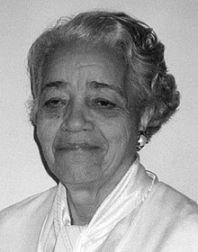

  <a class="c-survey-banner__link" href="https://form.raspberrypi.org/f/code-editor-feedback" target="_blank">Take our survey</a> to help make our Code Editor better!

## You will make

اصنع رسمًا متحركًا لدفع قمر صناعي إلى مداره - عن طريق ركوب صاروخ! ستعمل الرسوم المتحركة الخاصة بك على إنشاء تأثيرات رسومية رائعة ومحاكاة أفضل كمية من الوقود لإعطاء الصاروخ.

** عمليات المحاكاة الحاسوبية ** تُستخدم لحساب ما سيحدث عندما نرسل صاروخًا إلى الفضاء. يؤدي تشغيل عمليات المحاكاة ووضع الخطط على جهاز كمبيوتر إلى تقليل مخاطر حدوث مشكلات باهظة الثمن أو خطيرة في الفضاء.

سوف تقوم بمايلي:
+ استخدم **صورة** في الرسوم المتحركة الخاصة بك
+ استخدم حلقات`for`لتكرار الإجراءات
+ أربط الشروط مع `and`

- بدون طباعة -

### Play ▶️

--- task ---

  
تحتاج إلى تزويد الصاروخ بالوقود الكافي للوصول إلى مدار القمر الصناعي. جرب كمية صغيرة (حوالي 10000 كجم) وكمية كبيرة جدًا (حوالي 50000 كجم) لترى ما سيحدث. 

ما مقدار الوقود الذي يكفي دون أن يتبقى الكثير؟

<iframe src="https://editor.raspberrypi.org/en/embed/viewer/rocket-launch-example" width="400" height="710" frameborder="0" marginwidth="0" marginheight="0" allowfullscreen>
</iframe>

--- /task ---

--- /no-print ---

--- print-only ---

--- /print-only ---

 {: width = "300px"} قدمت دوروثي فوجان مساهمات مهمة في رحلات الفضاء المبكرة. نظرًا لأن المستقبل سيستخدم أجهزة الكمبيوتر الإلكترونية ، علّمت نفسها وفريقها كيفية البرمجة.

يروي فيلم *Hidden Figures* قصة دور دوروثي ونساء سوداوات أخريات في نجاح برنامج الفضاء الأمريكي. 
