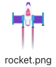

## انطلاق الصاروخ!

في كل مرة يتم فيها رسم إطار جديد ، يحتاج الصاروخ إلى تحريك الشاشة للأعلى لإنشاء تأثير حركي (يبين ان الصاروخ يقلع في الفضاء).

! [صاروخ يطير بسرعة ثابتة من أسفل إلى أعلى الشاشة.](images/fly.gif){:width="300px"}

--- task ---

عند بداية المشروع سنحصل على صورة الصاروخ جاهزة.

--- /task ---

--- task ---

أضف الشفرة البرمجية إلى الدالة `setup()` لتحميل صورة الصاروخ التي اخترناها في متغير عام `rocket`.

--- code ---
---
language: python filename: main.py line_numbers: true line_number_start: 20
line_highlights: 24, 26
---

def setup():   
#إعداد الرسوم المتحركة هنا   
size(screen_size, screen_size)   
image_mode(CENTER)   
global planet, rocket   
planet = load_image('planet.png')    
rocket = load_image('rocket.png')

--- /code ---

--- /task ---

### Make the rocket fly

سيبدأ احداثي `y` للصاروخ عند 400 (ارتفاع الشاشة) ثم ينخفض بمقدار 1 في كل مرة يتم فيها رسم إطار جديد.

--- task ---

نضيف `rocket_y` كمتغيرًا عاماً لتتبع موقع `y` للصاروخ.

--- code ---
---
language: python filename: main.py line_numbers: true line_number_start: 7
line_highlights: 9
---

# تهيئة المتغيرات العامة
screen_size = 400    
rocket_y = screen_size # ابدأ من الأسفل

--- /code ---

--- /task ---

--- task ---

حدد دالة `draw_rocket()` لتغيير احداثي `y` للصاروخ وإعادة رسمه.

`rocket_y -= 1` هي اقصر طريقة لكتابة `rocket_y = rocket_y - 1`.

--- code ---
---
language: python filename: main.py line_numbers: true line_number_start: 11
line_highlights: 12-16
---

# يتم وضع دالة draw_rocket هنا
def draw_rocket():

--- /code ---

--- /task ---

--- task ---

استدع `draw_rocket()` الجديد في دالة `draw()` بحيث يُعاد رسم الصاروخ كل إطار.

--- code ---
---
language: python filename: main.py line_numbers: true line_number_start: 34
line_highlights: 37
---

def draw():   
#الأشياء التي يجب القيام بها في كل إطار   
draw_background()   
draw_rocket()

--- /code ---

--- /task ---

--- task ---

**اختبار:** لنقم بتشغيل الشفرة البرمجية للتحقق من أن الصاروخ يبدأ من أسفل الشاشة ويتحرك للأعلى في كل إطار.

--- /task ---

--- save ---
