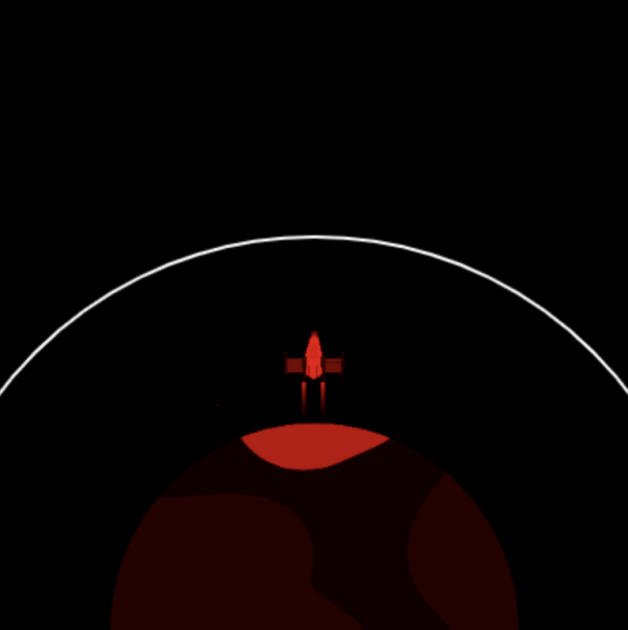
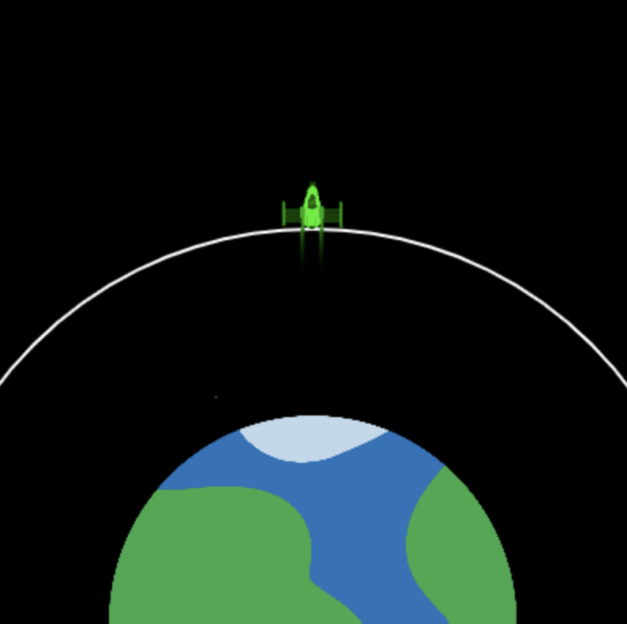

## الوصول إلى المدار

الهدف من إطلاق الصاروخ هو دفع قمر صناعي إلى المدار. 

المدار هو مسار منحني يسلكه جسم حول جسم آخر بسبب الجاذبية.

يمكن للصاروخ تغيير لونه لإظهار مدى نجاح الإطلاق. 

! [ثلاث صور متجاورة تُظهر نجاح الإطلاق (لون أخضر)، وإفراط في استخدام الوقود (لون اصفر خفيف)، وغير ناجح (لون أحمر).](images/check_orbit.png){:width="400px"}

--- task ---

قم بإنشاء متغيرين عالميين جديدين لتعيين نصف قطر دائرة المدار والإحداثيات `y` للمدار إلى النقطة التي يحتاج مركز الصاروخ للوصول إليها لإطلاق القمر الصناعي.

--- code ---
---
language: python filename: main.py line_numbers: true line_number_start: 7
line_highlights: 11-12
---

# تهيئة المتغيرات العامة
screen_size = 400   
rock_y = screen_size   
burn = 100   
orbit_radius = 250   
orbit_y = screen_size - orbit_radius

--- /code ---

--- /task ---

--- task ---

قم بتحديث الدالة `() draw_background` لرسم شكل بيضوي لتمثيل مدار القمر الصناعي الذي يحتاج الصاروخ للوصول إليه.

--- code ---
---
language: python filename: main.py - draw_background() line_numbers: true line_number_start: 37
line_highlights: 42-45
---

def draw_background():   
background(0) #مختصر الخلفية (0, 0, 0) — اسود   
image(planet, width/2, height, 300, 300)

  no_fill() #اطفاء اي تعبة اقل من صفر fill  
stroke(255) #تعيين stroke بيضاء stroke   
stroke_weight(2)   
ellipse(width/2, height, orbit_radius * 2, orbit_radius * 2)

--- /code ---

--- /task ---

--- task ---

**اختبار:** قم بتشغيل برنامجك وتحقق من رسم خط مدار أبيض.

{:width="300px"}

--- /task ---

يجب أن يتوقف الصاروخ عندما يصل إلى مدار القمر الصناعي - نهاية المهمة.

--- task ---

قم بتحديث الرمز البرمجي `if fuel >= burn` للتحقق أيضًا من أن الصاروخ لم يصل إلى المدار.

يمكنك استخدام العبارات `and` في `if` للتحقق مما إذا كان شرطان أو أكثر صحيحين.

--- code ---
---
language: python filename: main.py - draw_rocket() line_numbers: true line_number_start: 14
line_highlights: 19
---

# يتم وضع دالة draw_rocket هنا
def draw_rocket ():

  global rocket_y, fuel, burn

    if fuel >= burn and rocket_y > orbit_y: #لا يزال يطير

--- /code ---

--- /task ---

--- task ---

**اختبار:** قم بتشغيل مشروعك وأدخل `50000` كمقدار للوقود. يجب أن يكون هذا وقودًا وفيرًا للوصول إلى المدار. يجب أن يتوقف الصاروخ عن الحركة عندما يصل إلى المدار.

--- /task ---

يجب أن يكون لون الصاروخ أحمر إذا نفد الوقود قبل أن يرتفع بما يكفي لإطلاق القمر الصناعي.

--- task ---

--- code ---
---
language: python filename: main.py — draw_rocket() line_numbers: true line_number_start: 30
line_highlights: 34-35
---

    fill(200, 200, 200, 100)   
    for i in range(20):   
      ellipse(width/2 + randint(-5, 5), rocket_y + randint(20, 50), randint(5, 10), randint(5, 10))

  if fuel < burn and rocket_y > orbit_y: #لا مزيد من الوقود وليس في المدار tint(255, 0, 0) #فشل

--- /code ---

--- /task ---

--- task ---

**اختبار:** قم بتشغيل الشفرة البرمجية الخاصة بك وأدخل `20000` كمقدار الوقود. تأكد من أن الصاروخ يتحول إلى اللون الأحمر عندما يتوقف أسفل المدار.

{:width="300px"}

أوه لا ، لقد تحول الكوكب إلى اللون الأحمر!

--- /task ---

--- task ---

تعمل الدالة `() tint` على ضبط لون الصبغة لجميع الصور المرسومة حتى تقوم بتغيير الصبغة أو استخدام `() no_tint` لإيقاف تشغيله.

**اختر:** أضف استدعاء إلى `() no_tint` بعد رسم الصورة بحيث لا يتحول لون الكوكب إلى اللون الأحمر في الإطار التالي - أو اتركه إذا كنت تحب أن يتحول لون الكوكب إلى اللون الأحمر!

--- code ---
---
language: python filename: main.py - draw_rocket() line_numbers: true line_number_start: 34
line_highlights: 38
---

if fuel < burn and rocket_y > orbit_y: tint(255, 0, 0) #فشل

image(rocket, width/2, rocket_y, 64, 64)   
no_tint () # حتى لا يتلون الكوكوب باللون الاحمر في الإطار التالي!

--- /code ---

--- /task ---

--- task ---

استخدم دالة `() tint` مرة أخرى، هذه المرة لتلوين الصاروخ باللون الأخضر إذا كان الصاروخ يحتوي على وقود كافٍ للوصول إلى مدار القمر الصناعي:

--- code ---
---
language: python filename: main.py - draw_rocket() line_numbers: true line_number_start: 34
line_highlights: 36-37
---

if fuel < burn and rocket_y > orbit_y: tint(255, 0, 0) #فشل   
elif rocket_y <= orbit_y:   
tint(0, 255, 0) #نجاح

image(rocket, width/2, rocket_y, 64, 64)   
no_tint()

--- /code ---

--- /task ---

--- task ---

**اختبار:** قم بتشغيل مشروعك وأدخل `50000` كمقدار للوقود. تأكد من أن صاروخك يتحول إلى اللون الأخضر عندما يصل إلى مدار القمر الصناعي.

{:width="300px"}

--- /task ---

لديك الآن محاكاة يمكن استخدامها لإظهار مقدار الوقود المطلوب كحد أدنى للوصول إلى مدار القمر الصناعي. هذا عظيم؛ ومع ذلك ، يمكنك أن تأخذ كمية كبيرة من الوقود وتظل ناجحًا ، لكن هذا مكلف ومهدر!

--- task ---

قم بتعديل الشروط في شفرة النجاح البرمجية الخاصة بك بحيث يتحول الصاروخ إلى اللون الأخضر فقط إذا وصل إلى المدار `و` ولديه أقل من 1000 كغم من الوقود المتبقي.

أضف شفرة برمجية لتلوين الصاروخ باللون الأصفر إذا كان لدى الصاروخ أكثر من 1000 كغم من الوقود المتبقي عند وصوله إلى المدار.

--- code ---
---
language: python filename: main.py line_numbers: true line_number_start: 34
line_highlights: 36, 38-39
---

if fuel < burn and rocket_y > orbit_y: tint(255, 0, 0) #فشل   
elif fuel < 1000 and rocket_y <= orbit_y:   
tint(0, 255, 0) #نجاح   
elif fuel >= 1000 and rocket_y <= orbit_y:    
tint(255, 200, 0) #وقود كثير جداً

image(rocket, width/2, rocket_y, 64, 64)    
no_tint () # حتى لا يتم تلوين الكوكب في الإطار التالي!

--- /code ---

--- /task ---

--- task ---

**اختبار:** قم بتشغيل البرنامج عدة مرات بأرقام مختلفة ؛ على سبيل المثال ، يجب أن تكون 25000 كغم من الوقود هي الكمية اللازمة لتحويل الصاروخ إلى اللون الأخضر ، ولكن تحقق أيضًا من أن الصبغة الصفراء تعمل أيضًا باستخدام رقم أكبر.

{:width="300px"}

--- /task ---

--- save ---
