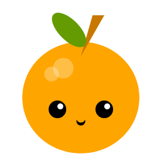

## ماذا بعد؟

إذا كنت تتبع مسار [مقدمة Python](https://projects.raspberrypi.org/en/raspberrypi/python-intro) ، يمكنك الانتقال إلى مشروع [اصنع وجه](https://projects.raspberrypi.org/en/projects/make-a-face). في هذا المشروع ، سترسم وجهًا أو قناعًا باستخدام أشكال هندسية.

--- print-only ---

--- /print-only ---

--- no-print ---

<iframe src="https://editor.raspberrypi.org/en/embed/viewer/fruit-face-example" width="400" height="710" frameborder="0" marginwidth="0" marginheight="0" allowfullscreen>
</iframe>

--- /no-print ---

إذا كنت ترغب في الحصول على مزيد من المتعة في استكشاف Python ، فيمكنك تجربة أي من [هذه المشاريع](https://projects.raspberrypi.org/en/projects?software%5B%5D=python).
