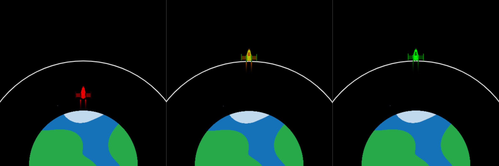

  <a class="c-survey-banner__link" href="https://form.raspberrypi.org/f/code-editor-feedback" target="_blank">Take our survey</a> to help make our Code Editor better!

## Cyflwyniad

Gwnewch animeiddiad i yrru lloeren i orbit — drwy gael pàs ar roced! Bydd eich animeiddiad yn creu effeithiau graffeg cŵl ac yn efelychu'r cyfaint gorau o danwydd i'w roi i'r roced.

Mae **efelychiadau cyfrifiadurol** yn cael eu defnyddio i gyfrifo beth fydd yn digwydd pan fyddwn ni'n anfon roced i'r gofod. Mae rhedeg efelychiadau a gwneud cynlluniau ar gyfrifiadur yn lleihau'r risg o broblemau drud neu beryglus yn y gofod.

Byddwch chi'n:
+ Defnyddio **delweddau** yn eich animeiddiadau
+ Defnyddio dolenni `for` i ailadrodd gweithrediadau
+ Ymuno amodau gydag `and`

--- no-print ---

### Rhowch gynnig arni

--- task ---

  
You need to supply the rocket with enough fuel to reach the satellite orbit. Try a small amount (around 10,000kg) and a very large amount (around 50,000kg) to see what happens. 

How much fuel is just enough without too much left over?

<iframe src="https://editor.raspberrypi.org/en/embed/viewer/rocket-launch-example" width="600" height="600" frameborder="0" marginwidth="0" marginheight="0" allowfullscreen>
</iframe>

--- /task ---

--- /no-print ---

--- print-only ---

--- /print-only ---

 {:width="300px"} Roedd Dorothy Vaughan wedi gwneud cyfraniadau pwysig i deithiau cynnar i'r gofod. Gan weld y byddai'r dyfodol yn defnyddio cyfrifiaduron electronig, dysgodd ei hun a'i thîm sut i godio.

Mae'r ffilm *Hidden Figures* yn adrodd stori'r rôl allweddol yr oedd Dorothy a merched Du eraill wedi'i chwarae yn llwyddiant rhaglen ofod yr Unol Daleithiau. 
