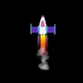

## Effeithiau'r ecsôst

Bydd y roced yn edrych yn fwy realistig gyda rhywfaint o effeithiau arbennig i efelychu ôl yr ecsôst. 

Fe allwch chi greu effeithiau cŵl drwy ddefnyddio dolen `for` i lunio nifer o siapiau ym mhob ffrâm.

{:width="300px"}

Mae codio'n cael ei ddefnyddio i wneud **effeithiau graffeg** ar gyfer ffilmiau a gemau. Mae'n gyflymach o lawer ysgrifennu cod na llunio pob ffrâm mewn animeiddiad yn unigol. 

Mae llunio nifer o elipsau melyn mewn gwahanol safleoedd `y` yn creu ôl ecsôst gyda gwaelod crwn.

--- task ---

Mae dolen `for` yn ailadrodd darn o god unwaith ar gyfer bob eitem sy'n cael ei rhoi iddi. Fe allwch chi ddefnyddio'r swyddogaeth `range()` i redeg y cod mewn dolen `for` hyn a hyn o weithiau. Er enghraifft, mae `range(5)` yn creu dilyniant o bum rhif yn dechrau ar 0, felly [0, 1, 2, 3, 4].

Bob tro mae'r ddolen `for` yn ailadrodd, mae'n gosod newidyn ar gyfer yr eitem bresennol er mwyn i chi allu ei defnyddio yn y ddolen.

Diweddarwch eich swyddogaeth `llunio_roced()` i gynnwys dolen `for` sy'n ailadrodd y lluniad o `25` elips ecsôst. Mae'r **newidyn dolen** `i` yn cael ei ychwanegu at `roced_y` i lunio pob elips yn bellach o dan y roced.

--- code ---
---
language: python 
filename: main.py - llunio_roced() 
line_numbers: true 
line_number_start: 12
line_highlights: 16-22
---

def llunio_roced():

  global roced_y   
  roced_y -= 1

  no_stroke() #Diffodd y strôc

  for i in range(25): #Llunio 25 o elipsau ecsôst sy'n llosgi   
    fill(255, 255, 0) #Melyn   
    ellipse(width/2, roced_y + i, 8, 3) #i yn cynyddu bob tro mae'r ddolen yn ailadrodd

  image(roced, width/2, roced_y, 64, 64)

--- /code ---

--- /task ---

--- task ---

**Profi:** Rhedwch eich cod i wneud yn siŵr bod gan y roced ôl ecsôst newydd.

{:width="300px"}

--- /task ---

Mae modd defnyddio'r newidyn `i` hefyd i greu graddiant lliw gyda llai o wyrdd ym mhob elips sy'n cael ei lunio.

--- task ---

Newidiwch yr alwad i `fill()` i osod lefel y gwyrdd ar `255 - i*10` fel bod gan yr elips cyntaf yr un faint o goch a gwyrdd, a'r elips olaf ychydig iawn o wyrdd.

--- code ---
---
language: python 
filename: main.py - llunio_roced() 
line_numbers: true 
line_number_start: 19
line_highlights: 20
---

  for i in range(25):   
    fill(255, 255 - i * 10, 0) #Lleihau lefel y gwyrdd    
    ellipse(width/2, roced_y + i, 8, 3)

--- /code ---

--- /task ---

--- task ---

**Profi:** Gwnewch yn siŵr eich bod yn cael ôl elips sy'n newid o felyn i goch yn raddol.

--- /task ---

Mae'r ôl mwg ecsôst yn cael ei greu drwy lunio nifer o elips llwyd sydd ychydig yn dryloyw mewn safle gwahanol ym mhob ffrâm.

--- task ---

Tro hwn, mae'r `fill()` tu allan i'r ddolen gan fod y lliw yr un fath i bob elips mwg. Anhryloywedd yw pedwerydd mewnbwn `fill()`. Mae gwerth anhryloywedd isel yn gwneud y lliw yn fwy tryloyw er mwyn i chi allu gweld y siapiau oddi tano.

Ym mhob ffrâm yn yr animeiddiad, bydd 20 elips o feintiau ar hap yn cael eu llunio mewn safleoedd ar hap.

--- code ---
---
language: python 
filename: main.py - llunio_roced() 
line_numbers: true 
line_number_start: 19
line_highlights: 23-26
---

  for i in range(25):  
    fill(255, 255 - i * 10, 0)   
    ellipse(width/2, roced_y + i, 8, 3)

  fill(200, 200, 200, 100) #Llwyd tryloyw   
  for i in range(20): #Llunio 20 o elipsau mwg ar hap    
    ellipse(width/2 + randint(-5, 5), roced_y + randint(20, 50), randint(5, 10), randint(5, 10))

  image(roced, width/2, roced_y, 64, 64)

--- /code ---

--- /task ---

--- task ---

**Profi:** Rhedwch eich rhaglen a gwneud yn siŵr bod mwg yr ecsôst yn weladwy.

--- /task ---

--- save ---
