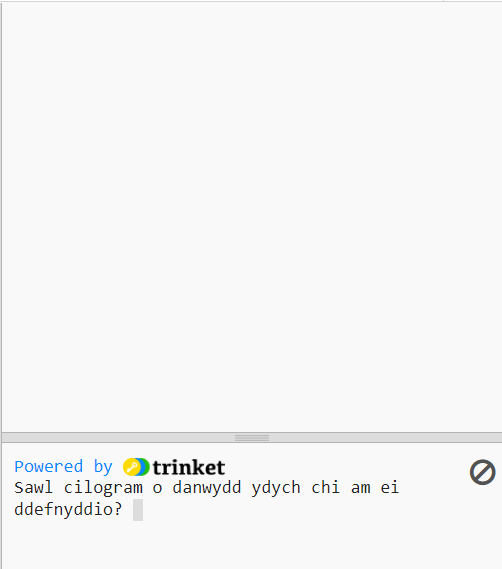
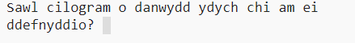
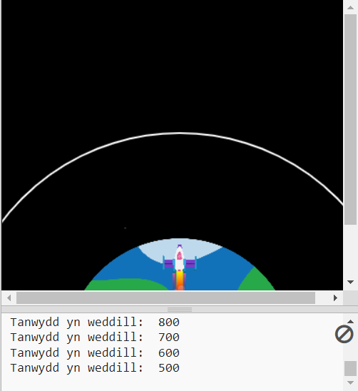

## Llosgi tanwydd

Un o'r pethau pwysicaf i benderfynu arnyn nhw wrth lansio roced yw faint o danwydd i'w lwytho arni. 

I wneud hyn, rhaid i chi efelychu faint o danwydd fydd yn cael ei losgi yn ystod y daith.

{:width="300px"}

--- task ---

Ychwanegwch newidyn i gadw golwg ar faint o danwydd mae eich roced yn ei losgi (mewn fframiau).

--- code ---
---
language: python 
filename: main.py 
line_numbers: true 
line_number_start: 7
line_highlights: 10
---

#Gosod newidynnau cyffredinol
screen_size = 400   
roced_y = screen_size  
llosgi = 100 #Faint o danwydd sy'n cael ei losgi ym mhob ffrâm

--- /code ---

--- /task ---

--- task ---

Ar waelod eich rhaglen, ychwanegwch god i ofyn i'r defnyddiwr faint o danwydd i'w ychwanegu at y roced, a storio ei ateb mewn newidyn `tanwydd` cyffredinol.

--- code ---
---
language: python 
filename: main.py 
line_numbers: true 
line_number_start: 52
line_highlights: 52
---

tanwydd = int(input('Sawl cilogram o danwydd ydych chi am ei ddefnyddio?'))   
run()

--- /code ---

--- /task ---

Dylai'r roced ddim ond symud os nad yw wedi llosgi ei holl danwydd.

--- task ---

Ychwanegwch god at y swyddogaeth `llunio_roced()` i leihau'r `tanwydd` sy'n weddill o werth `llosgi` bob ffrâm. Defnyddiwch `print()` i ddangos faint o danwydd sy'n weddill ym mhob ffrâm.

Rhaid i chi ddweud eich bod am ddefnyddio'r newidynnau `tanwydd` a `llosgi` cyffredinol.

--- code ---
---
language: python 
filename: main.py — llunio_roced() 
line_numbers: true 
line_number_start: 15
line_highlights: 15, 17-18
---

  global roced_y, tanwydd, llosgi   
  roced_y -= 1   
  tanwydd -= llosgi #llosgi tanwydd   
  print('Tanwydd yn weddill: ', tanwydd)

--- /code ---

--- /task ---

--- task ---

**Profi:** Rhedwch eich rhaglen i wneud yn siŵr nad yw'r animeiddiad yn dechrau nes bod `Sawl cilogram o danwydd ydych chi am ei ddefnyddio?` wedi'i ateb. Rhowch gynnig ar roi `30000` fel y cyfaint tanwydd.

Bydd y roced yn dal i fynd hyd yn oed os nad oes ganddi danwydd yn weddill.

--- /task ---

--- task ---

Dylai'r roced ddim ond symud os oes ganddi ddigon o danwydd yn weddill. Ychwanegwch ddatganiad `if` i wirio bod `tanwydd >= llosgi`.

Bydd angen i chi fewnoli'r holl linellau cod cyn galw'r swyddogaeth `image()`. I wneud hyn, amlygwch yr holl linellau gyda'r llygoden a tharo <kbd>Tab</kbd> ar y fysellfwrdd i fewnoli'r holl linellau ar unwaith.

Does dim angen mewnoli'r llinell `image()` oherwydd rydych chi eisiau llunio'r roced bob tro.

--- code ---
---
language: python 
filename: main.py — llunio_roced() 
line_numbers: true 
line_number_start: 15
line_highlights: 16-31
---

  global roced_y, tanwydd, llosgi

  if tanwydd >= llosgi: #Tanwydd yn weddill   
    roced_y -= 1   
    tanwydd -= llosgi   
    print('Tanwydd yn weddill: ', tanwydd)   

    no_stroke() #Diffodd y strôc   
    
    for i in range(25):   
      fill(255, 255 - i*10, 0)   
      ellipse(width/2, roced_y + i, 8, 3)    
    
    fill(200, 200, 200, 100)   
    for i in range(20):   
      ellipse(width/2 + randint(-5, 5), roced_y + randint(20, 50), randint(5, 10), randint(5, 10))

  image(roced, width/2, roced_y, 64, 64)

--- /code ---

--- /task ---

--- task ---

**Profi:** Rhedwch eich rhaglen i wneud yn siŵr bod y roced yn stopio pan nad oes tanwydd yn weddill.

{:width="300px"}

--- /task ---

Dydy'r efelychiad cyfrifiadurol hwn ddim yn gywir iawn, ond mae'n ddigon da i'n hanimeiddiad.

--- save ---

