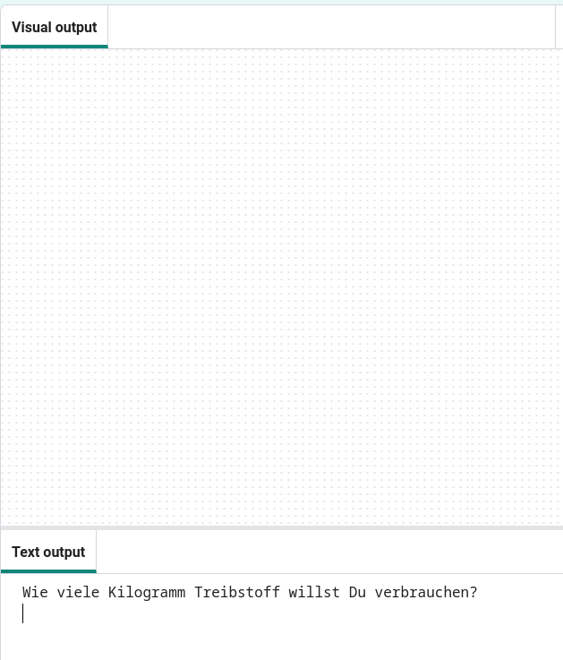
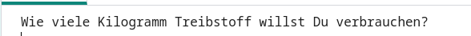
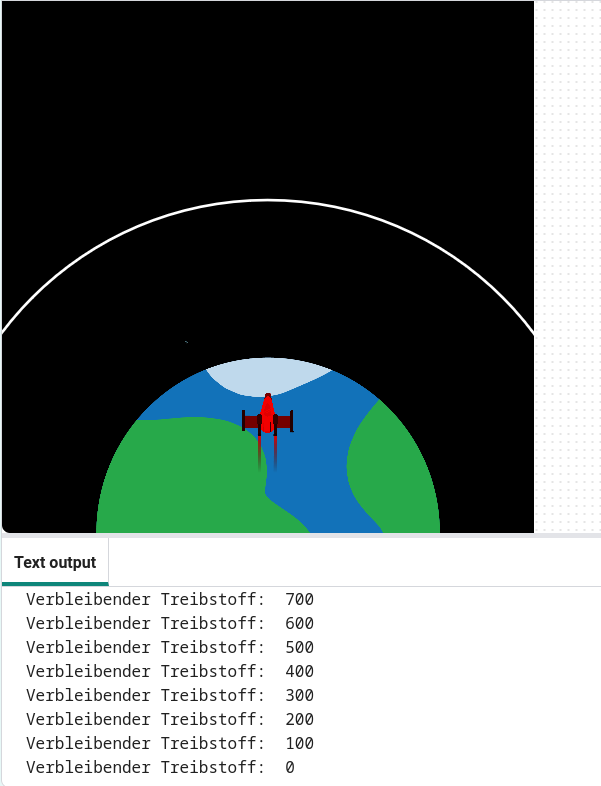

## Treibstoff verbrennen

Eine der wichtigsten Entscheidungen beim Start einer Rakete ist, wie viel Treibstoff sie laden soll. 

Dazu muss simuliert werden, wie viel Treibstoff während der Fahrt verbraucht wird.

{:width="300px"}

### Erstelle eine Variable für den Treibstoff

--- task ---

Füge eine Variable hinzu, um zu verfolgen, wie viel Treibstoff deine Rakete verbraucht (pro Frame).

--- code ---
---
language: python
filename: main.py
line_numbers: true
line_number_start: 7 
line_highlights: 10
---

# Globale Variablen einrichten
bildschirm_groesse = 400   
rakete_y = bildschirm_groesse  
verbrennen = 100  # Wieviel Treibstoff wird in jedem Frame verbrannt

--- /code ---

--- /task ---

--- task ---

Füge am Ende deines Programms Code hinzu, der abfragt, wie viel Treibstoff der Rakete hinzugefügt werden soll, und speichere diese Antwort in einer globalen Variablen `treibstoff`.

--- code ---
---
language: python
filename: main.py 
line_numbers: true
line_number_start: 51
line_highlights: 51
---

treibstoff = int(input('Wie viele Kilogramm Treibstoff willst Du verbrauchen?'))   
run()

--- /code ---

--- /task ---

### Treibstoff auf Verbrennung prüfen

Die Rakete sollte sich nur bewegen, wenn sie nicht ihren gesamten Treibstoff verbraucht hat.

--- task ---

Füge der Funktion `zeichne_rakete()` Code hinzu, um den verbleibenden `treibstoff` um `verbrennen` in jedem Frame zu reduzieren. Verwende `print()`, um anzuzeigen, wie viel Treibstoff in jedem Frame übrig ist.

Du musst angeben, dass du die globalen Variablen `treibstoff` und `verbrennen` verwenden möchtest.

--- code ---
---
language: python
filename: main.py — draw_rocket()
line_numbers: true
line_number_start: 15 
line_highlights: 15, 17-18
---

    global rakete_y, treibstoff, verbrennen   
    rakete_y -= 1   
    treibstoff -= verbrennen  # Treibstoff verbrennen   
    print('Verbleibender Treibstoff: ', treibstoff)

--- /code ---

--- /task ---

--- task ---

**Test:** Führe dein Programm aus, um zu überprüfen, dass die Animation erst startet, nachdem `Wie viele Kilogramm Kraftstoff möchtest du verbrauchen?` beantwortet wurde. Probier es mal mit `30000` als Treibstoffmenge.

Die Rakete wird weiterfliegen, auch wenn sie keinen Treibstoff mehr hat.

--- /task ---

--- task ---

Die Rakete sollte sich nur bewegen, wenn sie noch genügend Treibstoff hat. Füge eine `if`-Anweisung hinzu, um zu überprüfen, ob `treibstoff >= verbrennen` ist.

Du musst alle Codezeilen vor dem Funktionsaufruf `image()` einrücken. Markiere dazu alle Zeilen mit der Maus und tippe dann auf der Tastatur auf <kbd>Tabulator</kbd>, um alle Zeilen auf einmal einzurücken.

Die Zeile mit `image()` muss nicht eingerückt werden, da du immer die Rakete zeichnen möchtest.

--- code ---
---
language: python
filename: main.py — draw_rocket()
line_numbers: true
line_number_start: 15
line_highlights: 17-30
---

    global rakete_y, treibstoff, verbrennen  
    
    if treibstoff >= verbrennen:  # Noch Treibstoff verfügbar   
        rakete_y -= 1   
        treibstoff -= verbrennen   
        print('Verbleibender Treibstoff: ', treibstoff)   
    
        no_stroke()  # Schaltet Zeichnen aus   
    
        for i in range(25):   
            fill(255, 255 - i*10, 0)   
            ellipse(width/2, rakete_y + i, 8, 3)    
    
        fill(200, 200, 200, 100)   
        for i in range(20):   
            ellipse(width/2 + randint(-5, 5), rakete_y + randint(20, 50), randint(5, 10), randint(5, 10))   
    
    image(rakete, width/2, rakete_y, 64, 64)

--- /code ---

--- /task ---

--- task ---

**Test:** Führe dein Programm aus, um zu überprüfen, ob die Rakete stoppt, wenn kein Treibstoff mehr vorhanden ist.

{:width="300px"}

--- /task ---

Ist deine Rakete stehen geblieben, als ihr der Treibstoff ausgegangen ist? Gut gemacht, du hast eine Rakete in den Weltraum geschickt!

--- save ---

