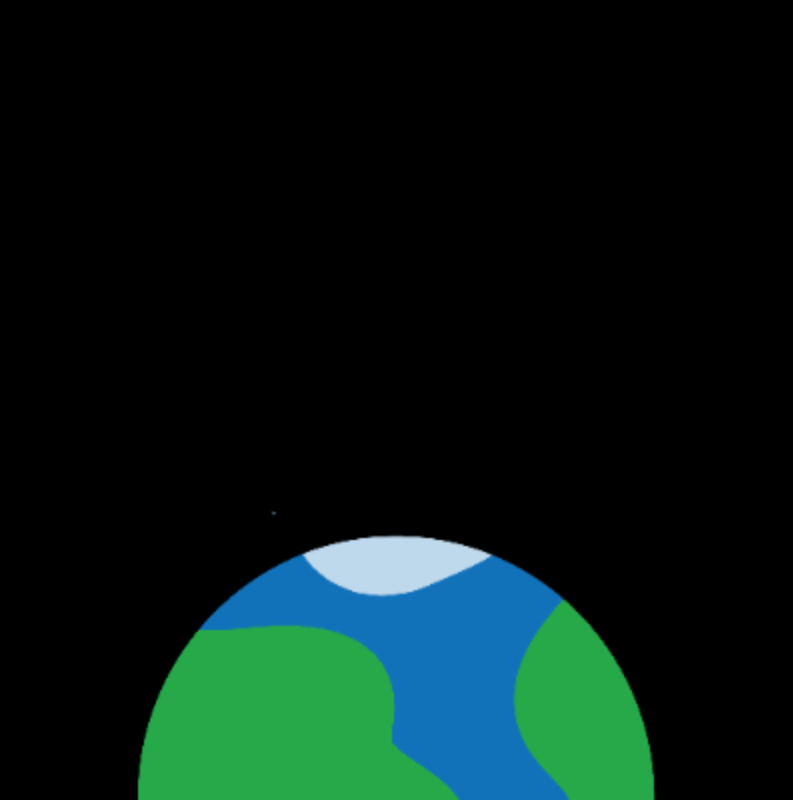
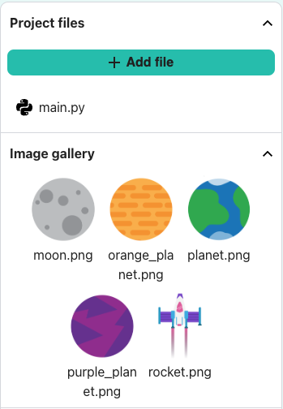

## Draw the background

--- task --

Open the [starter project](https://editor.raspberrypi.org/en/projects/rocket-launch-starter){:target="_blank"}.

--- /task ---

First, you will create a black background to represent space.

--- task --- Define a `draw_background()` function, and set the background colour to black.

--- code ---
---
language: python line_numbers: true line_number_start: 12
line_highlights: 13-14
---

# Η συνάρτηση draw_background πηγαίνει εδώ
def draw_background():   
background(0, 0, 0)

--- /code ---

--- /task ---

--- task ---

Add this function to the list of things to `draw()` in every frame.

--- code ---
---
language: python line_numbers: true line_number_start: 25
line_highlights: 27
---

def draw(): # Things to do in every frame draw_background()

--- /code ---

--- /task ---

--- task ---

**Test:** Run your code and you should see a black square. --- /task ---

--- task ---

Add a line of code to display an image of a planet.

--- code ---
---
language: python line_numbers: true line_number_start: 13
line_highlights: 15-16
---
def draw_background():  
background(0,0,0) image(planet, screen_size/2, screen_size, 300, 300) --- /code ---

The `image()` function needs the following data:

- image filename - we have already loaded the planet image
- x coordinate - we have already set the screen size
- y coordinate
- image width
- image height

--- /task ---

--- task ---

**Test:** Run your code and check that it draws a black background with half a planet at the bottom.

{:width="300px"}

--- /task ---

### A different planet?

--- task ---

Click on the image icon to the left to view the image gallery.

If you want to change the planet image, change `planet.png` in the code to the filename of your chosen planet, for example, `orange_planet.png`.

--- code ---
---
language: python line_numbers: true line_number_start: 17
line_highlights: 22
---
def setup(): # Set up your animation here size(screen_size, screen_size) image_mode(CENTER) global planet planet = load_image('planet.png') --- /code ---

--- /task ---

