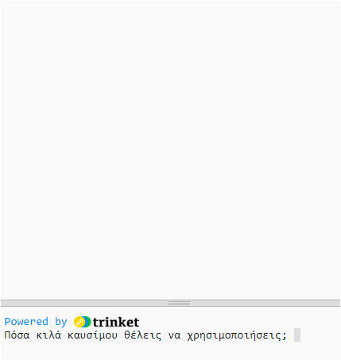

## Καύση καυσίμου

Ένα από τα πιο σημαντικά πράγματα που πρέπει να αποφασίσεις κατά την εκτόξευση ενός πυραύλου είναι πόσο καύσιμο θα φορτωθεί σε αυτόν. 

Για να γίνει αυτό, πρέπει να προσομοιώσεις πόσα καύσιμα θα καούν στο ταξίδι.

{:width="300px"}

--- task ---

Πρόσθεσε μια μεταβλητή για να παρακολουθείς πόσα καύσιμα καίει ο πύραυλός σου (ανά καρέ).

--- code ---
---
language: python filename: main.py line_numbers: true line_number_start: 7
line_highlights: 10
---

# Ρύθμιση καθολικών μεταβλητών
screen_size = 400   
rocket_y = screen_size  
burn = 100 #Πόσο καύσιμο καίγεται σε κάθε καρέ

--- /code ---

--- /task ---

--- task ---

Στο κάτω μέρος του προγράμματός σου, πρόσθεσε κώδικα για να ρωτήσεις τον χρήστη πόσο καύσιμο να προσθέσει στον πύραυλο και αποθήκευσε την απάντησή του σε μια καθολική μεταβλητή `fuel`.

--- code ---
---
language: python filename: main.py line_numbers: true line_number_start: 52
line_highlights: 52
---

fuel = int(input('Πόσα κιλά καυσίμου θέλεις να χρησιμοποιήσεις;'))   
run()

--- /code ---

--- /task ---

Ο πύραυλος πρέπει να κινείται μόνο εάν δεν έχει κάψει όλο το καύσιμό του.

--- task ---

Πρόσθεσε κώδικα στη συνάρτηση `draw_rocket()` για να μειώσεις το υπόλοιπο `καύσιμο` κατά την `καύση` σε κάθε καρέ. Χρησιμοποίησε το `print()` για να δείξεις πόση ποσότητα καυσίμου απομένει σε κάθε καρέ.

Πρέπει να πεις ότι θέλεις να χρησιμοποιήσεις τις καθολικές μεταβλητές `fuel` και `burn`.

--- code ---
---
language: python filename: main.py — draw_rocket() line_numbers: true line_number_start: 15
line_highlights: 15, 17-18
---

  global rocket_y, fuel, burn   
rocket_y -= 1   
fuel -= burn #Καύση καυσίμου   
print('Καύσιμο που απέμεινε: ', fuel)

--- /code ---

--- /task ---

--- task ---

**Δοκιμή:** Εκτέλεσε το πρόγραμμά σου για να ελέγξεις ότι η κινούμενη εικόνα δεν ξεκινά πριν να απαντηθεί το `Πόσα κιλά καυσίμου θέλεις να χρησιμοποιήσεις;`. Δοκίμασε να εισαγάγεις `30000` ως ποσότητα καυσίμου.

Ο πύραυλος θα συνεχίσει να λειτουργεί ακόμα κι αν δεν έχει απομείνει καύσιμο.

--- /task ---

--- task ---

Ο πύραυλος πρέπει να κινείται μόνο εάν έχει αρκετό καύσιμο. Πρόσθεσε μια εντολή `if` για να ελέγξεις ότι `fuel >= burn`.

Θα χρειαστεί να τοποθετήσεις με εσοχή όλες τις γραμμές κώδικα πριν από την κλήση της συνάρτησης `image()`. Για να το κάνεις αυτό, επισήμανε όλες τις γραμμές με το ποντίκι και, στη συνέχεια, πάτα το πλήκτρο <kbd>Tab</kbd> από το πληκτρολόγιο για να κάνεις εσοχή σε όλες τις γραμμές ταυτόχρονα.

Η γραμμή `image()` δεν χρειάζεται να έχει εσοχή επειδή θέλεις πάντα να σχεδιάζεις τον πύραυλο.

--- code ---
---
language: python filename: main.py — draw_rocket() line_numbers: true line_number_start: 15
line_highlights: 16-31
---

  global rocket_y, fuel, burn

  if fuel >= burn: #Ακόμα υπάρχει καύσιμο   
rocket_y -= 1   
fuel -= burn   
print('Καύσιμο που απέμεινε: ', fuel)   

    no_stroke() #Απενεργοποίηση πινελιάς
    
    for i in range(25):   
      fill(255, 255 - i*10, 0)   
      ellipse(width/2, rocket_y + i, 8, 3)    
    
    fill(200, 200, 200, 100)   
    for i in range(20):   
      ellipse(width/2 + randint(-5, 5), rocket_y + randint(20, 50), randint(5, 10), randint(5, 10))

  image(rocket, width/2, rocket_y, 64, 64)

--- /code ---

--- /task ---

--- task ---

**Δοκιμή:** Εκτέλεσε το πρόγραμμά σου για να ελέγξεις ότι ο πύραυλος σταματά όταν δεν υπάρχει καύσιμο.

{:width="300px"}

--- /task ---

Αυτή η προσομοίωση υπολογιστή δεν είναι πολύ ακριβής, αλλά είναι αρκετά καλή για την κινούμενη εικόνα μας.

--- save ---

