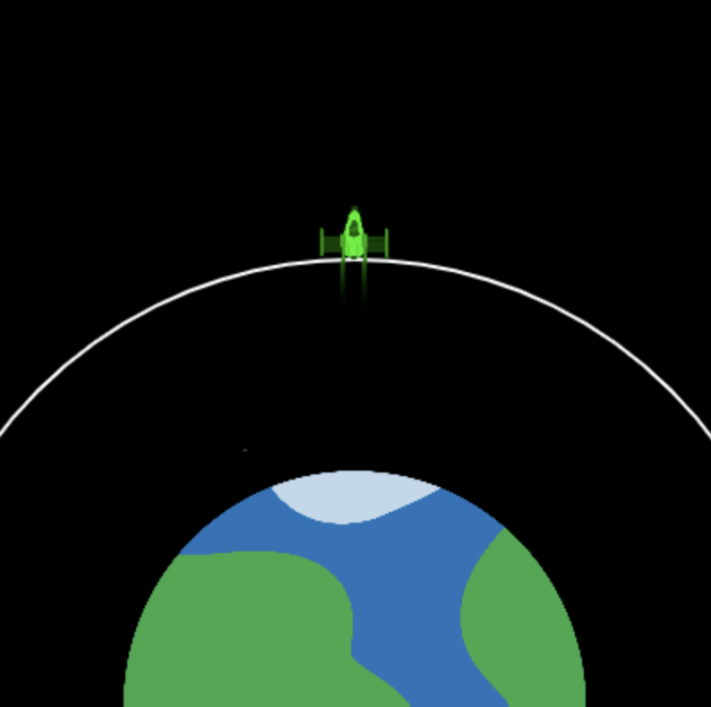

## Φτάνοντας σε τροχιά

Ο σκοπός της εκτόξευσης του πυραύλου είναι να προωθήσει έναν δορυφόρο να μπει σε τροχιά. 

Μια τροχιά είναι μια καμπύλη διαδρομή που ακολουθεί ένα αντικείμενο γύρω από ένα άλλο λόγω της βαρύτητας.

Ο πύραυλος μπορεί να αλλάξει χρώμα για να δείξει πόσο επιτυχημένη ήταν η εκτόξευση. 

{:width="400px"}

--- task ---

Δημιούργησε δύο νέες καθολικές μεταβλητές για να ορίσεις την ακτίνα του κύκλου της τροχιάς και τη θέση `y` της τροχιάς ως το σημείο που πρέπει να φτάσει το κέντρο του πυραύλου για να εκτοξεύσει τον δορυφόρο.

--- code ---
---
language: python filename: main.py line_numbers: true line_number_start: 7
line_highlights: 11-12
---

# Ορισμός καθολικών μεταβλητών
screen_size = 400   
rocket_y = screen_size   
burn = 100   
orbit_radius = 250   
orbit_y = screen_size - orbit_radius

--- /code ---

--- /task ---

--- task ---

Ενημέρωσε τη συνάρτηση `draw_background()` για να σχεδιάσεις μια έλλειψη για να αναπαραστήσεις την τροχιά του δορυφόρου που πρέπει να φτάσει ο πύραυλος.

--- code ---
---
language: python filename: main.py - draw_background() line_numbers: true line_number_start: 37
line_highlights: 42-45
---

def draw_background():   
background(0) #Συντόμευση για το background(0, 0, 0) — μαύρο   
image(planet, width/2, height, 300, 300)

  no_fill() #Απενεργοποίηση γεμίσματος  
stroke(255) #Ορισμός της άσπρης πινελιάς   
stroke_weight(2)   
ellipse(width/2, height, orbit_radius * 2, orbit_radius * 2)

--- /code ---

--- /task ---

--- task ---

**Δοκιμή:** Εκτέλεσε το πρόγραμμά σου και έλεγξε ότι σχεδιάστηκε μια λευκή τροχιά.

{:width="300px"}

--- /task ---

Ο πύραυλος θα πρέπει να σταματήσει όταν φτάσει στην τροχιά του δορυφόρου - το τέλος της αποστολής.

--- task ---

Ενημέρωσε τον κώδικά σου `if fuel >= burn` για να ελέγξεις επίσης ότι ο πύραυλος δεν έχει φτάσει στην τροχιά.

Μπορείς να χρησιμοποιήσεις το `and` σε ένα `if` για να ελέγξεις εάν ισχύουν δύο ή περισσότερες συνθήκες.

--- code ---
---
language: python filename: main.py - draw_rocket() line_numbers: true line_number_start: 14
line_highlights: 19
---

# Η συνάρτηση draw_rocket πηγαίνει εδώ
def draw_rocket():

  global rocket_y, fuel, burn

    if fuel >= burn and rocket_y > orbit_y: #Ακόμα πετάει

--- /code ---

--- /task ---

--- task ---

**Δοκιμή:** Εκτέλεσε το έργο σου και δώσε `50000` ως ποσότητα καυσίμου. Αυτό θα πρέπει να είναι άφθονο καύσιμο για να φτάσει σε τροχιά. Ο πύραυλος θα πρέπει να σταματήσει να κινείται όταν φτάσει σε τροχιά.

--- /task ---

Ο πύραυλος θα πρέπει να έχει κόκκινο χρώμα εάν τελειώσει το καύσιμο πριν φτάσει αρκετά ψηλά για να εκτοξεύσει τον δορυφόρο.

--- task ---

--- code ---
---
language: python filename: main.py — draw_rocket() line_numbers: true line_number_start: 30
line_highlights: 34-35
---

    fill(200, 200, 200, 100)   
    for i in range(20):   
      ellipse(width/2 + randint(-5, 5), rocket_y + randint(20, 50), randint(5, 10), randint(5, 10))

  if fuel < burn and rocket_y > orbit_y: #Δεν υπάρχει καύσιμο και δεν είναι σε τροχιά tint(255, 0, 0) #Αποτυχία

--- /code ---

--- /task ---

--- task ---

**Δοκιμή:** Εκτέλεσε το έργο σου και δώσε `20000` ως ποσότητα καυσίμου. Έλεγξε ότι ο πύραυλος γίνεται κόκκινος όταν σταματά κάτω από την τροχιά.

{:width="300px"}

Αχ όχι, ο πλανήτης έγινε κόκκινος!

--- /task ---

--- task ---

Η συνάρτηση `tint()` ορίζει το χρώμα απόχρωσης για όλες τις εικόνες που σχεδιάζονται μέχρι να αλλάξεις την απόχρωση ή να χρησιμοποιήσεις το `no_tint()` για να το απενεργοποιήσεις.

**Επίλεξε:** Πρόσθεσε μια κλήση στο `no_tint()` αφού σχεδιάσεις την εικόνα, έτσι ώστε ο πλανήτης να μην είναι κόκκινος στο επόμενο καρέ — ή άφησέ το αν θέλεις ο πλανήτης να γίνει κόκκινος!

--- code ---
---
language: python filename: main.py - draw_rocket() line_numbers: true line_number_start: 34
line_highlights: 38
---

if fuel < burn and rocket_y > orbit_y: tint(255, 0, 0) #Αποτυχία

image(rocket, width/2, rocket_y, 64, 64)   
no_tint() #Έτσι ο πλανήτης δεν θα έχει κόκκινη απόχρωση στο επόμενο καρέ!

--- /code ---

--- /task ---

--- task ---

Χρησιμοποίησε ξανά τη συνάρτηση `tint()`, αυτή τη φορά για να χρωματίσεις τον πύραυλο πράσινο εάν ο πύραυλος έχει αρκετό καύσιμο για να φτάσει στην τροχιά του δορυφόρου:

--- code ---
---
language: python filename: main.py - draw_rocket() line_numbers: true line_number_start: 34
line_highlights: 36-37
---

if fuel < burn and rocket_y > orbit_y: tint(255, 0, 0) #Αποτυχία   
elif rocket_y <= orbit_y:   
tint(0, 255, 0) #Επιτυχία

image(rocket, width/2, rocket_y, 64, 64)   
no_tint()

--- /code ---

--- /task ---

--- task ---

**Δοκιμή:** Εκτέλεσε το έργο σου και δώσε `50000` ως ποσότητα καυσίμου. Έλεγξε ότι ο πύραυλός σου γίνεται πράσινος όταν φτάσει στην τροχιά του δορυφόρου.

{:width="300px"}

--- /task ---

Τώρα έχεις μια προσομοίωση που μπορεί να χρησιμοποιηθεί για να δείξει πόσο καύσιμο χρειάζεται τουλάχιστον για να φτάσει στην τροχιά του δορυφόρου. Αυτό είναι υπέροχο! Ωστόσο, θα μπορούσες να πάρεις μια τεράστια ποσότητα καυσίμου και να είναι επιτυχημένη η εκτόξευση, αλλά αυτό είναι δαπανηρό και σπάταλο!

--- task ---

Τροποποίησε τους όρους στον κώδικα επιτυχίας σου, ώστε ο πύραυλος να γίνει πράσινος μόνο εάν φτάσει στην τροχιά `και` έχει λιγότερο από 1.000 κιλά υπολειπόμενου καυσίμου.

Πρόσθεσε κώδικα για να χρωματίσεις τον πύραυλο κίτρινο εάν ο πύραυλος έχει περισσότερα από 1.000 κιλά υπολειπόμενου καυσίμου όταν φτάσει σε τροχιά.

--- code ---
---
language: python filename: main.py line_numbers: true line_number_start: 34
line_highlights: 36, 38-39
---

if fuel < burn and rocket_y > orbit_y: tint(255, 0, 0) #Αποτυχία   
elif fuel < 1000 and rocket_y <= orbit_y:   
tint(0, 255, 0) #Επιτυχία   
elif fuel >= 1000 and rocket_y <= orbit_y:    
tint(255, 200, 0) #Πάρα πολύ καύσιμο

image(rocket, width/2, rocket_y, 64, 64)    
no_tint() #Έτσι ο πλανήτης δεν είναι χρωματισμένος στο επόμενο καρέ!

--- /code ---

--- /task ---

--- task ---

**Δοκιμή:** Εκτέλεσε το πρόγραμμά σου πολλές φορές με διαφορετικούς αριθμούς. Για παράδειγμα, 25.000 κιλά καυσίμου θα πρέπει να είναι η ποσότητα που χρειάζεται για να γίνει πράσινος ο πύραυλος, αλλά επίσης έλεγξε ότι η κίτρινη απόχρωση λειτουργεί επίσης χρησιμοποιώντας μεγαλύτερο αριθμό.

{:width="300px"}

--- /task ---

--- save ---
