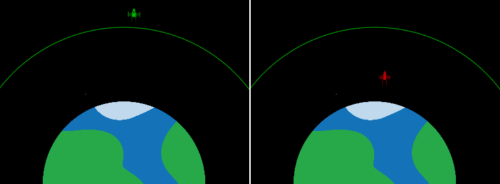

  <a class="c-survey-banner__link" href="https://form.raspberrypi.org/f/code-editor-feedback" target="_blank">Take our survey</a> to help make our Code Editor better!

## You will make

Make an animation to propel a satellite into orbit — by hitching a ride on a rocket! Your animation will create cool graphic effects and simulate the best amount of fuel to give the rocket. 

**Computer simulations** are used to calculate what will happen when we send a rocket into space. Running simulations and making plans on a computer reduces the risk of expensive or dangerous problems in space.

You will:
+ Use **images** in your animations
+ Use `for` loops to repeat actions
+ Join conditions with `and`

--- no-print ---

### Play ▶️

--- task ---

  
You need to supply the rocket with enough fuel to reach the satellite orbit. Try a small amount (around 10,000kg) and a very large amount (around 50,000kg) to see what happens. 

How much fuel is just enough without too much left over?

<iframe src="https://editor.raspberrypi.org/en/embed/viewer/rocket-launch-example" width="400" height="710" frameborder="0" marginwidth="0" marginheight="0" allowfullscreen>
</iframe>

--- /task ---

--- /no-print ---

--- print-only ---

--- /print-only ---

{:width="300px"} Dorothy Vaughan made important contributions to early spaceflight. Seeing that the future would use electronic computers, she taught herself, and her team, how to code.

The film *Hidden Figures* tells the story of how Dorothy and other Black women played a key role in the success of the US space program. 
