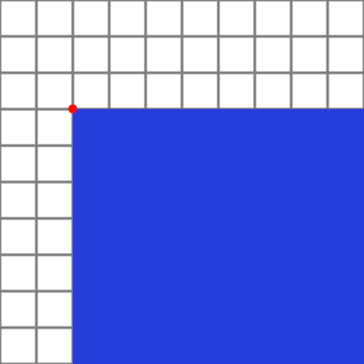

## Placing a planet

You will now create your program, and add a sprite for the planet your rocket will be launching from.

{:width="300px"}

--- task ---

Open the [project template](https://trinket.io/python/b0f4874ac4){:target="_blank"} and remix it.

--- save ---

--- /task ---

First, setup the black background of space.

--- task ---

Add some variables for your animation's width and height where the comments tell you to create global variables:

--- code ---
---
language: python
filename: main.py
line_numbers: true
line_number_start: 6 
line_highlights: 7-9
---
# Setup global variables 
SCREEN_WIDTH = 480
SCREEN_HEIGHT = 400

--- /code ---

**Tip:** When Python programmers won't be changing the value of a variable as the program is running, they name it with UPPERCASE LETTERS.

Then use those variables to set the animation's size in the `setup` function:

--- code ---
---
language: python
filename: main.py
line_numbers: true
line_number_start: 18 
line_highlights: 20-21
---
def setup():
  # Setup your animation here
  size(SCREEN_WIDTH, SCREEN_HEIGHT)
  
--- /code ---

--- /task ---

--- task ---

Create a `draw_bg` function below the comment that tells you where it should go. Use `background` to set the background colour to black.

--- code ---
---
language: python
filename: main.py
line_numbers: true
line_number_start: 16 
line_highlights: 17-19
---
# The draw_bg function goes here
def draw_bg():
  background(0,0,0)
--- /code ---

**Tip:** Placing the instructions for drawing the background into their own function means that you can easily re-draw the background in every frame of your animation by calling `draw_bg`.
--- /task ---

--- task ---

To make the background appear, call `draw_bg` in `draw`. This will cause the background to be re-drawn every time `draw` is called, covering over any older drawing.

--- code ---
---
language: python
filename: main.py
line_numbers: true
line_number_start: 24 
line_highlights: 26-27
---
def draw():
  # Things to do in every frame
  draw_bg()
  
--- /code ---

--- save ---

**Test:** Run your code and check that it draws a black background.

--- /task ---

Now you need to add the planet image to your animation.

--- task ---

First, you need to add a couple of global variables. `planet` will hold the sprite's image file. `PLANET_RADIUS` other will set its radius, which you'll use to control its size.

--- code ---
---
language: python
filename: main.py
line_numbers: true
line_number_start: 6 
line_highlights: 9-12
---
# Setup global variables 
SCREEN_WIDTH = 480
SCREEN_HEIGHT = 400
PLANET_RADIUS = 150

planet = None

--- /code ---

--- /task ---

--- task ---

Now update the `setup` function to load `planet.png` into `planet`. Remember that, to update a global variable, you have to declare it with the `global` keyword inside of `setup`.

<mark>Give them a choice on loading their own planet image?</mark>

--- code ---
---
language: python
filename: main.py
line_numbers: true
line_number_start: 23 
line_highlights: 25–27
---
def setup():
  # Setup your animation here
  global planet
  planet = load_image('planet.png')
  
  size(SCREEN_WIDTH, SCREEN_HEIGHT)
--- /code ---

--- /task ---

You'll use the `image` function to draw the sprite. The function needs to be told how big the sprite should be, and where to position its top-left corner on the grid (represented by the red circle in the image below). Because you need to line the centre of the image up with the centre of the grid (represented by the pink diamond), you need to subtract half the width of the image (the value of the `PLANET_RADIUS` variable) from the x-coordinate of the centre of the grid (half of the `SCREEN_WIDTH` variable). Likewise, to have half the image hidden below the bottom of the grid, you need to subtract `PLANET_RAIUS` from the y-coordinate of the bottom of the grid (the `SCREEN_HEIGHT` variable).

--- task ---

Update the code in `draw_bg` to draw the planet sprite:

--- code ---
---
language: python
filename: main.py
line_numbers: true
line_number_start: 20 
line_highlights: 23-31
---
def draw_bg():
  background(0,0,0)
  
  # Draw the planet you're launching from
  image(
  planet, # sprite
  (SCREEN_WIDTH/2)-PLANET_RADIUS, # x top-left corner
  SCREEN_HEIGHT-PLANET_RADIUS, # y top-left corner
  PLANET_RADIUS*2, # sprite width
  PLANET_RADIUS*2 # sprite height
  )
  
--- /code ---

--- save ---

**Test:** Run your code and watch the planet appear!

--- /task ---