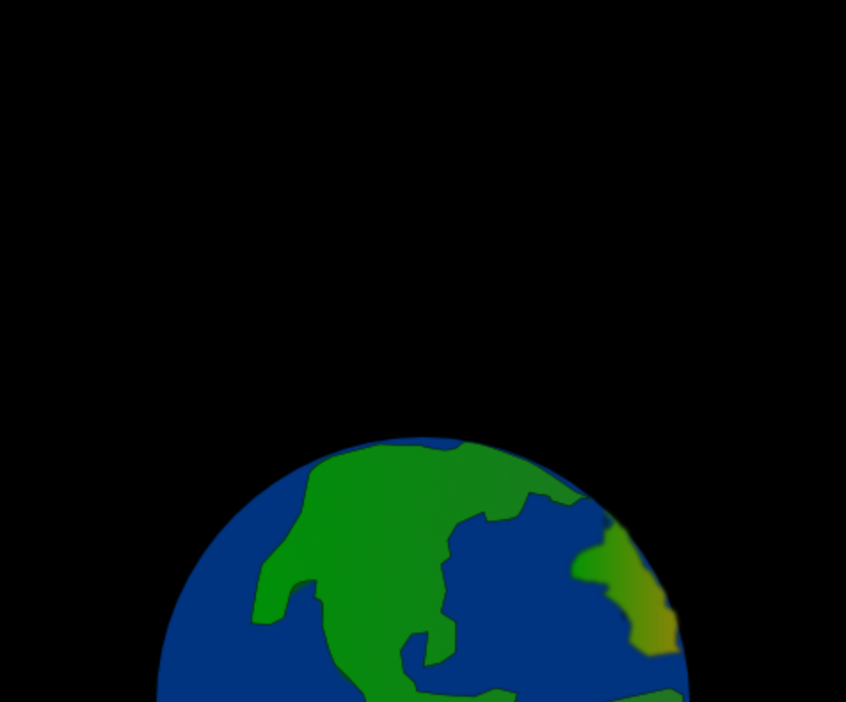

## Set the scene

The animation needs a space backdrop with a planet to launch the rocket from.

{:width="300px"}

--- task ---

Open the [project template](https://editor.raspberrypi.org/en/projects/rocket-launch-starter){:target="_blank"}.

### Create the screen

--- /task ---

You will use a `screen_size` variable to set the size of the screen and in calculations. Variables defined outside functions are **global** so you can use them anywhere in your program.

--- task ---

Find the comment `Setup global variables` and add a line of code to create your `screen_size` variable:

--- code ---
---
language: python
filename: main.py
line_numbers: true
line_number_start: 7 
line_highlights: 8
---

# Setup global variables    
screen_size = 400   

--- /code ---

--- /task ---

--- task ---

Use the `screen_size` variable to create a square 400 by 400 pixels:

--- code ---
---
language: python
filename: main.py — setup()
line_numbers: true
line_number_start: 18
line_highlights: 20
---

def setup():   
    # Setup your animation here   
    size(screen_size, screen_size)   
  

--- /code ---

--- /task ---

### Choose an image

--- task ---

The starter project has three different planet images and the moon provided for you. You can view these in the **Image gallery** on the left hand side of the code editor.

**Choose:** Decide which image you want to use and make a note of the filename. For example, `orange_planet.png`.

--- /task ---

--- task ---

Add code to the `setup()` function to load and position your image. 

The `image_mode(CENTER)` line says that you will be positioning images by giving the coordinates of the centre of the image (instead of the top left corner).

Next load your image into a global `planet` variable. The variable needs to be global so you can use it later when you draw the planet to the screen.

--- code ---
---
language: python
filename: main.py
line_numbers: true
line_number_start: 18 
line_highlights: 21-23
---

def setup():   
    # Setup your animation here   
    size(screen_size, screen_size)   
    image_mode(CENTER)  # Positions the image in the center
    global planet   
    planet = load_image('planet.png')  # Your chosen planet

--- /code ---

--- /task ---

### Draw background

--- task ---

Define a `draw_background()` function, to draw the background, below the comment that tells you where it should go. 

Use `background(0)` to set the background colour to black and add an `image()` function to draw the planet. The `image()` function is laid out:

`image(image filename, x-coordinate, y-coordinate, image_width, image_height)`

The line of code `from p5 import *` gives you global `width` and `height` variables based on the size of the screen. Use these in your code to position the planet with its centre half-way across (`width/2`) and at the bottom (`height`) of the screen.

--- code ---
---
language: python
filename: main.py — draw_background()
line_numbers: true
line_number_start: 14 
line_highlights: 15-17
---

# The draw_background function goes here   
def draw_background():   
    background(0)  # Short for background(0, 0, 0) — black    
    image(planet, width/2, height, 300, 300)  # Draw the image
  

--- /code ---

Putting all the code for drawing the background into one function makes your code easier to understand.

--- /task --- 

--- task ---

To make the background appear, call `draw_background()` in `draw()`. This will cause the background to be re-drawn every time `draw()` is called, covering over any older drawing:

--- code ---
---
language: python
filename: main.py — draw()
line_numbers: true
line_number_start: 28 
line_highlights: 30
---

def draw():   
    # Things to do in every frame    
    draw_background()
  
--- /code ---

--- /task ---

--- task ---

**Test:** Run your code and check that it draws a black background with half a planet at the bottom.

--- /task ---

If you have a Raspberry Pi account, on your code editor you can click on the **Save** button to save a copy of your project to your Projects.

--- save ---
