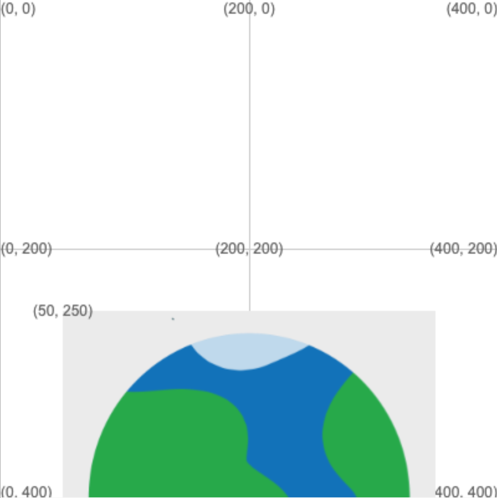

## Placing a planet

You will now create your program, and add a sprite for the planet your rocket will be launching from.

{:width="300px"}

--- task ---

Open the [project template](https://trinket.io/python/b0f4874ac4){:target="_blank"} and remix it.

--- save ---

--- /task ---

First, setup the black background of space.

--- task ---

Add some variables for your animation's width and height where the comments tell you to create global variables:

--- code ---
---
language: python
filename: main.py
line_numbers: true
line_number_start: 6 
line_highlights: 7-9
---
# Setup global variables 
SCREEN_WIDTH = 400
SCREEN_HEIGHT = 400

--- /code ---

**Tip:** When Python programmers won't be changing the value of a variable as the program is running, they name it with UPPERCASE LETTERS. Variables like this are called **constants**.

--- /task ---

--- task ---

Use the variables you've created to set the animation's size in the `setup` function:

--- code ---
---
language: python
filename: main.py — setup()
line_numbers: true
line_number_start: 16
line_highlights: 18-20
---
def setup():
  # Setup your animation here
  size(SCREEN_WIDTH, SCREEN_HEIGHT)
  

--- /code ---

--- /task ---

--- task ---

Create a `draw_bg()` function, to draw the background, below the comment that tells you where it should go. Use `background()` to set the background colour to black.

--- code ---
---
language: python
filename: main.py — draw_bg()
line_numbers: true
line_number_start: 14
line_highlights: 15-18
---
# The draw_bg function goes here
def draw_bg():
  background(0,0,0)

--- /code ---

**Tip:** Placing the instructions for drawing the background into their own function means that you can easily re-draw the background in every frame of your animation by calling `draw_bg()`.
--- /task ---

--- task ---

To make the background appear, call `draw_bg()` in `draw()`. This will cause the background to be re-drawn every time `draw()` is called, covering over any older drawing.

--- code ---
---
language: python
filename: main.py — draw()
line_numbers: true
line_number_start: 24 
line_highlights: 26-28
---
def draw():
  # Things to do in every frame
  draw_bg()
  

--- /code ---

--- save ---

**Test:** Run your code and check that it draws a black background.

--- /task ---

Now you need to add the planet image to your animation.

--- task ---

First, you need to add a couple of global variables. `planet` will hold the sprite's image file. `PLANET_RADIUS` other will set its radius, which you'll use to control its size.

--- code ---
---
language: python
filename: main.py
line_numbers: true
line_number_start: 6 
line_highlights: 9-12
---
# Setup global variables 
SCREEN_WIDTH = 400
SCREEN_HEIGHT = 400
PLANET_RADIUS = 150

planet = None  # Make an empty variable

--- /code ---

--- /task ---

--- task ---

Now update the `setup()` function to load `planet.png` into `planet`. Remember that, to update a global variable, you have to declare it with the `global` keyword inside of `setup()`.

<mark>Give them a choice on loading their own planet image — will add instructions when I get a variety of planet images.</mark>

--- collapse ---
---
title: Adding your own image to Trinket
---

If you want to use your own picture for the planet — or the rocket later — then you can do that by choosing the 'View and add images' button.

Then choose 'Image Library' and follow the on-screen instructions to upload an image to your Trinket image library.

Note the filename of the image you've uploaded, and use it in the code in place of `planet.png`.

--- /collapse ---

--- code ---
---
language: python
filename: main.py — setup()
line_numbers: true
line_number_start: 22 
line_highlights: 24–26
---
def setup():
  # Setup your animation here
  global planet
  planet = load_image('planet.png')
  
  size(SCREEN_WIDTH, SCREEN_HEIGHT)
--- /code ---

--- /task ---

You'll use the `image()` function to draw the sprite. 

--- collapse ---
---
title: Centering the sprite with the image function
---

You'll use the `image()` function to draw the sprite. The function needs to know how big the sprite should be: that's twice `PLANET_RADIUS`.

The function also needs to know where to put the sprite's top-left corner. To place the centre of the image at the centre of the grid, you need to do a little maths: 
 + The x-coordinate of the top-left corner needs to be the centre of the grid, minus half the width of the sprite: `(SCREEN_WIDTH/2)-PLANET_RADIUS`
 + The y-coordinate of the top-left corner needs to be the y-coordinate of the bottom of the screen, minus half the width of the sprite: `SCREEN_HEIGHT-PLANET_RADIUS`

--- /collapse ---

--- task ---

Update the code in `draw_bg()` to draw the planet sprite:

--- code ---
---
language: python
filename: main.py — draw_bg()
line_numbers: true
line_number_start: 18 
line_highlights: 20-28
---
def draw_bg():
  background(0,0,0)
  
  # Draw the planet you're launching from
  image(
    planet, # sprite
    (SCREEN_WIDTH/2)-PLANET_RADIUS, # x top-left corner
    SCREEN_HEIGHT-PLANET_RADIUS, # y top-left corner
    PLANET_RADIUS*2, # sprite width
    PLANET_RADIUS*2 # sprite height
    )
  
--- /code ---

**Tip:** When calling a function with lots of parameters, like `image()`, you can split the parameters onto different lines to make the code easier to read.

--- save ---

**Test:** Run your code and watch the planet appear!

--- /task ---