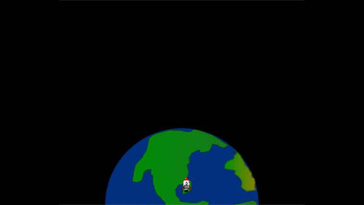

## Liftoff!

Each time a new frame is drawn the rocket needs to move up the screen to create an animation effect.

{:width="300px"}

--- task ---

The starter project has a rocket image provided for you. 

--- /task ---

--- task ---

Add code to the `setup()` function to load the rocket image into a `rocket` global variable. 

--- code ---
---
language: python
filename: main.py
line_numbers: true
line_number_start: 17 
line_highlights: 21, 23
---
def setup():
  # Setup your animation here
  size(screen_size, screen_size)
  image_mode(CENTER)
  global planet, rocket
  planet = load_image('planet.png')
  rocket = load_image('rocket.png')

--- /code ---

--- /task ---

The y position of the rocket will start at 400 (the screen height) and then decrease by 1 each time a new frame is drawn.

--- task ---

Add a `rocket_y` global variable to keep track of the rocket's y position. 

--- code ---
---
language: python
filename: main.py
line_numbers: true
line_number_start: 7 
line_highlights: 9
---
# Setup global variables 
screen_size = 400
rocket_y = screen_size # start at the bottom

--- /code ---

--- /task ---

--- task ---

Define a `draw_rocket()` function to change the rocket's y position and draw it.

`rocket_y -= 1` is a shorter way of saying `rocket_y = rocket_y - 1`.

--- code ---
---
language: python
filename: main.py
line_numbers: true
line_number_start: 16 
line_highlights: 17-21 
---
# The draw_rocket function goes here
def draw_rocket():

  global rocket_y # say we want to use the global rocket_y variable
  rocket_y -= 1 # move the rocket
  image(rocket, width/2, rocket_y, 64, 64)

--- /code ---

--- /task ---

--- task ---

Call your new `draw_rocket()` in the `draw()` function so that the rocket gets redrawn every frame.

--- code ---
---
language: python
filename: main.py
line_numbers: true
line_number_start: 31 
line_highlights: 34 
---
def draw():
  # Things to do in every frame
  draw_background()
  draw_rocket()

--- /code ---

--- /task ---

--- task ---  

**Test:** Run your code to check that the rocket starts at the bottom of the screen and moves up each frame.

--- /task ---

--- save ---