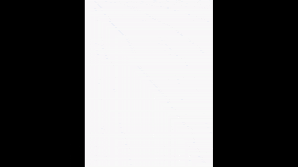

## Countdown

Before launching, rockets have a countdown. To create this in your program, you're going to use a `for` loop.

{:width="300px"}

You can use Python's built-in `range()` function — which makes a sequence of numbers in order — to give you the numbers you'll need for your countdown. When calling `range()` you can pass it a single number. If you do, `range()` will give you the sequence of all the numbers counting up to the number you gave it.

--- task ---

First, create a `countdown()` function where the comments tell you to. Inside that function, create the sequence of numbers to count down.

--- code ---
---
language: python
filename: main.py — countdown()
line_numbers: true
line_number_start: 15
line_highlights: 16-20
---
# The countdown function goes here
def countdown():

  count = range(10)

--- /code ---

--- /task ---

A `for` loop repeats a piece of code once for every item it is given. By giving it the sequence stored in `count`, you can print out all those numbers with very little code.

--- task ---

--- code ---
---
language: python
filename: main.py — countdown()
line_numbers: true
line_number_start: 15
line_highlights: 19-21
---
# The countdown function goes here
def countdown():

  count = range(10)
  
  for t_minus in count:
    print('T minus', t_minus) # Print at each step

--- /code ---

--- /task ---

**Tip:** The value of the **loop variable** — which you have called `t_minus` here — changes every time the loop restarts, moving through all the items the `for` loop was given, in order.

Then add a lift-off message once the coundown is complete. Do this by adding `print`s that are outside the `for` loop, but still inside `countdown`.

--- code ---
---
language: python
filename: main.py — countdown()
line_numbers: true
line_number_start: 16
line_highlights: 23-24
---
def countdown():

  count = range(10)

  for t_minus in count:
    print('T minus', t_minus) # Print at each step

  print('We have liftoff!')
  print('🚀🚀🚀🚀🚀')

--- /code ---

--- /task ---

--- task ---

Now add a call to `countdown` at the end of `setup`, so it runs before the animation starts.

--- code ---
---
language: python
filename: main.py — setup()
line_numbers: true
line_number_start: 41
line_highlights: 48
---
def setup():
  # Setup your animation here
  global planet
  planet = load_image('planet.png')
  
  size(SCREEN_WIDTH, SCREEN_HEIGHT)
  
  countdown()
  
  
--- /code ---

--- save ---

**Test:** Run your code and see what happens

--- /task ---

There are a few problems with what your code does right now:
 + The numbers count up instead of down
 + The numbers only go as far as 9, even though you used `range(10)`
 + The coundown happens instantly, but in a real rocket launch each number is a second apart

--- task ---

First, fix the numbers: `range(10)` creates a sequence of numbers between 0 and 10. It starts at zero becasuse computers usually start counting from zero. The sequence `range()` creates includes 0, but does not include 10. So, to get the 10 included, you will have to use `range(11)`. 

--- code ---
---
language: python
filename: main.py — countdown()
line_numbers: true
line_number_start: 18
line_highlights: 18
---
  count = range(11)

  for t_minus in count:
    print('T minus', t_minus) # Print at each step
--- /code ---

**Test:** If you run this code, you'll see 10 in the program's output.

The range is still in the wrong order. But, `range` behaves differently if you give it three numbers instead of one:
 + The first number is the start of the range 
 + The second number is the end of the range
 + The third number is the step between them

So `range(5, 20, 5)` will produce 5, 10, 15. You can also count backwards, by using a negative step. Update your `countdown()` function to use a step of `-1`, and to count down from ten to zero. Just like you had to use `range(11)` to get 10 to appear in the results, you'll have to go to `-1` to get 0 to appear.

--- code ---
---
language: python
filename: main.py — countdown()
line_numbers: true
line_number_start: 18
line_highlights: 18
---
  count = range(10,-1,-1)

  for t_minus in count:
    print('T minus', t_minus) # Print at each step
--- /code ---

--- save ---

**Test:** Run the code, and check that you get the countdown from 10 to 0.

--- /task ---

The countdown is still happening too fast. You need to make Python wait for a second between each number. You can do this using the `sleep()` function, which you can `import` from the `time` library.

--- task ---

First, add the `import` at the top of the file:

--- code ---
---
language: python
filename: main.py
line_numbers: true
line_number_start: 3 
line_highlights: 5
---
# Import library code
from p5 import *
from time import sleep
--- /code ---

Then update the `for` loop in `countdown()` to call the `sleep()` function, passing it the number of seconds to wait.

**Tip:** Programmers often describe telling a function to run as **calling** it. Likewise, they describe giving the function values to use as **passing** those values to the function.

--- code ---
---
language: python
filename: main.py — countdown()
line_numbers: true
line_number_start: 21 
line_highlights: 23
---
  for t_minus in range(10,-1,-1):
    print('T minus', t_minus) # Print at each step
    sleep(1)

  print('We have liftoff!')
  print('🚀🚀🚀🚀🚀')
--- /code ---

--- save ---

**Test:** Run your code and watch the countdown!

**Tip:** Because you'll be running your code a lot to test it, you might want to pass a lower value to sleep for now (maybe `0.1`) and then change it back when you're ready to share your animation with others.

--- /task ---
