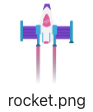

## Lift off!

The starter project has a rocket image provided for you. 

--- task ---
Add code to the `setup()` function to load the rocket image into a `rocket` global variable. 

--- code ---
---
language: python
filename: main.py
line_numbers: true
line_number_start: 18
line_highlights: 22, 24
---

def setup():   
    # Set up your animation here   
    size(screen_size, screen_size)   
    image_mode(CENTER)   
    global planet, rocket   
    planet = load_image('planet.png')    
    rocket = load_image('rocket.png')    

--- /code ---
--- /task ---

--- task ---

Add a `rocket_position` global variable to keep track of the rocket's `y` position. 

--- code ---
---
language: python
line_numbers: true
line_number_start: 6 
line_highlights: 8
---

# Setup global variables    
screen_size = 400    
rocket_position = screen_size  

--- /code ---

--- /task ---

The `y` position of the rocket will start at 400 (the screen height) and then decrease by 1 each time a new frame is drawn.

--- task ---

Add a `rocket_y` global variable to keep track of the rocket's `y` position. 

--- code ---
---
language: python
filename: main.py
line_numbers: true
line_number_start: 7 
line_highlights: 9
---

# Setup global variables    
screen_size = 400    
rocket_y = screen_size  # Start at the bottom

--- /code ---

The `rocket_position` is set to the `screen_size` at the start so that the rocket appears right at the bottom edge of the screen. 

--- /task ---

--- task ---

Define a `draw_rocket()` function to make the rocket appear on the screen.

--- code ---
---
language: python
line_numbers: true
line_number_start: 9 
line_highlights: 10-12 
---

# The draw_rocket function goes here   
def draw_rocket():   
    global rocket_position      
    image(rocket, width/2, rocket_position, 64, 64)    

--- /code ---

--- /task ---

--- task ---

Call the `draw_rocket()` function.

--- code ---
---
language: python
line_numbers: true
line_number_start: 28 
line_highlights: 31 
---

def draw():
    # Things to do in every frame
    draw_background()
    draw_rocket() 

--- /code ---

--- /task ---

--- task ---  

**Test:** Run your code and check that the rocket appears at the bottom of the image. 

--- /task ---

Each time a new frame is drawn, you need to move the rocket one pixel up the screen to create an animation effect.

--- task ---

The `rocket_position` of the rocket will start at 400 (the screen height) and then decrease by 1 each time a new frame is drawn.

--- code ---
---
language: python
line_numbers: true
line_number_start: 8 
line_highlights: 11
---

# The draw_rocket function goes here   
def draw_rocket():   
    global rocket_position     
    rocket_position = rocket_position - 1    
    image(rocket, width/2, rocket_position, 64, 64)    
--- /code ---

--- /task ---

--- task ---

**Test:** Run your code to check that the rocket blasts off from the bottom of the screen.

{:width="300px"}

--- /task ---