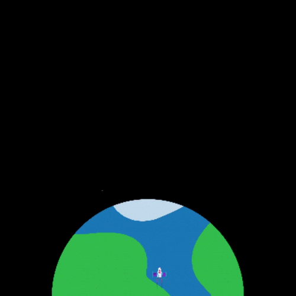

## Liftoff!

Make your rocket fly, by creating a function that accepts a parameter.

{:width="300px"}

Functions that accept parameters as inputs are really powerful tools: they let you create a piece of code that produces different outputs based on its inputs, which can be very useful in your programming. You've actually used lots of these kinds of functions already: the `print()`, `sleep()`, and `background()` functions all accept parameters that change what gets printed, how long the program waits for, and what colour the background is, respectively. The function you're going to create will use the amount of time the animation has been running to decide where to draw your rocket.

Create a function called `fly()` that accepts a parameter called `frames`. You give a function parameters by placing them in the parentheses after the function's name when you define it with `def`. Have it set a variable called `how_far` to ten times `frames`. Then have it print that variable out.

--- task ---

--- code ---
---
language: python
filename: main.py — fly()
line_numbers: true
line_number_start: 14 
line_highlights: 15-20
---
# The fly function goes here
def fly(frames):
  
  how_far = 10 * frames
  print(how_far)

--- /code ---

--- /task ---

Add a line to the `draw()` function that calls your `fly()` function and passes `frame_count` to it. `frame_count` is a variable built-in to the p5 library, that counts number of frames of your animation that have been drawn.

--- task ---

--- code ---
---
language: python
filename: main.py — draw()
line_numbers: true
line_number_start: 58
line_highlights: 61-62
---
def draw():
  # Things to do in every frame
  draw_bg()
  
  fly(frame_count)

--- /code ---

**Tip:** When you pass a variable into a function like this, you are passing its value at the moment you call the function. Changes you make to the value inside the function won't change the original variable.

--- save ---

--- /task ---

--- task ---

**Test:** Run your program. After the countdown compleets, you should see numbers printing out, each 10 higher than the one before it. This will go on forever, so stop the program after you've seen this.

--- /task ---

These numbers, that your code prints out, can be used as the y-coordinates for drawing your rocket flying into orbit.

You'll need a rocket sprite, which you can create the same way you created the planet sprite. First, declare global variables to hold the height and width of the rocket, as well as one to hold the rocket image itself.

--- task ---

--- code ---
---
language: python
filename: main.py
line_numbers: true
line_number_start: 10 
line_highlights: 11-12, 15-16
---
PLANET_RADIUS = 150
ROCKET_HEIGHT = 32
ROCKET_WIDTH = 20

planet = None  # Make an empty variable
rocket = None

--- /code ---

--- /task ---

Then load the rocket as part of your `setup()` function. Make sure you add it to the list of `global` variables at the start of the function too, as you'll need to be able to use it in the other functions of your program.

--- task ---

--- code ---
---
language: python
filename: main.py — setup()
line_numbers: true
line_number_start: 51 
line_highlights: 53, 55
---
def setup():
  # Setup your animation here
  global planet, rocket
  planet = load_image('planet.png')
  rocket = load_image('rocket.png')

--- /code ---

--- /task ---

Now you need to draw your rocket sprite into your animation. To do this, you'll modify the fly function to delete the `print()` statement and add `image()` instead. Because you need the rocket to move by `how_far` every frame, you will use `translate()` to shift the screen in each frame before drawing the image. 

`translate()` moves the screen into a different position based on coordinates. The shapes on the screen will move with it but their appearance will not change. A translation can move the screen horizontally, vertically, or diagonally.

--- task ---

--- code ---
---
language: python
filename: main.py — fly()
line_numbers: true
line_number_start: 18
line_highlights: 22-35
---
def fly(frames):
  
  how_far = 10 * frames
  
  # Put the rocket in the middle of the screen
  rocket_x = SCREEN_WIDTH/2
  # Keep the rocket above the bottom of the screen
  rocket_y = SCREEN_HEIGHT-ROCKET_HEIGHT

  # Move the screen to position the rocket
  translate(rocket_x, rocket_y - how_far)
  
  image(
    rocket, # sprite
    0, # x-coordinate — 0 because translate did the moving
    0, # y-coordinate — 0 because translate did the moving
    ROCKET_WIDTH, # sprite width
    ROCKET_HEIGHT # sprite height
    )

--- /code ---

--- save ---

--- /task ---

--- task ---

**Test:** Run your code and watch the rocket fly!

--- /task ---

That looks great, but maybe a little too fast? You can adjust how quickly your animation happens by changing the **frame rate** — the number of frames your animation draws every second. Add the `frame_rate` function to `setup` and use it to set your animation to ten frames per second:

--- task ---

--- code ---
---
language: python
filename: main.py — setup()
line_numbers: true
line_number_start: 67
line_highlights: 
---
def setup():
  # Setup your animation here
  frame_rate(10)
  global planet, rocket
  planet = load_image('planet.png')
--- /code ---

--- save ---

**Test:** Run the program again, and see the difference.

**Choose:** You can adjust the frame rate if you think it's still too fast, or too slow. If you want it to go faster, you may reach the limits of your computer, or screen.

--- /task ---