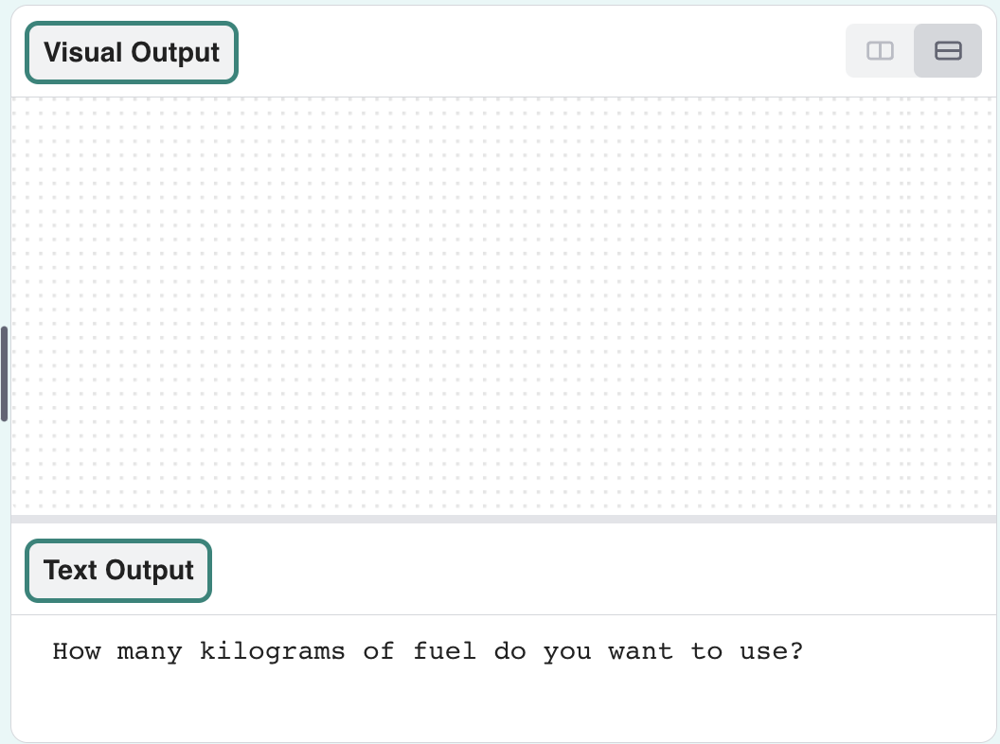
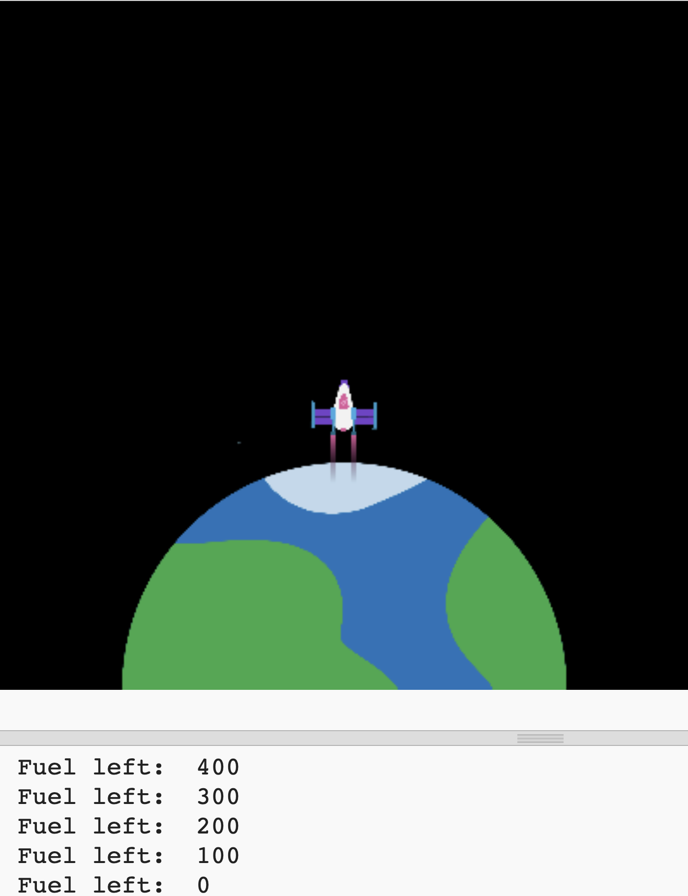

## Burn fuel

One of the most important things to decide when launching a rocket is how much fuel to load into it. 

To do this, you need to simulate how much fuel will be burned on the journey.

{:width="300px"}

### Create a fuel variable

--- task ---

Add a variable to keep track of how much fuel your rocket burns (in frames).

--- code ---
---
language: python
filename: main.py
line_numbers: true
line_number_start: 7 
line_highlights: 10
---

# Setup global variables    
screen_size = 400   
rocket_y = screen_size  
burn = 100  # How much fuel is burned in each frame

--- /code ---

--- /task ---

--- task ---

At the bottom of your program, add code to ask the user how much fuel to add to the rocket and store their answer in a `fuel` global variable. 

--- code ---
---
language: python
filename: main.py 
line_numbers: true
line_number_start: 51
line_highlights: 51
---

fuel = int(input('How many kilograms of fuel do you want to use?'))   
run()
  
--- /code ---

--- /task ---

### Check fuel against burn

The rocket should only move if it hasn't burned all of its fuel.

--- task ---

Add code to the `draw_rocket()` function to reduce the remaining `fuel` by the `burn` of each frame. Use `print()` to show how much fuel is left in each frame.

You need to say that you want to use the global `fuel` and `burn` variables.

--- code ---
---
language: python
filename: main.py — draw_rocket()
line_numbers: true
line_number_start: 15 
line_highlights: 15, 17-18
---

    global rocket_y, fuel, burn   
    rocket_y -= 1   
    fuel -= burn  # Burn fuel   
    print('Fuel left: ', fuel)   

--- /code ---

--- /task ---

--- task ---

**Test:** Run your program to check that the animation doesn't start until `How many kilograms of fuel do you want to use?` has been answered. Try entering `30000` as the amount of fuel.

The rocket will keep going even if it has no fuel left. 

--- /task ---

--- task ---

The rocket should only move if it has enough fuel left. Add an `if` statement to check that `fuel >= burn`.

You will need to indent all of the lines of code before the `image()` function call. To do this, highlight all of the lines with the mouse and then tap the <kbd>Tab</kbd> on the keyboard to indent all the lines at once.

The `image()` line doesn't need to be indented because you always want to draw the rocket.

--- code ---
---
language: python
filename: main.py — draw_rocket()
line_numbers: true
line_number_start: 15
line_highlights: 17-30
---

    global rocket_y, fuel, burn  

    if fuel >= burn:  # Still got fuel   
        rocket_y -= 1   
        fuel -= burn   
        print('Fuel left: ', fuel)   
        
        no_stroke()  # Turn off the stroke   
        
        for i in range(25):   
            fill(255, 255 - i*10, 0)   
            ellipse(width/2, rocket_y + i, 8, 3)    
        
        fill(200, 200, 200, 100)   
        for i in range(20):   
            ellipse(width/2 + randint(-5, 5), rocket_y + randint(20, 50), randint(5, 10), randint(5, 10))   

    image(rocket, width/2, rocket_y, 64, 64)

--- /code ---

--- /task ---

--- task ---

**Test:** Run your program to check that the rocket stops when there is no fuel left. 

{:width="300px"}

--- /task ---

Did your rocket stop when it ran out of fuel? Well done, you sent a rocket to outer space!

--- save ---

