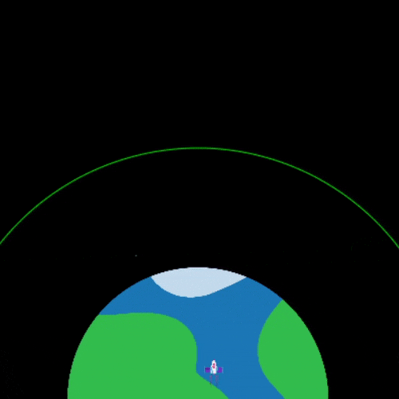

## Reaching orbit

The point of launching a rocket into space is, usually, to enter orbit of the Earth. To enter orbit, you have to get high enough above the Earth so that you no-longer fall straight back down. In reality, this is usually at least 160 km above the Earth, but since this animation is a model, you're going to be using smller, rounder, numbers. 

{:width="300px"}

--- task ---

Add a variable to give the radius of the orbit circle you're drawing around the planet. Base it on the planet radius, to make sure it's always bigger.

--- code ---
---
language: python
filename: main.py
line_numbers: true
line_number_start: 10 
line_highlights: 13-14
---
PLANET_RADIUS = 150
ROCKET_HEIGHT = 32
ROCKET_WIDTH = 20
ORBIT_RADIUS = PLANET_RADIUS + 100

--- /code ---

Then, in the `draw_bg()` function, add some code to draw a circle with that radius that is centred on the same point as the planet image. You can do this with the `ellipse()` function. Remember that, unlike `image()`, the coordinates you give `ellipse()` are for its centre.

[[[processing-python-ellipse]]]

--- code ---
---
language: python
filename: main.py — draw_bg()
line_numbers: true
line_number_start: 62
line_highlights: 64-73
---
  PLANET_RADIUS*2 # sprite height
  )
  
  no_fill() # Turn off any fill
  stroke(0, 200, 0) # Set a green stroke
  ellipse(
      SCREEN_WIDTH/2, 
      SCREEN_HEIGHT, 
      ORBIT_RADIUS*2,
      ORBIT_RADIUS*2
    )
  no_stroke() # Turn off the stroke

--- /code ---

--- save ---

**Test:** Run your code and check that it draws the circle.

--- /task ---

You should see something that looks like this:

Next, make the rocket change colour when it successfully enters orbit. You can do this by using the `tint` function to make it turn green once it has travelled far enough.

**The tint function:** Passing a colour to `tint()` lets you change the colours of any sprite you draw after it. The sprites will look like they have a light of the colour you chose shining on them.  Just like with `stroke()` and `fill()`, there is a `no_tint()` function to turn `tint()` off when you're finished with it.

To check if the rocket has travelled far enough, check if `how_far` is greater than or equal to (≥) the `ORBIT_RADIUS` you set. You can do this using `>=` as part of the test for an `if` statement.

--- task ---

Update your `fly()` function to make that test and add the tint if it passes:

--- code ---
---
language: python
filename: main.py — fly()
line_numbers: true
line_number_start: 19 
line_highlights: 23-26, 42
---
def fly(frames):
  
  how_far = 10 * frames
  
  # Reached orbit?
  if how_far >= ORBIT_RADIUS:
    tint(0, 200, 0)
  
  # Put the rocket in the middle of the screen
  rocket_x = SCREEN_WIDTH/2
  # Keep the rocket above the bottom of the screen
  rocket_y = SCREEN_HEIGHT-ROCKET_HEIGHT

  translate(rocket_x, rocket_y - how_far)
  
  image(
    rocket, # sprite
    0, # x-coordinate — 0 because translate did the moving
    0, # y-coordinate — 0 because translate did the moving
    ROCKET_WIDTH, # sprite width
    ROCKET_HEIGHT # sprite height
    )
  
  no_tint()
  

--- /code ---

--- save ---

**Test:** Run your code and watch the rocket change colour as it enters orbit.

--- /task ---