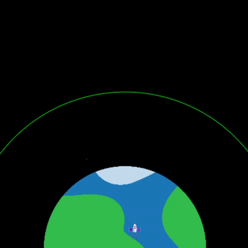

## Burn fuel

One of the most important things to decide when launching a rocket is how much fuel to load into it. 

To do this you need to simulate how much fuel will be burned on the journey.

{:width="300px"}

--- task ---

Add a variable to keep track of how much fuel your rocket burns (in frames).

--- code ---
---
language: python
filename: main.py
line_numbers: true
line_number_start: 7 
line_highlights: 10
---
# Setup global variables 
screen_size = 400
rocket_y = screen_size # start at the bottom
burn = 100 # how much fuel is burned in each frame

--- /code ---

--- /task ---

--- task ---

At the bottom of your program, add code to ask the user how much fuel to add to the rocket and store their answer in a `fuel` global variable. 

--- code ---
---
language: python
filename: main.py 
line_numbers: true
line_number_start: 49
line_highlights: 49
---
fuel = int(input('How many kilograms of fuel do you want to use?'))
run()
  
--- /code ---

--- /task ---

--- /task ---

The rocket should only move if it hasn't burned all of its fuel.

--- task ---
Add code to the `draw_rocket()` function to reduce the remaining `fuel` by `burn` each frame. Use `print()` to show how much fuel is left in each frame.

We need to say that we want to use the global `fuel` and `burn` variables.

--- code ---
---
language: python
filename: main.py — draw_rocket()
line_numbers: true
line_number_start: 20 
line_highlights: 20, 23-24
---
  global rocket_y, fuel, burn
  
  rocket_y -= 1 # move the rocket
  fuel -= burn # burn fuel
  print('Fuel left: ', fuel)
--- /code ---

--- /task ---

--- task ---
**Test:** Run your program to check that the animation doesn't start until the `How many kilograms of fuel do you want to use?` has been answered. Try entering '30000' as the amount of fuel.

The rocket will keep going even if it has no fuel left. 

--- /task ---

--- task ---

The rocket should only move if it has enough fuel left. Add an `if` statement to check that `fuel >= burn`.

You will need to indent all of the lines of code before the `image()` function call. To do this, highlight all of the lines with the mouse and then tap the <kbd>Tab</kbd> on the keyboard to indent all the lines at once.

The `image()` line doesn't need to be indented because you always wa

--- code ---
---
language: python
filename: main.py — draw_rocket()
line_numbers: true
line_number_start: 20 
line_highlights: 20, 22-35
---
  global rocket_y, fuel, burn

  if fuel >= burn: # still got fuel
    rocket_y -= 1 # move the rocket
    fuel -= burn # burn fuel
    print('Fuel left: ', fuel)
    
    no_stroke() # Turn off the stroke
    
    for i in range(25): # draw 25 burning exhaust ellipses
      fill(255, 255 - i*10, 0) # reduce amount of green
      ellipse(width/2, rocket_y + i, 8, 3) 
    
    fill(200, 200, 200, 100) # transparent grey
    for i in range(20): # draw 20 random smoke ellipses
      ellipse(width/2 + randint(-5, 5), rocket_y + randint(20, 50), randint(5, 10), randint(5, 10))

  image(rocket, width/2, rocket_y, 64, 64)

--- /code ---

--- /task ---

--- task ---

--- /task ---

--- save ---

--- task ---

**Test:** Try launching your rocket with enough fuel to reach orbit, and to fail to reach orbit. To reach orbit, use 25000 kg of fuel. To fail to reach orbit, use 24000 kg, or less.

--- /task ---

Your results should look something like this:

{:width="300px"}

{:width="300px"}

The point of launching a rocket into space is, usually, to enter orbit of the Earth. To enter orbit, you have to get high enough above the Earth so that you no-longer fall straight back down. In reality, this is usually at least 160 km above the Earth, but since this animation is a model, you're going to be using smller, rounder, numbers. 

{:width="300px"}

Add a variable to give the radius of the orbit circle you're drawing around the planet. Base it on the planet radius, to make sure it's always bigger.

--- task ---

--- code ---
---
language: python
filename: main.py
line_numbers: true
line_number_start: 10 
line_highlights: 13-14
---
PLANET_RADIUS = 150
ROCKET_HEIGHT = 32
ROCKET_WIDTH = 32
ORBIT_RADIUS = PLANET_RADIUS + 100

--- /code ---

--- /task ---

Then, in the `draw_bg()` function, add some code to draw a circle with that radius that is centred on the same point as the planet image. You can do this with the `ellipse()` function. Remember that, unlike `image()`, the coordinates you give `ellipse()` are for its centre.

[[[processing-python-ellipse]]]

--- task ---

--- code ---
---
language: python
filename: main.py — draw_bg()
line_numbers: true
line_number_start: 62
line_highlights: 64-73
---
  PLANET_RADIUS*2 # sprite height
  )
  
  no_fill() # Turn off any fill
  stroke(0, 200, 0) # Set a green stroke
  ellipse(
      SCREEN_WIDTH/2, 
      SCREEN_HEIGHT, 
      ORBIT_RADIUS*2,
      ORBIT_RADIUS*2
    )
  no_stroke() # Turn off the stroke

--- /code ---

--- save ---

--- /task ---

--- task ---

**Test:** Run your code and check that it draws the circle.

--- /task ---

You should see something that looks like this:

Next, make the rocket change colour when it successfully enters orbit. You can do this by using the `tint` function to make it turn green once it has travelled far enough.

**The tint function:** Passing a colour to `tint()` lets you change the colours of any sprite you draw after it. The sprites will look like they have a light of the colour you chose shining on them.  Just like with `stroke()` and `fill()`, there is a `no_tint()` function to turn `tint()` off when you're finished with it.

To check if the rocket has travelled far enough, check if `how_far` is greater than or equal to (≥) the `ORBIT_RADIUS` you set. You can do this using `>=` as part of the test for an `if` statement.

Update your `fly()` function to make that test and add the tint if it passes:

--- task ---

--- code ---
---
language: python
filename: main.py — fly()
line_numbers: true
line_number_start: 19 
line_highlights: 23-26, 42
---
def fly(frames):
  
  how_far = 10 * frames
  
  # Reached orbit?
  if how_far >= ORBIT_RADIUS:
    tint(0, 200, 0)
  
  # Put the rocket in the middle of the screen
  rocket_x = SCREEN_WIDTH/2
  # Keep the rocket above the bottom of the screen
  rocket_y = SCREEN_HEIGHT-ROCKET_HEIGHT

  translate(rocket_x, rocket_y - how_far)
  
  image(
    rocket, # sprite
    0, # x is 0 because translate did the moving
    0, # y is 0 because translate did the moving
    ROCKET_WIDTH, # sprite width
    ROCKET_HEIGHT # sprite height
    )
  
  no_tint()
  

--- /code ---

--- /task ---

--- task ---

--- save ---

**Test:** Run your code and watch the rocket change colour as it enters orbit.

--- /task ---

--- save ---
