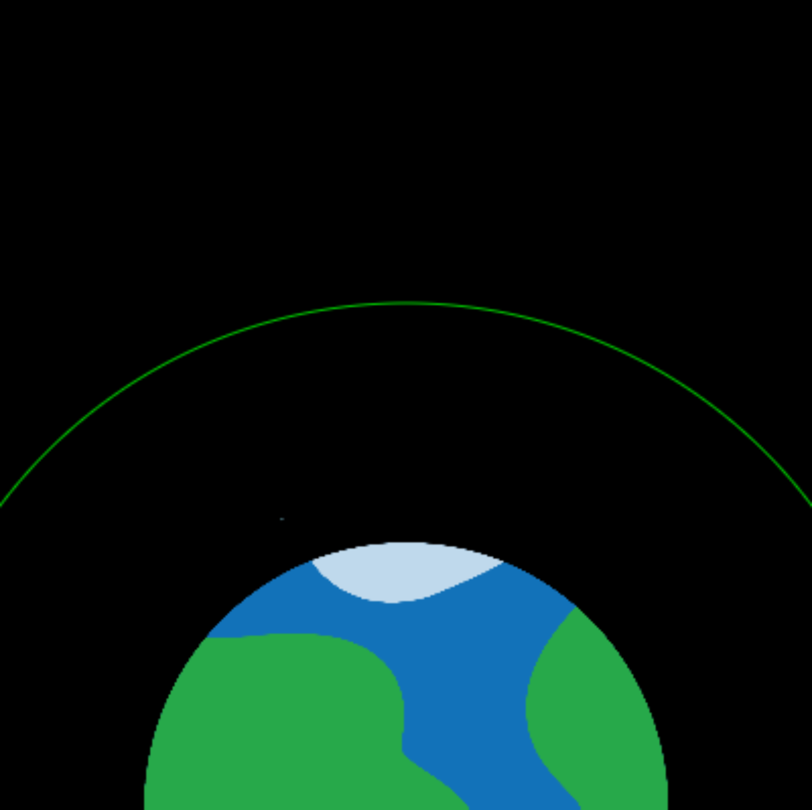

## Reaching orbit

The point of launching a rocket into space is, usually, to enter orbit of the Earth. To enter orbit, you have to get high enough above the Earth so that you no-longer fall straight back down. In reality, this is usually at least 160 km above the Earth, but since this animation is a model, you're going to be using smller, rounder, numbers. 

{:width="300px"}

Add a variable to give the radius of the orbit circle you're drawing around the planet. Base it on the planet radius, to make sure it's always bigger.

--- task ---

--- code ---
---
language: python
filename: main.py
line_numbers: true
line_number_start: 10 
line_highlights: 13-14
---
PLANET_RADIUS = 150
ROCKET_HEIGHT = 32
ROCKET_WIDTH = 32
ORBIT_RADIUS = PLANET_RADIUS + 100

--- /code ---

--- /task ---

Then, in the `draw_bg()` function, add some code to draw a circle with that radius that is centred on the same point as the planet image. You can do this with the `ellipse()` function. Remember that, unlike `image()`, the coordinates you give `ellipse()` are for its centre.

[[[processing-python-ellipse]]]

--- task ---

--- code ---
---
language: python
filename: main.py — draw_bg()
line_numbers: true
line_number_start: 62
line_highlights: 64-73
---
  PLANET_RADIUS*2 # sprite height
  )
  
  no_fill() # Turn off any fill
  stroke(0, 200, 0) # Set a green stroke
  ellipse(
      SCREEN_WIDTH/2, 
      SCREEN_HEIGHT, 
      ORBIT_RADIUS*2,
      ORBIT_RADIUS*2
    )
  no_stroke() # Turn off the stroke

--- /code ---

--- save ---

--- /task ---

--- task ---

**Test:** Run your code and check that it draws the circle.

--- /task ---

You should see something that looks like this:

Next, make the rocket change colour when it successfully enters orbit. You can do this by using the `tint` function to make it turn green once it has travelled far enough.

**The tint function:** Passing a colour to `tint()` lets you change the colours of any sprite you draw after it. The sprites will look like they have a light of the colour you chose shining on them.  Just like with `stroke()` and `fill()`, there is a `no_tint()` function to turn `tint()` off when you're finished with it.

To check if the rocket has travelled far enough, check if `how_far` is greater than or equal to (≥) the `ORBIT_RADIUS` you set. You can do this using `>=` as part of the test for an `if` statement.

Update your `fly()` function to make that test and add the tint if it passes:

--- task ---

--- code ---
---
language: python
filename: main.py — fly()
line_numbers: true
line_number_start: 19 
line_highlights: 23-26, 42
---
def fly(frames):
  
  how_far = 10 * frames
  
  # Reached orbit?
  if how_far >= ORBIT_RADIUS:
    tint(0, 200, 0)
  
  # Put the rocket in the middle of the screen
  rocket_x = SCREEN_WIDTH/2
  # Keep the rocket above the bottom of the screen
  rocket_y = SCREEN_HEIGHT-ROCKET_HEIGHT

  translate(rocket_x, rocket_y - how_far)
  
  image(
    rocket, # sprite
    0, # x is 0 because translate did the moving
    0, # y is 0 because translate did the moving
    ROCKET_WIDTH, # sprite width
    ROCKET_HEIGHT # sprite height
    )
  
  no_tint()
  

--- /code ---

--- /task ---

--- task ---

--- save ---

**Test:** Run your code and watch the rocket change colour as it enters orbit.

--- /task ---

## Liftoff!

Make your rocket fly, by creating a function that accepts a parameter.

{:width="300px"}

You've actually used lots of functionst that take parameters already: `print('Hello')` takes 'Hello' as a parameter and then prints that message to the screen. The function you're going to create will use the amount of time the animation has been running to decide where to draw your rocket.

Define a function called `fly()` that accepts a parameter called `frames`. You give a function parameters by placing them in the parentheses after the function's name when you define it with `def`. Have it set a variable called `how_far` to ten times `frames`. Then have it print that variable out. This will become the distance the rocket has flown at that point in the program.

--- task ---

--- code ---
---
language: python
filename: main.py — fly()
line_numbers: true
line_number_start: 14 
line_highlights: 15-20
---
# The fly function goes here
def fly(frames):
  
  how_far = 10 * frames
  print(how_far)

--- /code ---

--- /task ---

Add a line to the `draw()` function that calls your `fly()` function and passes `frame_count` to it. `frame_count` is a variable built-in to the p5 library, that counts number of frames of your animation that have been drawn.

--- task ---

--- code ---
---
language: python
filename: main.py — draw()
line_numbers: true
line_number_start: 58
line_highlights: 61-62
---
def draw():
  # Things to do in every frame
  draw_bg()
  
  fly(frame_count)

--- /code ---

**Tip:** When you pass a variable into a function like this, you are passing its value at the moment you call the function. Changes you make to the value inside the function won't change the original variable.

--- save ---

--- /task ---

--- task ---

**Test:** Run your program. After the countdown compleets, you should see numbers printing out, each 10 higher than the one before it. This will go on forever, so stop the program after you've seen this.

--- /task ---

These numbers, that your code prints out, can be used as the y-coordinates for drawing your rocket flying into orbit.

You'll need a rocket sprite, which you can create the same way you created the planet sprite. First, declare global variables to hold the height and width of the rocket image, as well as one to hold the rocket image itself.

--- task ---

--- code ---
---
language: python
filename: main.py
line_numbers: true
line_number_start: 10 
line_highlights: 11-12, 15-16
---
PLANET_RADIUS = 150
ROCKET_HEIGHT = 32
ROCKET_WIDTH = 32

planet = None  # Make an empty variable
rocket = None

--- /code ---

--- /task ---

Then load the rocket as part of your `setup()` function. Make sure you add it to the list of `global` variables at the start of the function too, as you'll need to be able to use it in the other functions of your program.

--- task ---

--- code ---
---
language: python
filename: main.py — setup()
line_numbers: true
line_number_start: 51 
line_highlights: 53, 55
---
def setup():
  # Setup your animation here
  global planet, rocket
  planet = load_image('planet.png')
  rocket = load_image('rocket.png')

--- /code ---

--- /task ---

Now you need to draw your rocket sprite into your animation. To do this, you'll modify the fly function to delete the `print()` statement and add `image()` instead. Because you need the rocket to move by `how_far` every frame, you will use `translate()` to shift the screen in each frame before drawing the image. 

`translate()` moves the screen into a different position based on coordinates. The shapes on the screen will move with it but their appearance will not change. A translation can move the screen horizontally, vertically, or diagonally.

--- task ---

--- code ---
---
language: python
filename: main.py — fly()
line_numbers: true
line_number_start: 18
line_highlights: 22-35
---
def fly(frames):
  
  how_far = 10 * frames
  
  # Put the rocket in the middle of the screen
  rocket_x = SCREEN_WIDTH/2
  # Keep the rocket above the bottom of the screen
  rocket_y = SCREEN_HEIGHT-ROCKET_HEIGHT

  # Move the screen to position the rocket
  translate(rocket_x, rocket_y - how_far)
  
  image(
    rocket, # sprite
    0, # x-coordinate — 0 because of translate
    0, # y-coordinate — 0 because of translate
    ROCKET_WIDTH, # sprite width
    ROCKET_HEIGHT # sprite height
    )

--- /code ---

--- save ---

--- /task ---

--- task ---

**Test:** Run your code and watch the rocket fly!

--- /task ---

That looks great, but maybe a little too fast? You can adjust how quickly your animation happens by changing the **frame rate** — the number of frames your animation draws every second. Add the `frame_rate` function to `setup` and use it to set your animation to ten frames per second:

--- task ---

--- code ---
---
language: python
filename: main.py — setup()
line_numbers: true
line_number_start: 67
line_highlights: 
---
def setup():
  # Setup your animation here
  frame_rate(10)
  global planet, rocket
  planet = load_image('planet.png')
--- /code ---

--- save ---

**Test:** Run the program again, and see the difference.

**Choose:** You can adjust the frame rate if you think it's still too fast, or too slow. If you want it to go faster, you may reach the limits of your computer, or screen.

**Frames per second (FPS):** Otherwise called 'frame rate', this refers to how many frames of an animation, film, or computer game are displayed in a second. The higher this rate is, the smoother and more natural motion seems to our eyes. Most films use around 24 FPS, as this is enough for the illusion of smooth motion, though some films (e.g. Spider-Man: Into the Spider-Verse animated parts of the film at 12 fps) change their frame rate to create a deliberate effect. 
 
In computer games, because players need to *react* to the motion on the screen, higher frame rates are usually desirable. The player who sees something first can react to it first, after all! Most action, driving, or shooter games are ideally played at over 60 fps, with profressional players often using 80, or even 120, fps. Whether your computer can draw those frames fast enough will depend on the power of the computer itself, as well as the graphics settings you have selected for the game — trying to draw a larger and more complex image is going to take more effort.
 
Finally, even if your computer can draw incredibly quickly, your screen can only display a certain number of frames per second — called its refresh rate. Your visible frame rate will be the lower of the fps of the source, e.g. a game, and your montior's refresh rate.

--- /task ---