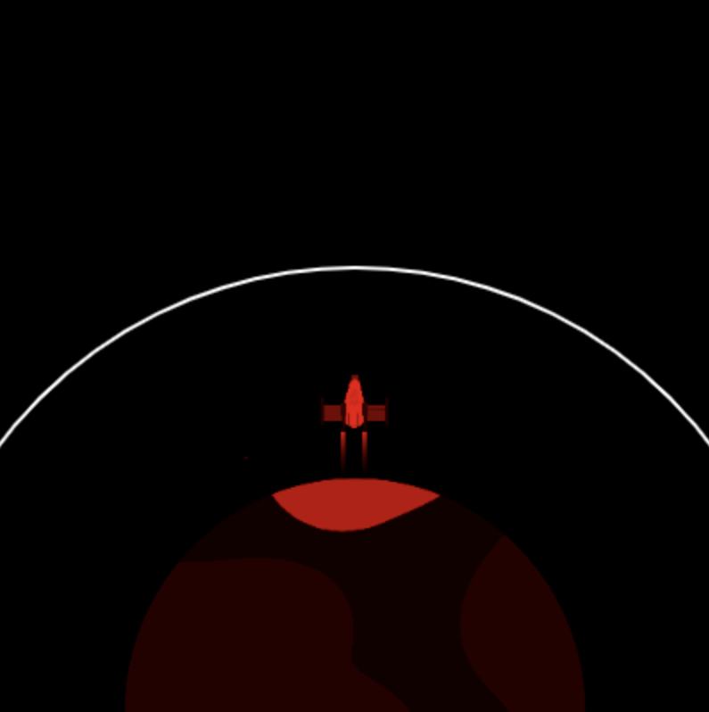

## Reaching orbit

The point of launching the rocket is to propel a satellite into orbit. 

An orbit is a curved path that one object takes around another due to gravity.

The rocket will change colour to show how successful the launch was. 

{:width="300px"}

--- task ---

Create two new global variables to set the radius of the orbit circle and the y coordinate of the orbit t the point the rocket centre needs to reach to launch the satellite. 

--- code ---
---
language: python
filename: main.py
line_numbers: true
line_number_start: 7 
line_highlights: 11-12
---

# Setup global variables 
screen_size = 400
rocket_y = screen_size # start at the bottom
burn = 100 
orbit_radius = 250
orbit_y = screen_size - orbit_radius

--- /code ---

--- /task ---

--- task ---
Update the `draw_background()` function to draw an ellipse to represent the satellite orbit that the rocket needs to reach.  

--- code ---
---
language: python
filename: main.py - draw_background()
line_numbers: true
line_number_start: 16
line_highlights: 20-24
---
def draw_background():
  background(0) # short for background(0, 0, 0) - black 
  image(planet, width/2, height, 300, 300)

  # Draw the orbit
  no_fill() # Turn off any fill
  stroke(255) # Set a white stroke
  stroke_weight(2)
  ellipse(width/2, height, orbit_radius*2, orbit_radius*2)
--- /code ---

--- /task ---

--- task ---

**Test:** Run your program and check that a white orbit line is drawn. 

--- /task ---

The rocket should stop when it reaches the satellite orbit - the end of the mission. 

--- task ---

Update your `if fuel >= burn` code to also check that the rocket hasn't reached the orbit. 

You can use an `and` in `if` statements to check if two, or more, conditions are true. 

--- code ---
---
language: python
filename: main.py - draw_rocket()
line_numbers: true
line_number_start: 19
line_highlights: 24
---
# The draw_rocket function goes here
def draw_rocket():
  
  global rocket_y, fuel, burn # say we want to use the global variables
  
    if fuel >= burn and rocket_y > orbit_y: # still flying
--- /code ---

--- /task ---

--- task ---

**Test:** Run your project and enter 50000 as the amount of fuel. This should be plenty of fuel to reach orbit. The rocket should stop moving when it reaches orbit. 

--- /task ---

The rocket should be coloured red if it runs out of fuel before getting high enough to launch the satellite.

--- task ---

--- code ---
---
language: python
filename: main.py — draw_rocket()
line_numbers: true
line_number_start: 35
line_highlights: 39-40
---
    fill(200, 200, 200, 100) # transparent grey
    for i in range(20): # draw 20 random smoke ellipses
      ellipse(width/2 + randint(-5, 5), rocket_y + randint(20, 50), randint(5, 10), randint(5, 10))

  if fuel < burn and rocket_y > orbit_y: # No more fuel and not in orbit
    tint(255, 0, 0) # Failure

--- /code ---

--- /task ---

--- task ---

**Test:** Run your code and enter 20000 as the amount of fuel. Check that the rocket turns red when it stops below the orbit.

Oh no, the planet has turned red! 

--- /task ---

--- task ---
The `tint()` function sets the tint colour for all images that are drawn until you change the tint or use `no_tint()` to turn it off.

**Choose:** Add a call to `no_tint()` after drawing the image so that the planet isn't tinted red in the next frame - or leave it if you like the planet turning red! 

--- code ---
---
language: python
filename: main.py - draw_rocket()
line_numbers: true
line_number_start: 45
line_highlights: 49
---
if fuel < burn and rocket_y > orbit_y: 
  tint(255, 0, 0) # Failure
    
image(rocket, width/2, rocket_y, 64, 64)
no_tint() # so we don't tint the planet in the next frame!
  
--- /code ---

--- /task ---

--- task ---

Use the `tint()` function again, this time to colour the rocket green if the rocket has enough fuel to reach the satellite orbit:  

--- code ---
---
language: python
filename: main.py - draw_rocket()
line_numbers: true
line_number_start: 45
line_highlights: 47-48
---
if fuel < burn and rocket_y > orbit_y: 
  tint(255, 0, 0) # Failure
elif rocket_y <= orbit_y:
  tint(0, 255, 0) # Success

image(rocket, width/2, rocket_y, 64, 64)
no_tint() # so we don't tint the planet in the next frame!
  
--- /code ---
--- /task ---

--- task ---

**Test:** Run your project and enter 50000 as the amount of fuel. Check that your rocket turns green when it reaches the satellite orbit.

--- /task ---

You now have a simulation that can be used to show how much fuel is needed as a minimum to reach the satellite orbit. That's great but you can take a huge amount of fuel and still success - which is costly and wasteful! 

--- task ---

Amend the condition in your success code to only turn green if the rocket reaches the orbit `and` with less than 1000kg of fuel left. 

Add code to colour the rocket yellow if the rocket has more than 1000kg of fuel left when it reaches orbit. 

--- code ---
---
language: python
filename: main.py
line_numbers: true
line_number_start: 45
line_highlights: 47, 49-50
---
if fuel < burn and rocket_y > orbit_y: 
  tint(255, 0, 0) # Failure
elif fuel < 1000 and rocket_y <= orbit_y:
  tint(0, 255, 0) # Success
elif fuel >= 1000 and rocket_y <= orbit_y: 
  tint(255, 200, 0) # Too much fuel
    
image(rocket, width/2, rocket_y, 64, 64)
no_tint() # so we don't tint the planet in the next frame!
--- /code ---

--- /task ---

--- task ---

**Test:** Run your program several times with different numbers, 25000kg of fuel should be the amount needed to turn green but check that yellow works too by using a bigger number. 

--- /task ---

--- save ---