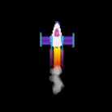

## Efectos de escape

El cohete se verá más realista con algunos efectos especiales para simular el rastro de escape. 

Puedes crear efectos geniales usando un bucle `for` para dibujar muchas formas en cada cuadro.

{:width="300px"}

La codificación se usa para hacer **efectos gráficos** para películas y juegos. Es mucho más rápido escribir código que dibujar cada cuadro de una animación individualmente. 

### Dibuja tu escape

Dibujar muchas elipses amarillas en diferentes posiciones `y` crea un rastro de escape con un fondo redondo.

--- task ---

Actualiza tu función `draw_rocket()` para incluir un bucle `for` que repita el dibujo de `25` elipses para hacer el escape. La variable de bucle **** `i` se suma a `rocket_y` para dibujar cada elipse más abajo del cohete.

--- code ---
---
language: python filename: main.py - draw_rocket() line_numbers: true line_number_start: 12
line_highlights: 16-20
---

def draw_rocket(): global rocket_y   
rocket_y -= 1   

    no_stroke()  # desactiva el trazo
    
    for i in range(25):  # dibuja 25 elipses para hacer el escape 
        fill(255, 255, 0)  # amarillo
        ellipse(width/2, rocket_y + i, 8, 3)  # i aumenta cada vez que el bucle se ejecuta
    
    image(rocket, width/2, rocket_y, 64, 64)

--- /code ---

--- /task ---

Un bucle `for` repite una pieza de código una vez por cada elemento que se le da.

Para ejecutar el código en un bucle `for` un número específico de veces, puedes hacer uso de la función `range()`. Por ejemplo, `range(5)` crea una secuencia de cinco números a partir de 0, dando [0, 1, 2, 3, 4].

Cada vez que se repite el ciclo `for`, establece una variable en el elemento actual para que pueda usarlo en el ciclo.

--- task ---

**Prueba:** Ejecuta tu código para verificar que el cohete tenga un nuevo rastro de escape.

{:width="300px"}

--- /task ---

### Agregar un degradado

La variable `i` también se puede usar para crear un degradado de color con menos verde en cada elipse que se dibuja.

--- task ---

Cambia la llamada a `fill()` para establecer la cantidad de verde en `255 - i*10` para que la primera elipse tenga la misma cantidad de rojo y verde y la última elipse tenga muy poco verde.

--- code ---
---
language: python filename: main.py - draw_rocket() line_numbers: true line_number_start: 18
line_highlights: 19
---

    para i en rango(25):   
        fill(255, 255 - i * 10, 0) # Reducir la cantidad de verde 
        elipse (width/2, rocket_y + i, 8, 3)

--- /code ---

--- /task ---

--- task ---

**Prueba:** Comprueba que obtienes un rastro de elipses que cambia gradualmente de amarillo a rojo.

--- /task ---

### Crea un efecto de humo

El rastro humo de escape se crea dibujando muchas elipses grises ligeramente transparentes en diferentes posiciones en cada cuadro.

--- task ---

Esta vez, `fill()` está fuera del bucle ya que el color es el mismo para cada elipse de humo. La cuarta entrada para `fill()` es la opacidad, un valor de opacidad bajo hace que el color sea más transparente para que pueda ver las formas debajo.

En cada fotograma de la animación, se dibujarán 20 elipses de tamaños aleatorios en posiciones aleatorias.

--- code ---
---
language: python filename: main.py - draw_rocket() line_numbers: true line_number_start: 18
line_highlights: 22-24
---

    for i in range(25):  
        fill(255, 255 - i * 10, 0)   
        ellipse(width/2, rocket_y + i, 8, 3)    
    
    fill(200, 200, 200, 100)  # gris transparente
    for i in range(20):  # dibuja 20 elipses de humo aleatorias    
        ellipse(width/2 + randint(-5, 5), rocket_y + randint(20, 50), randint(5, 10), randint(5, 10))    
    
    image(rocket, width/2, rocket_y, 64, 64)

--- /code ---

--- /task ---

--- task ---

**Prueba:** Ejecuta tu programa y verifica que los gases de escape sean visibles.

--- /task ---

--- save ---
