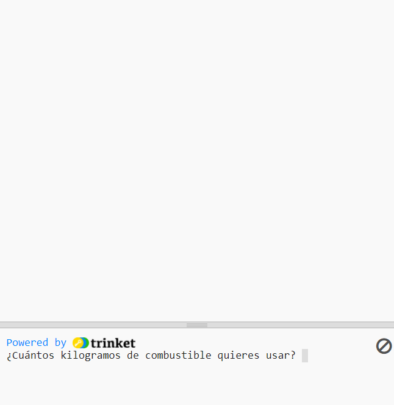

## Quemar combustible

Una de las cosas más importantes que hay que decidir al lanzar un cohete es cuánto combustible cargar en él. 

Para hacer esto, debes simular cuánto combustible se quemará en el viaje.

{:width="300px"}

### Create a fuel variable

--- task ---

Agrega una variable para realizar un seguimiento de la cantidad de combustible que quema tu cohete (en cuadros).

--- code ---
---
language: python filename: main.py line_numbers: true line_number_start: 7
line_highlights: 10
---

# Configurar variables globales
screen_size = 400   
rocket_y = screen_size  
burn = 100  # How much fuel is burned in each frame

--- /code ---

--- /task ---

--- task ---

En la parte inferior de tu programa, agrega código para preguntarle al usuario cuánto combustible agregar al cohete y almacena su respuesta en una variable global `combustible`.

--- code ---
---
language: python filename: main.py line_numbers: true line_number_start: 51
line_highlights: 51
---

combustible = int(input('¿Cuántos kilogramos de combustible quieres usar?'))   
run()

--- /code ---

--- /task ---

### Check fuel against burn

El cohete solo debería moverse si no ha quemado todo su combustible.

--- task ---

Agrega código a la función `dibujar_cohete()` para reducir los `combustible` restantes por los `quemar` de cada cuadro. Use `print()` para mostrar cuánto combustible queda en cada cuadro.

Debes decir que deseas utilizar las variables globales `combustible` y `quemar`.

--- code ---
---
language: python filename: main.py — draw_rocket() line_numbers: true line_number_start: 15
line_highlights: 15, 17-18
---

    global rocket_y, fuel, burn   
    rocket_y -= 1   
    fuel -= burn  # Burn fuel   
    print('Fuel left: ', fuel)

--- /code ---

--- /task ---

--- task ---

**Test:** Run your program to check that the animation doesn't start until `How many kilograms of fuel do you want to use?` has been answered. Try entering `30000` as the amount of fuel.

The rocket will keep going even if it has no fuel left.

--- /task ---

--- task ---

The rocket should only move if it has enough fuel left. Add an `if` statement to check that `fuel >= burn`.

You will need to indent all of the lines of code before the `image()` function call. To do this, highlight all of the lines with the mouse and then tap the <kbd>Tab</kbd> on the keyboard to indent all the lines at once.

The `image()` line doesn't need to be indented because you always want to draw the rocket.

--- code ---
---
language: python filename: main.py — draw_rocket() line_numbers: true line_number_start: 15
line_highlights: 17-30
---

    global rocket_y, fuel, burn  
    
    if fuel >= burn:  # Still got fuel   
        rocket_y -= 1   
        fuel -= burn   
        print('Fuel left: ', fuel)   
    
        no_stroke()  # Turn off the stroke   
    
        for i in range(25):   
            fill(255, 255 - i*10, 0)   
            ellipse(width/2, rocket_y + i, 8, 3)    
    
        fill(200, 200, 200, 100)   
        for i in range(20):   
            ellipse(width/2 + randint(-5, 5), rocket_y + randint(20, 50), randint(5, 10), randint(5, 10))   
    
    image(rocket, width/2, rocket_y, 64, 64)

--- /code ---

--- /task ---

--- task ---

**Test:** Run your program to check that the rocket stops when there is no fuel left.

{:width="300px"}

--- /task ---

Did your rocket stop when it ran out of fuel? Well done, you sent a rocket to outer space!

--- save ---

