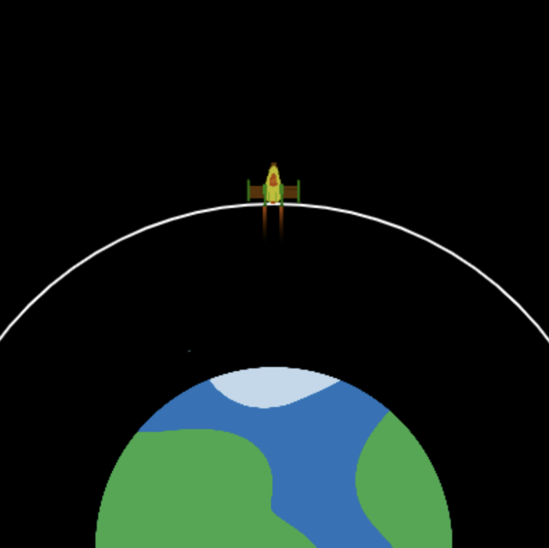

## Alcanzando la órbita

El objetivo de lanzar el cohete es impulsar un satélite a la órbita. 

Una órbita es una trayectoria curva que un objeto toma alrededor de otro debido a la gravedad.

El cohete puede cambiar de color para mostrar el éxito del lanzamiento. 

{:width="400px"}

### Dibuja una línea de órbita

--- task ---

Crea dos nuevas variables globales para establecer el radio del círculo de la órbita y la coordenada `y` de la órbita hasta el punto al que debe llegar el centro del cohete para lanzar el satélite.

--- code ---
---
language: python filename: main.py line_numbers: true line_number_start: 7
line_highlights: 11-12
---

# Configurar variables globales
tamano_pantalla = 400   
cohete_y = tamano_pantalla   
quemar = 100   
orbita_radio = 250   
orbita_y = tamano_pantalla - orbita_radio

--- /code ---

--- /task ---

--- task ---

Actualiza la función `dibujar_fondo()` para dibujar una elipse que represente la órbita del satélite que el cohete debe alcanzar.

--- code ---
---
language: python filename: main.py - draw_background() line_numbers: true line_number_start: 38
line_highlights: 42-45
---

def draw_background():   
background(0)  # Abreviatura de background(0, 0, 0) — black<0 /> image(planet, width/2, height, 300, 300)   

    no_fill()  # Turn off any fill  
    stroke(255)  # Set a white stroke   
    stroke_weight(2)   
    ellipse(width/2, height, orbit_radius * 2, orbit_radius * 2)

--- /code ---

--- /task ---

--- task ---

**Prueba:** Ejecuta tu programa y verifica que se dibuje una línea de órbita blanca.

{:width="300px"}

--- /task ---

### Lanza el cohete a la órbita

El cohete debe detenerse cuando alcance la órbita del satélite: el final de la misión.

--- task ---

Actualiza tu código `if fuel >= burn` para verificar también que el cohete no haya alcanzado la órbita.

Puedes usar un `and` en declaraciones `if` para verificar si dos o más condiciones son verdaderas.

--- code ---
---
language: python filename: main.py - draw_rocket() line_numbers: true line_number_start: 15
line_highlights: 19
---

# La función dibujar_cohete va aquí
def draw_rocket():   
global rocket_y, fuel, burn

        if fuel >= burn and rocket_y > orbit_y:  # sigue volando

--- /code ---

--- /task ---

--- task ---

**Prueba:** Ejecuta tu proyecto e ingresa `50000` como la cantidad de combustible. Esto debería ser suficiente combustible para alcanzar la órbita. El cohete debería dejar de moverse cuando alcance la órbita.

--- /task ---

### Comprueba si el lanzamiento es exitoso

El cohete debería tornarse color rojo si se queda sin combustible antes de alcanzar la altura suficiente para lanzar el satélite.

--- task ---

--- code ---
---
language: python filename: main.py — draw_rocket() line_numbers: true line_number_start: 30
line_highlights: 34-35
---

    fill(200, 200, 200, 100)   
    for i in range(20):   
        ellipse(width/2 + randint(-5, 5), rocket_y + randint(20, 50), randint(5, 10), randint(5, 10))
    
    if fuel < burn and rocket_y > orbit_y:  # No tiene más combustible y no ha llegado a la órbita 
        tint(255, 0, 0)  # Fallo

--- /code ---

--- /task ---

--- task ---

**Prueba:** Ejecuta tu código e ingresa `20000` como la cantidad de combustible. Comprueba que el cohete se vuelve rojo cuando se detiene por debajo de la órbita.

{:width="300px"}

¡Oh no, el planeta se ha vuelto rojo!

--- /task ---

--- task ---

La función `tint()` establece el color de tinte para todas las imágenes que se dibujan hasta que cambie el tinte o use `no_tint()` para apagarlo.

**Elige:** Agrega una llamada a `no_tint()` después de dibujar la imagen para que el planeta no se tiña de rojo en el siguiente cuadro, ¡o déjalo si deseas que el planeta se vuelva rojo!

--- code ---
---
language: python filename: main.py - draw_rocket() line_numbers: true line_number_start: 34
line_highlights: 38
---

    if fuel < burn and rocket_y > orbit_y:    
        tint(255, 0, 0)  # Fallo
    
    image(rocket, width/2, rocket_y, 64, 64)   
    no_tint()  # ¡Para que el planeta no se vuelva rojo en el siguiente fotograma!

--- /code ---

--- /task ---

--- task ---

Usa la función `tint()` nuevamente, esta vez para colorear el cohete de verde si el cohete tiene suficiente combustible para alcanzar la órbita del satélite:

--- code ---
---
language: python filename: main.py - draw_rocket() line_numbers: true line_number_start: 34
line_highlights: 36-37
---

    if fuel < burn and rocket_y > orbit_y:    
        tint(255, 0, 0)  # Fallo
    elif rocket_y <= orbit_y:   
        tint(0, 255, 0)  # Éxito   
    
    image(rocket, width/2, rocket_y, 64, 64)   
    no_tint()

--- /code ---

--- /task ---

--- task ---

**Prueba:** Ejecuta tu proyecto e ingresa `50000` como la cantidad de combustible. Comprueba que tu cohete se vuelve verde cuando alcanza la órbita del satélite.

{:width="300px"}

--- /task ---

Ahora tienes una simulación que puede usarse para mostrar cuánto combustible se necesita como mínimo para alcanzar la órbita del satélite. Genial; sin embargo, podrías tomar una gran cantidad de combustible y aún así tener éxito, ¡pero esto es costoso y resulta en un desperdicio!

--- task ---

Modifica las condiciones en tu código de éxito para que el cohete solo se vuelva verde si alcanza la órbita `y` le quedan menos de 1,000 kg de combustible.

Agrega un código para colorear el cohete de amarillo si al cohete le quedan más de 1000 kg de combustible cuando alcanza la órbita.

--- code ---
---
language: python filename: main.py line_numbers: true line_number_start: 34
line_highlights: 36, 38-39
---

    if fuel < burn and rocket_y > orbit_y:   
        tint(255, 0, 0)  # Fallo
    elif fuel < 1000 and rocket_y <= orbit_y:   
        tint(0, 255, 0)  # Éxito
    elif fuel >= 1000 and rocket_y <= orbit_y:    
        tint(255, 200, 0)  # Demasiado combustible
    
    image(rocket, width/2, rocket_y, 64, 64)    
    no_tint()  # ¡Para que el planeta no se vuelva rojo en el fotograma siguiente!

--- /code ---

--- /task ---

--- task ---

**Prueba:** Ejecuta tu programa varias veces con diferentes números; por ejemplo, 25.000 kg de combustible debería ser la cantidad necesaria para que el cohete se vuelva verde, pero también verifica que el tinte amarillo funcione usando un número mayor.

{:width="300px"}

--- /task ---

--- save ---
