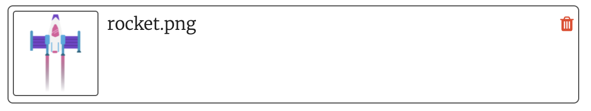

## ¡Despegue!

Cada vez que se dibuja un nuevo cuadro, el cohete debe moverse hacia arriba en la pantalla para crear un efecto de animación.

{:width="300px"}

--- task ---

El proyecto de inicio tiene una imagen de cohete provista para tí.

--- /task ---

--- task ---

Agrega código a la función `setup()` para cargar la imagen del cohete en una variable global `cohete`.

--- code ---
---
language: python 
filename: main.py 
line_numbers: true 
line_number_start: 20
line_highlights: 24, 26
---

def setup():   
  #Configura tu animación aquí   
  tamano(tamano_pantalla, tamano_pantalla)   
  image_mode(CENTER)   
  global planeta, cohete   
  planeta = load_image('planet.png')    
  cohete = load_image( 'rocket.png')

--- /code ---

--- /task ---

La posición `y` del cohete comenzará en 400 (la altura de la pantalla) y luego disminuirá en 1 cada vez que se dibuje un nuevo cuadro.

--- task ---

Agrega una variable global `cohete_y` para realizar un seguimiento de la posición `y` del cohete.

--- code ---
---
language: python 
filename: main.py 
line_numbers: true 
line_number_start: 7
line_highlights: 9
---

#Configurar variables globales
tamano_pantalla = 400    
cohete_y = tamano_pantalla #Empieza por abajo

--- /code ---

--- /task ---

--- task ---

Define una función `dibujar_cohete()` para cambiar la posición `y` del cohete y volver a dibujarlo.

`cohete_y -= 1` es una forma más corta de decir `cohete_y = cohete_y - 1`.

--- code ---
---
language: python 
filename: main.py 
line_numbers: true 
line_number_start: 11
line_highlights: 12-16
---

#La función dibujar_cohete va aquí
def dibujar_cohete():

  global cohete_y #Utiliza la variable global cohete_y    
  cohete_y -= 1 #Mueve la imagen del cohete    
  image(cohete, width/2, cohete_y, 64, 64)

--- /code ---

--- /task ---

--- task ---

Llama a tu nuevo `dibujar_cohete()` en la función `dibujar()` para que el cohete se vuelva a dibujar en cada cuadro.

--- code ---
---
language: python 
filename: main.py 
line_numbers: true 
line_number_start: 34
line_highlights: 37
---

def dibujar():   
  #Cosas que hacer en cada fotograma   
  dibujar_fondo()   
  dibujar_cohete()

--- /code ---

--- /task ---

--- task ---  

**Prueba:** Ejecute su código para verificar que el cohete comience en la parte inferior de la pantalla y suba cada cuadro.

--- /task ---

--- save ---
