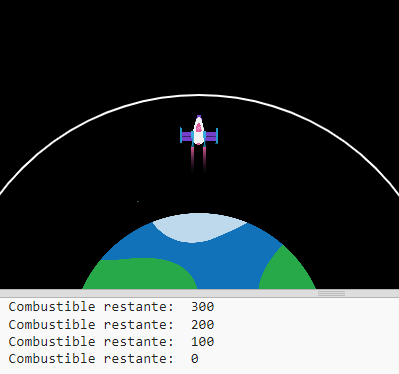

## Quemar combustible

Una de las cosas más importantes que hay que decidir al lanzar un cohete es cuánto combustible cargar en él. 

Para hacer esto, debes simular cuánto combustible se quemará en el viaje.

{:width="300px"}

--- task ---

Agrega una variable para realizar un seguimiento de la cantidad de combustible que quema tu cohete (en cuadros).

--- code ---
---
language: python 
filename: main.py 
line_numbers: true 
line_number_start: 7
line_highlights: 10
---

#Configurar variables globales
tamano_pantalla = 400   
cohete_y = screen_size  
quemar = 100 #Cuánto combustible se quema en cada fotograma

--- /code ---

--- /task ---

--- task ---

En la parte inferior de tu programa, agrega código para preguntarle al usuario cuánto combustible agregar al cohete y almacena su respuesta en una variable global `combustible`.

--- code ---
---
language: python 
filename: main.py 
line_numbers: true 
line_number_start: 52
line_highlights: 52
---

combustible = int(input('¿Cuántos kilogramos de combustible quieres usar?'))   
run()

--- /code ---

--- /task ---

El cohete solo debería moverse si no ha quemado todo su combustible.

--- task ---

Agrega código a la función `dibujar_cohete()` para reducir los `combustible` restantes por los `quemar` de cada cuadro. Use `print()` para mostrar cuánto combustible queda en cada cuadro.

Debes decir que deseas utilizar las variables globales `combustible` y `quemar`.

--- code ---
---
language: python 
filename: main.py — dibujar_cohete() 
line_numbers: true 
line_number_start: 15
line_highlights: 15, 17-18
---

  global cohete_y, combustible, quemar   
  cohete_y -= 1   
  combustible -= quemar #Quemar combustible   
  print('Combustible restante: ', combustible)

--- /code ---

--- /task ---

--- task ---

**Prueba:** Ejecuta tu programa para verificar que la animación no comience hasta que se conteste la pregunta `¿Cuántos kilogramos de combustible deseas usar?`. Intenta ingresar `30000` como la cantidad de combustible.

El cohete seguirá funcionando aunque no le quede combustible.

--- /task ---

--- task ---

El cohete solo debe moverse si le queda suficiente combustible. Agrega una declaración `if` para verificar que `combustible >= quema`.

Deberás sangrar todas las líneas de código antes de la llamada a la función `image()`. Para hacer esto, resalta todas las líneas con el mouse y luego toca el <kbd>Tab</kbd> en el teclado para sangrar todas las líneas a la vez.

No es necesario sangrar la línea `image()` porque deseas dibujar el cohete siempre.

--- code ---
---
language: python 
filename: main.py — dibujar_cohete() 
line_numbers: true 
line_number_start: 15
line_highlights: 16-31
---

  global cohete_y, combustible, quemar

  if combustible >= quemar: #Todavía tengo combustible   
    cohete_y -= 1   
    combustible -= quemar   
    print('Combustible restante: ', combustible)   

    no_stroke() #Desactiva el trazo   
    
    for i in range(25):   
      fill(255, 255 - i*10, 0)   
      ellipse(width/2, cohete_y + i, 8, 3)    
    
    fill(200, 200, 200, 100)   
    for i in range(20):   
      ellipse(width/2 + randint (-5, 5), cohete_y + randint (20, 50), randint (5, 10), randint (5, 10))

  image(cohete, width/2, cohete_y, 64, 64)

--- /code ---

--- /task ---

--- task ---

**Prueba:** Ejecuta tu programa para comprobar que el cohete se detiene cuando no queda combustible.

{:width="300px"}

--- /task ---

Esta simulación por computadora no es muy precisa, pero es lo suficientemente buena para nuestra animación.

--- save ---

