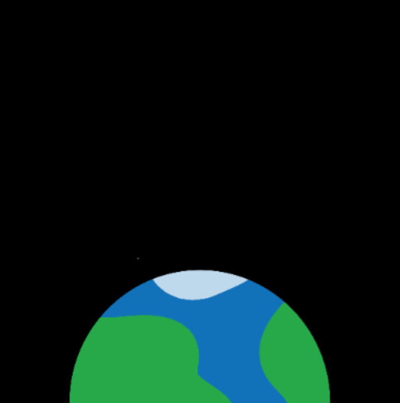

## Créer la scène

L'animation nécessite un arrière-plan spatiale avec une planète à partir de laquelle lancer la fusée.

{:width="300px"}

--- task ---

Ouvre le [modèle de projet](https://editor.raspberrypi.org/en/projects/rocket-launch-starter-fr-fr){:target="_blank"}.

### Créer l'écran

--- /task ---

Tu utiliseras une variable `taille_ecran` pour définir la taille de l'écran et dans les calculs. Les variables définies en dehors des fonctions sont **globales**, tu peux donc les utiliser n'importe où dans ton programme.

--- task ---

Trouve le commentaire `Configurer les variables globales` et ajoute une ligne de code pour créer ta variable `taille_ecran` :

--- code ---
---
language: python
filename: main.py
line_numbers: true
line_number_start: 7 
line_highlights: 8
---

# Configurer les variables globales
taille_ecran = 400

--- /code ---

--- /task ---

--- task ---

Utilise la variable `taille_ecran` pour créer un carré de 400 par 400 pixels :

--- code ---
---
language: python
filename: main.py — setup()
line_numbers: true
line_number_start: 18
line_highlights: 20
---

def configuration():   
    # Configure ton animation ici   
    size(taille_ecran, taille_ecran)

--- /code ---

--- /task ---

### Choisir une image

--- task ---

Le projet de démarrage a trois images de planètes différentes et la lune t'est fournie. Tu peux les afficher dans la **galerie d'images** à gauche de l'éditeur de code.

**Choisir :** décide quelle image tu veux utiliser et note le nom du fichier. Par exemple, `orange_planet.png`.

--- /task ---

--- task ---

Ajoute du code à la fonction `configuration()` pour charger et positionner ton image.

La ligne `image_mode(CENTER)` indique que tu vas positionner les images en donnant les coordonnées du centre de l'image (au lieu du coin supérieur gauche).

Ajoute également du code à la fonction `configuration()` pour charger l'image choisie dans une variable globale `planete`. La variable doit être globale afin que tu puisses l'utiliser plus tard lorsque tu dessines la planète à l'écran.

--- code ---
---
language: python
filename: main.py
line_numbers: true
line_number_start: 18 
line_highlights: 21-23
---

def configuration():   
    # Configure ton animation ici   
    size(taille_ecran, taille_ecran)   
    image_mode(CENTER)   
    global planete   
    planete = load_image('planet.png') # Ta planète choisie

--- /code ---

--- /task ---

### Dessiner l'arrière-plan

--- task ---

Définis une fonction `dessine_arriere_plan()`, pour dessiner l'arrière-plan, sous le commentaire qui t'indique où il doit aller.

Utilise `background(0)` pour définir la couleur d'arrière-plan sur noir et ajoute une fonction `image()` pour dessiner la planète. La fonction `image()` se présente comme suit :

`image(nom du fichier image, coordonnée x, coordonnée y, largeur_image, hauteur_image)`

La ligne de code `from p5 import *` te donne des variables globales `width` et `height` basées sur la taille de l'écran. Utilise-les dans ton code pour positionner la planète avec son centre à mi-chemin (`width/2`) et en bas (`height`) de l'écran.

--- code ---
---
language: python
filename: main.py — draw_background()
line_numbers: true
line_number_start: 14 
line_highlights: 15-17
---

# La fonction dessine_arriere_plan vient ici
def dessine_arriere_plan():   
    background(0) # Raccourci pour background(0, 0, 0) — noir    
    image(planete, width/2, height, 300, 300) # Dessine l'image

--- /code ---

Mettre tout le code pour dessiner l'arrière-plan dans une seule fonction rend ton code plus facile à comprendre.

--- /task --- 

--- task ---

Pour faire apparaître l'arrière-plan, appelle `dessine_arriere_plan()` dans `dessin()`. Cela fera en sorte que l'arrière-plan soit redessiné chaque fois que `dessin()` est appelé, couvrant ainsi tout dessin plus ancien :

--- code ---
---
language: python
filename: main.py — draw()
line_numbers: true
line_number_start: 28 
line_highlights: 30
---

def dessin():   
    # Choses à faire dans chaque image    
    dessine_arriere_plan()

--- /code ---

--- /task ---

--- task ---

**Test :** exécute ton code et vérifie qu'il dessine un arrière-plan noir avec une demi-planète en bas.

--- /task ---

Si tu as un compte Raspberry Pi, tu peux cliquer sur le bouton **Save** de ton éditeur de code pour enregistrer une copie de ton projet dans tes Projets.

--- save ---
