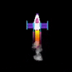
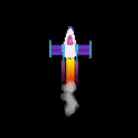

## Effets d'échappement

La fusée aura l'air plus réaliste avec quelques effets spéciaux pour simuler la traînée d'échappement. 

Tu peux créer des effets sympas en utilisant une boucle "for" pour dessiner de nombreuses formes dans chaque image.

{:width="300px"}

Le codage est utilisé pour créer des **effets graphiques** pour les films et les jeux. Il est beaucoup plus rapide d'écrire du code que de dessiner chaque image d'une animation individuellement. 

### Dessiner ton échappement

Dessiner beaucoup d'ellipses jaunes à différentes positions `y` crée une traînée d'échappement avec un fond rond.

--- task ---

Mets à jour ta fonction `dessine_fusee()` pour inclure une boucle `for` qui répète le dessin de `25` ellipses d'échappement. La **variable de boucle** `i` est ajoutée à `fusee_y` pour dessiner chaque ellipse plus loin sous la fusée.

--- code ---
---
language: python
filename: main.py - draw_rocket()
line_numbers: true
line_number_start: 12
line_highlights: 16-20
---

def dessine_fusee():
    global fusee_y   
    fusee_y -= 1   

    no_stroke()  # Désactiver le trait
    
    for i in range(25):  # Dessine 25 ellipses d'échappement en combustion   
        fill(255, 255, 0)  # Jaune   
        ellipse(width/2, fusee_y + i, 8, 3)  # i augmente à chaque fois que la boucle se répète    
    
    image(fusee, width/2, fusee_y, 64, 64)

--- /code ---

--- /task ---

Une boucle `pour` répète un bout de code une fois pour chaque élément qui lui est donné.

Pour exécuter le code dans une boucle `for` un certain nombre de fois, tu peux utiliser la fonction `range()`. Par exemple, `range(5)` crée une séquence de cinq nombres à partir de 0, donc [0, 1, 2, 3, 4].

Chaque fois que la boucle `for` se répète, elle définit une variable sur l'élément actuel afin que tu puisses l'utiliser dans la boucle.

--- task ---

**Test :** exécute ton code pour vérifier que la fusée a une nouvelle traînée d'échappement.

{:width="300px"}

--- /task ---

### Ajouter un dégradé

La variable `i` peut également être utilisée pour créer un dégradé de couleur avec moins de vert dans chaque ellipse dessinée.

--- task ---

Remplace l'appel par `fill()` pour définir la quantité de vert sur `255 - i * 10` afin que la première ellipse ait des quantités égales de rouge et de vert et que la dernière ellipse ait très peu de vert.

--- code ---
---
language: python
filename: main.py - draw_rocket()
line_numbers: true
line_number_start: 18
line_highlights: 19
---

    for i in range(25):   
        fill(255, 255 - i * 10, 0) # Réduis la quantité de vert    
        ellipse(width/2, fusee_y + i, 8, 3)

--- /code ---

--- /task ---

--- task ---

**Test :** vérifie que tu obtiens une traînée d'ellipses passant progressivement du jaune au rouge.

--- /task ---

### Créer un effet de fumée

La traînée de fumée est créée en dessinant de nombreuses ellipses grises légèrement transparentes à différents endroits de chaque image.

--- task ---

Cette fois, le `fill()` est en dehors de la boucle car la couleur est la même pour chaque ellipse de fumée. La quatrième entrée de `fill()` est l'opacité, une faible valeur d'opacité rend la couleur plus transparente afin que tu puisses voir les formes en dessous.

Dans chaque image de l'animation, 20 ellipses de tailles aléatoires seront dessinées à des positions aléatoires.

--- code ---
---
language: python
filename: main.py - draw_rocket()
line_numbers: true
line_number_start: 18
line_highlights: 22-24
---

    for i in range(25):  
        fill(255, 255 - i * 10, 0)   
        ellipse(width/2, fusee_y + i, 8, 3)    
    
    fill(200, 200, 200, 100)  # Gris transparent   
    for i in range(20):  # Dessine 20 ellipses de fumée    
        ellipse(width/2 + randint(-5, 5), fusee_y + randint(20, 50), randint(5, 10), randint(5, 10))    
    
    image(fusee, width/2, fusee_y, 64, 64)

--- /code ---

--- /task ---

--- task ---

**Test :** exécute ton programme et vérifie que les gaz d'échappement sont visibles.

--- /task ---

--- save ---
