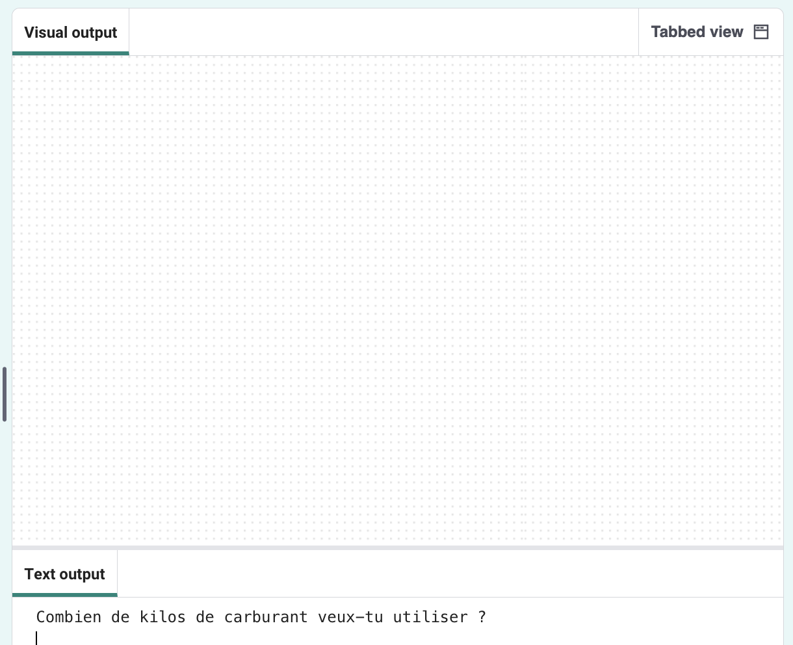
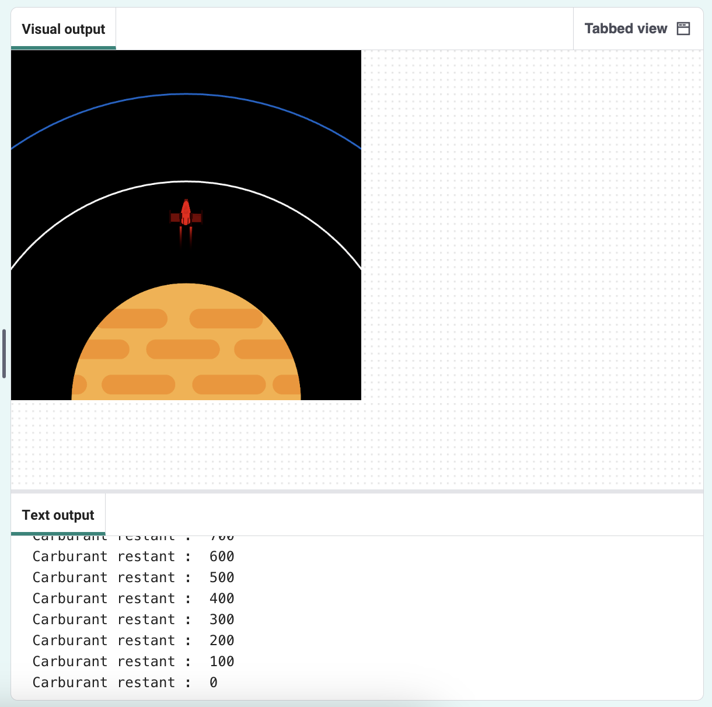

## Brûler du carburant

L'une des choses les plus importantes à décider lors du lancement d'une fusée est la quantité de carburant à y charger. 

Pour ce faire, tu dois simuler la quantité de carburant qui sera brûlée pendant le trajet.

{:width="300px"}

### Créer une variable de carburant

--- task ---

Ajoute une variable pour suivre la quantité de carburant consommée par ta fusée (en images).

--- code ---
---
language: python
filename: main.py
line_numbers: true
line_number_start: 7 
line_highlights: 10
---

# Configurer les variables globales
taille_ecran = 400   
fusee_y = taille_ecran  
brule = 100 # Quelle est la quantité de carburant brûlée dans chaque image

--- /code ---

--- /task ---

--- task ---

Au bas de ton programme, ajoute du code pour demander à l'utilisateur la quantité de carburant à ajouter à la fusée et stocke sa réponse dans une variable globale `carburant`.

--- code ---
---
language: python
filename: main.py 
line_numbers: true
line_number_start: 51
line_highlights: 51
---

carburant = int(input('Combien de kilos de carburant veux-tu utiliser ?'))   
run()

--- /code ---

--- /task ---

### Vérifier le carburant par rapport au brûlé

La fusée ne devrait se déplacer que si elle n'a pas brûlé tout son carburant.

--- task ---

Ajoute du code à la fonction `dessine_fusee()` pour réduire les `carburants` restants par le `brule` de chaque image. Utilise `print()` pour afficher la quantité de carburant restant dans chaque image.

Tu dois dire que tu veux utiliser les variables globales `carburant` et `brule`.

--- code ---
---
language: python
filename: main.py — draw_rocket()
line_numbers: true
line_number_start: 15 
line_highlights: 15, 17-18
---

    global fusee_y, carburant, brule   
    fusee_y -=1   
    carburant -= brule # Carburant brûlé   
    print('Carburant restant : ', carburant)

--- /code ---

--- /task ---

--- task ---

**Test :** exécute ton programme pour vérifier que l'animation ne démarre pas avant d'avoir répondu à la question `Combien de kilogrammes de carburant voulez-vous utiliser ?`. Essaye d'entrer `30000` comme quantité de carburant.

La fusée continuera même s'il n'y a plus de carburant.

--- /task ---

--- task ---

La fusée ne devrait se déplacer que s'il lui reste suffisamment de carburant. Ajoute une instruction `if` pour vérifier que `carburant >= brule`.

Tu devras indenter toutes les lignes de code avant l'appel de la fonction `image()`. Pour ce faire, mets en surbrillance toutes les lignes avec la souris, puis appuie sur la touche <kbd>Tab</kbd> du clavier pour mettre en retrait toutes les lignes à la fois.

La ligne `image()` n'a pas besoin d'être indentée car tu veux toujours dessiner la fusée.

--- code ---
---
language: python
filename: main.py — draw_rocket()
line_numbers: true
line_number_start: 15
line_highlights: 17-30
---

    global fusee_y, carburant, brule  
    
    if carburant >= brule:  # il y a encore du carburant   
        fusee_y -= 1   
        carburant -= brule   
        print('Carburant restant: ', carburant)   
    
        no_stroke()  # plus de trait   
    
        for i in range(25):   
            fill(255, 255 - i*10, 0)   
            ellipse(width/2, fusee_y + i, 8, 3)    
    
        fill(200, 200, 200, 100)   
        for i in range(20):   
            ellipse(width/2 + randint(-5, 5), fusee_y + randint(20, 50), randint(5, 10), randint(5, 10))   
    
    image(fusee, width/2, fusee_y, 64, 64)

--- /code ---

--- /task ---

--- task ---

**Test :** exécute ton programme pour vérifier que la fusée s'arrête lorsqu'il n'y a plus de carburant.

{:width="300px"}

--- /task ---

Ta fusée s'est-elle arrêtée lorsqu'elle était à court de carburant ? Bravo, tu as envoyé une fusée dans l'espace !

--- save ---

