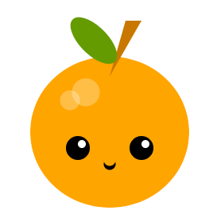

## Et ensuite ?

Si tu suis le parcours [Introduction à Python](https://projects.raspberrypi.org/en/raspberrypi/python-intro), tu peux passer au projet [Faire un visage](https://projects.raspberrypi.org/en/projects/make-a-face). Dans ce projet, tu vas dessiner un visage ou un masque à l'aide de formes géométriques.

--- print-only ---

--- /print-only ---

--- no-print ---

<iframe src="https://editor.raspberrypi.org/en/embed/viewer/fruit-face-example" width="600" height="600" frameborder="0" marginwidth="0" marginheight="0" allowfullscreen>
</iframe>

--- /no-print ---

Si tu veux t'amuser davantage en explorant Python, tu peux essayer n'importe lequel de [ces projets](https://projects.raspberrypi.org/en/projects?software%5B%5D=python).
