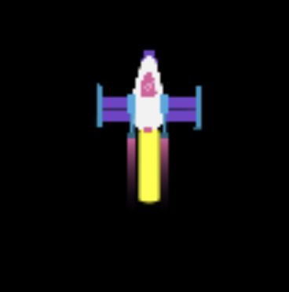

## निकास प्रभाव

रॉकेट कुछ विशेष प्रभावों के साथ अधिक यथार्थवादी दिखेगा निकास परीक्षण का अनुरूपण करने के लिए। 

आप प्रत्येक फ्रेम में बहुत सारी आकृतियाँ बनाने के लिए 'लूप के लिए' का उपयोग करके शानदार प्रभाव बना सकते हैं।

{:width="300px"}

कोडिंग का उपयोग फिल्मों और खेल के लिए #currentग्राफ़िक इफेक्ट्स  बनाने के लिए किया जाता है। एक-एक करके एनीमेशन के प्रत्येक फ्रेम को बनाने की तुलना में कोड लिखना बहुत तेज है। 

विभिन्न `y` स्थानों पर बहुत सारे पीले दीर्घवृत्त बनाना एक गोल नीचे के साथ एक निकास परीक्षण बनाता है।

--- task ---

`for` लूप कोड के एक टुकड़े को प्रत्येक वस्तु के लिए एक बार दोहराता है जो यह दी गई है। किसी `for` लूप में कोड चलाने के लिए, आप `range()` फ़ंक्शन का उपयोग कर सकते हैं। उदाहरण के लिए, `range(5)` 0 से शुरू होने वाली पांच संख्याओं का अनुक्रम बनाता है, इसलिए [0, 1, 2, 3, 4]।

हर बार जब `for` लूप दोहराता है, तो यह वर्तमान आइटम के लिए एक वेरिएबल सेट करता है ताकि आप इसे लूप में उपयोग कर सकें।

अपने `draway_rock()` फ़ंक्शन को अपडेट करें `for` लूप को शामिल करने के लिए जो `25` के रेखाचित्रों को दोहराता है। **लूप वेरिएबल** `i` को `roct_y` में जोड़ा जाता है ताकि प्रत्येक दीर्घवृत्त को रॉकेट के नीचे और खींचा जा सके।

--- code ---
---
language: python filename: main.py - draw_rocket() line_numbers: true line_number_start: 12
line_highlights: 16-22
---

def draw_rocket():

  global rocket_y   
rocket_y -= 1

  no_stroke() #Turn off the stroke

  for i in range(25): #Draw 25 burning exhaust ellipses   
fill(255, 255, 0) #Yellow   
ellipse(width/2, rocket_y + i, 8, 3) #i increases each time the loop repeats

  image(rocket, width/2, rocket_y, 64, 64)

--- /code ---

--- /task ---

--- task ---

**परीक्षण:** रॉकेट में एक नया निकास ट्रेल है यह जांचने के लिए अपना कोड चलाएं।

{:width="300px"}

--- /task ---

`i` वेरिएबल का उपयोग प्रत्येक दीर्घवृत्त जो खींचा जाता है में कम हरा के साथ एक रंगीन ग्रेडिएंट बनाने के लिए भी किया जा सकता है।

--- task ---

हरे रंग की मात्रा को `255 - i*10` पर सेट करने के लिए कॉल को `fill()` में बदलें ताकि पहले दीर्घवृत्त में लाल और हरा बराबर मात्रा हो और अंतिम दीर्घवृत्त बहुत कम हरा हो।

--- code ---
---
language: python filename: main.py - draw_rocket() line_numbers: true line_number_start: 19
line_highlights: 20
---

  for i in range(25):   
fill(255, 255 - i * 10, 0) #Reduce the amount of green    
ellipse(width/2, rocket_y + i, 8, 3)

--- /code ---

--- /task ---

--- task ---

**परीक्षण:** जांचें कि आपको धीरे-धीरे पीले से लाल रंग में बदलते हुए दीर्घवृत्त का एक निशान मिलता है।

--- /task ---

प्रत्येक फ्रेम में विभिन्न स्थानों पर थोड़ा बहुत पारदर्शी ग्रे दीर्घवृत्त खींचकर धुएँ का निकास ट्रेल बनाया जाता है।

--- task ---

इस बार `fill()` लूप के बाहर है क्योंकि प्रत्येक स्मोक दीर्घवृत्त के लिए रंग समान है। `fill()` के लिए चौथा इनपुट अपारदर्शिता है, एक निम्न अपारदर्शिता मान रंग को अधिक पारदर्शी बनाता है ताकि आप नीचे की आकृतियाँ देख सकें।

एनीमेशन के प्रत्येक फ्रेम में, यादृच्छिक पदों पर यादृच्छिक आकार के 20 दीर्घवृत्त खींचे जाएंगे।

--- code ---
---
language: python filename: main.py - draw_rocket() line_numbers: true line_number_start: 19
line_highlights: 23-26
---

  for i in range(25):  
fill(255, 255 - i * 10, 0)   
ellipse(width/2, rocket_y + i, 8, 3)

  fill(200, 200, 200, 100) #Transparent grey   
for i in range(20): #Draw 20 random smoke ellipses    
ellipse(width/2 + randint(-5, 5), rocket_y + randint(20, 50), randint(5, 10), randint(5, 10))

  image(rocket, width/2, rocket_y, 64, 64)

--- /code ---

--- /task ---

--- task ---

**परीक्षण:** अपना प्रोग्राम चलाएं और जांचें कि बाहर से निकलने वाले धुएँ दिखाई दे रही हैं।

--- /task ---

--- save ---
