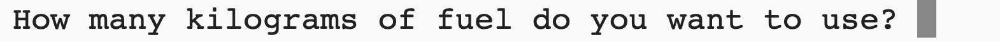

## ईंधन बर्न करें

रॉकेट को कब लॉन्च करना है, यह तय करने के लिए सबसे महत्वपूर्ण चीजों में से एक यह है कि इसमें कितना ईंधन लोड करना है। 

ऐसा करने के लिए, आपको यह अनुरूपण करने की आवश्यकता है कि यात्रा में कितना ईंधन जलाया जाएगा।

{:width="300px"}

### Create a fuel variable

--- task ---

आपके रॉकेट में कितना ईंधन बर्न होता है इसका ट्रैक रखने के लिए एक वेरिएबल जोड़ें (फ्रेम में)।

--- code ---
---
language: python filename: main.py line_numbers: true line_number_start: 7
line_highlights: 10
---

# वैश्विक वेरिएबल सेटअप करें
screen_size = 400   
rocket_y = screen_size  
burn = 100  # How much fuel is burned in each frame

--- /code ---

--- /task ---

--- task ---

अपने प्रोग्राम के निचले भाग में, उपयोगकर्ता से यह पूछने के लिए कोड जोड़ें कि रॉकेट में कितना ईंधन जोड़ना है और अपने उत्तर को `fuel` वैश्विक वेरिएबल में संग्रहीत करें।

--- code ---
---
language: python filename: main.py line_numbers: true line_number_start: 51
line_highlights: 51
---

fuel = int(input('How many kilograms of fuel do you want to use?'))   
run()

--- /code ---

--- /task ---

### Check fuel against burn

रॉकेट को तभी चलना चाहिए जब उसने अपने सभी ईंधन को नहीं जलाया हो।

--- task ---

प्रत्येक फ्रेम के `burn` द्वारा शेष `fuel` को कम करने के लिए `drawing_rotरॉकेट()` फंक्शन में कोड जोड़ें। प्रत्येक फ्रेम में कितना ईंधन बचा है यह दिखाने के लिए `print()` का उपयोग करें।

आपको यह कहना होगा कि आप वैश्विक `fuel` और `breast` वेरिएबल्स का उपयोग करना चाहते हैं।

--- code ---
---
language: python filename: main.py — draw_rocket() line_numbers: true line_number_start: 15
line_highlights: 15, 17-18
---

    global rocket_y, fuel, burn   
    rocket_y -= 1   
    fuel -= burn  # Burn fuel   
    print('Fuel left: ', fuel)

--- /code ---

--- /task ---

--- task ---

**Test:** Run your program to check that the animation doesn't start until `How many kilograms of fuel do you want to use?` has been answered. Try entering `30000` as the amount of fuel.

The rocket will keep going even if it has no fuel left.

--- /task ---

--- task ---

The rocket should only move if it has enough fuel left. Add an `if` statement to check that `fuel >= burn`.

You will need to indent all of the lines of code before the `image()` function call. To do this, highlight all of the lines with the mouse and then tap the <kbd>Tab</kbd> on the keyboard to indent all the lines at once.

The `image()` line doesn't need to be indented because you always want to draw the rocket.

--- code ---
---
language: python filename: main.py — draw_rocket() line_numbers: true line_number_start: 15
line_highlights: 17-30
---

    global rocket_y, fuel, burn  
    
    if fuel >= burn:  # Still got fuel   
        rocket_y -= 1   
        fuel -= burn   
        print('Fuel left: ', fuel)   
    
        no_stroke()  # Turn off the stroke   
    
        for i in range(25):   
            fill(255, 255 - i*10, 0)   
            ellipse(width/2, rocket_y + i, 8, 3)    
    
        fill(200, 200, 200, 100)   
        for i in range(20):   
            ellipse(width/2 + randint(-5, 5), rocket_y + randint(20, 50), randint(5, 10), randint(5, 10))   
    
    image(rocket, width/2, rocket_y, 64, 64)

--- /code ---

--- /task ---

--- task ---

**Test:** Run your program to check that the rocket stops when there is no fuel left.

{:width="300px"}

--- /task ---

Did your rocket stop when it ran out of fuel? Well done, you sent a rocket to outer space!

--- save ---

