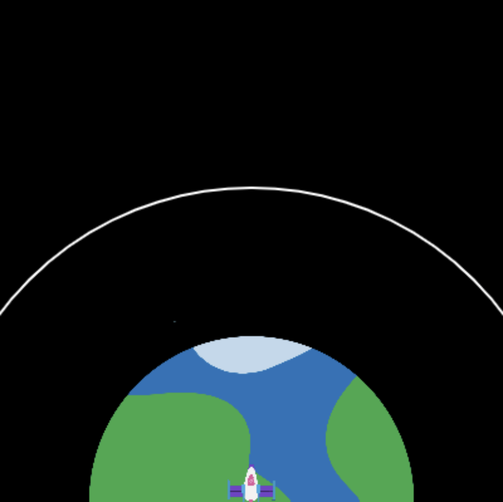

## ऑर्बिट पर पहुँच रहा है

रॉकेट को लॉन्च करने का बिंदु एक उपग्रह को ऑर्बिट में प्रजेक्ट करना है। 

ऑर्बिट एक वक्र पथ है जिसे गुरुत्वाकर्षण के कारण एक वस्तु दूसरे के आसपास ले जाती है।

रॉकेट यह दिखाने के लिए रंग बदल सकता है कि प्रक्षेपण कितना सफल रहा था। 

{:width="400px"}

--- task ---

ऑर्बिट सर्कल के त्रिज्या को सेट करने के लिए दो नए वैश्विक वेरिएबल बनाएं और उपग्रह को लॉन्च करने के लिए रॉकेट केंद्र को जिस बिंदु तक पहुंचना है उस बिंदु तक ऑर्बिट के `y` निर्देशांक।

--- code ---
---
language: python filename: main.py line_numbers: true line_number_start: 7
line_highlights: 11-12
---

# वैश्विक वेरिएबल सेटअप करें
screen_size = 400   
rocket_y = screen_size   
burn = 100   
orbit_radius = 250   
orbit_y = screen_size - orbit_radius

--- /code ---

--- /task ---

--- task ---

रॉकेट को जिस सैटेलाइट ऑर्बिट तक पहुँचने की आवश्यकता है, उसका प्रतिनिधित्व करने के लिए एक दीर्घवृत्त बनाने के लिए `drawing_background()` फ़ंक्शन को अपडेट करें।

--- code ---
---
language: python filename: main.py - draw_background() line_numbers: true line_number_start: 37
line_highlights: 42-45
---

def draw_background():   
background(0) #Short for background(0, 0, 0) — black   
image(planet, width/2, height, 300, 300)

  no_fill() #Turn off any fill  
stroke(255) #Set a white stroke   
stroke_weight(2)   
ellipse(width/2, height, orbit_radius * 2, orbit_radius * 2)

--- /code ---

--- /task ---

--- task ---

**परीक्षण:** अपना प्रोग्राम चलाएं और जांचें कि एक सफेद ऑर्बिट रेखा बनाई गई है।

{:width="300px"}

--- /task ---

रॉकेट को तब रुकना चाहिए जब वह उपग्रह की कक्षा में पहुँच जाए - मिशन के अंत में।

--- task ---

यह भी देखने के लिए कि रॉकेट कक्षा में नहीं पहुंचा है, अपने `if fuel>= breen` कोड को अपडेट करें।

आप `if` कथनों में `and` का उपयोग कर सकते हैं यह जांचने के लिए कि क्या दो या अधिक, स्थितियां सच हैं।

--- code ---
---
language: python filename: main.py - draw_rocket() line_numbers: true line_number_start: 14
line_highlights: 19
---

# draway_crock फ़ंक्शन यहाँ जाता है
def draw_rocket():

  global rocket_y, fuel, burn

    if fuel >= burn and rocket_y > orbit_y: #Still flying

--- /code ---

--- /task ---

--- task ---

**परीक्षण:** अपने प्रोजेक्ट को चलाएं और `50000` को फ्यूल की मात्रा के रूप में दर्ज करें। यह ऑर्बिट तक पहुंचने के लिए बहुत अधिक ईंधन होना चाहिए। रॉकेट को तब चलना बंद करना चाहिए जब वह कक्षा में पहुंच जाए।

--- /task ---

रॉकेट को लाल रंग में होना चाहिए यदि यह उपग्रह को लॉन्च करने के लिए पर्याप्त मात्रा में प्राप्त करने से पहले ईंधन से बाहर निकलता है।

--- task ---

--- code ---
---
language: python filename: main.py — draw_rocket() line_numbers: true line_number_start: 30
line_highlights: 34-35
---

    fill(200, 200, 200, 100)   
    for i in range(20):   
      ellipse(width/2 + randint(-5, 5), rocket_y + randint(20, 50), randint(5, 10), randint(5, 10))

  if fuel < burn and rocket_y > orbit_y: #No more fuel and not in orbit tint(255, 0, 0) #Failure

--- /code ---

--- /task ---

--- task ---

**परीक्षण:** अपना कोड चलाएं और ईंधन की मात्रा के रूप में `20000` दर्ज करें। जांचें कि रॉकेट तब लाल हो जाता है जब वह कक्षा से नीचे रुक जाता है।

{:width="300px"}

ओह नहीं, ग्रह लाल हो गया है!

--- /task ---

--- task ---

`tint()` फंक्शन उन सभी चित्रों के लिए टिंट रंग सेट करता है जो तब तक बनाई जाती हैं जब तक आप tint को नहीं बदलते या इसे बंद करने के लिए `no_tint()` का उपयोग नहीं करते।

**choose:** चित्र खींचने के बाद `no_tint()` में कॉल जोड़ें ताकि ग्रह अगली फ्रेम में लाल रंग से रंग न जोड़े — या यदि आपको ग्रह लाल हो रहा है तो इसे छोड़ दें!

--- code ---
---
language: python filename: main.py - draw_rocket() line_numbers: true line_number_start: 34
line_highlights: 38
---

if fuel < burn and rocket_y > orbit_y: tint(255, 0, 0) #Failure

image(rocket, width/2, rocket_y, 64, 64)   
no_tint() #So the planet isn't tinted red in the next frame!

--- /code ---

--- /task ---

--- task ---

इस बार फिर से `tint()` फंक्शन का उपयोग करें, यदि रॉकेट में उपग्रह की कक्षा तक पहुंचने के लिए पर्याप्त ईंधन है तो रॉकेट को हरा रंग करने के लिए:

--- code ---
---
language: python filename: main.py - draw_rocket() line_numbers: true line_number_start: 34
line_highlights: 36-37
---

if fuel < burn and rocket_y > orbit_y: tint(255, 0, 0) #Failure   
elif rocket_y <= orbit_y:   
tint(0, 255, 0) #Success

image(rocket, width/2, rocket_y, 64, 64)   
no_tint()

--- /code ---

--- /task ---

--- task ---

**परीक्षण:** अपने प्रोजेक्ट को चलाएं और `50000` को फ्यूल की मात्रा के रूप में दर्ज करें। जांचें कि आपका रॉकेट तब हरा हो जाता है जब यह उपग्रह की कक्षा में पहुँच जाता है।

{:width="300px"}

--- /task ---

अब आपके पास एक सिमुलेशन है जिसका उपयोग यह दिखाने के लिए किया जा सकता है कि उपग्रह की कक्षा तक पहुँचने के लिए कम से कम ईंधन की आवश्यकता है। यह बहुत अच्छा है; हालांकि, आप बहुत अधिक मात्रा में ईंधन ले सकते हैं और फिर भी सफल हो सकते हैं, लेकिन यह महंगा और बर्बाद होता है!

--- task ---

अपने सफलता कोड में शर्तों में संशोधन करें ताकि रॉकेट केवल हरे रंग में बदल जाए अगर यह `और` की कक्षा में पहुंच जाता है जिसमें 1,000 किलोग्राम से कम ईंधन बचा है।

रॉकेट को पीले रंग में रंग देने के लिए कोड जोड़ें यदि रॉकेट की कक्षा में पहुंचने पर उसमें 1,000 किलो से अधिक ईंधन बचा है।

--- code ---
---
language: python filename: main.py line_numbers: true line_number_start: 34
line_highlights: 36, 38-39
---

if fuel < burn and rocket_y > orbit_y: tint(255, 0, 0) #Failure   
elif fuel < 1000 and rocket_y <= orbit_y:   
tint(0, 255, 0) #Success   
elif fuel >= 1000 and rocket_y <= orbit_y:    
tint(255, 200, 0) #Too much fuel

image(rocket, width/2, rocket_y, 64, 64)    
no_tint() #So the planet isn't tinted in the next frame!

--- /code ---

--- /task ---

--- task ---

**परीक्षण:** अपने प्रोग्राम को कई बार अलग-अलग संख्याओं के साथ चलाएं; उदाहरण के लिए, 25,000kg का ईंधन रॉकेट को हरा करने के लिए आवश्यक मात्रा होनी चाहिए, लेकिन यह भी जांचें कि पीला tint भी बड़ी संख्या का उपयोग करके काम करता है।

{:width="300px"}

--- /task ---

--- save ---
