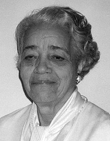

  <a class="c-survey-banner__link" href="https://form.raspberrypi.org/f/code-editor-feedback" target="_blank">Partecipa al nostro sondaggio</a> per contribuire a migliorare il nostro editor di codice!

## Quello che farai

Realizza un'animazione nella quale mandi un satellite in orbita, facendo trasportare da un razzo! La tua animazione creerà fantastici effetti grafici e simulerà la migliore quantità di carburante da fornire al razzo.

**Le simulazioni al computer** vengono utilizzate per calcolare cosa accadrà quando invieremo un razzo nello spazio. Effettuare simulazioni e realizzare piani al computer riduce il rischio di problemi costosi o pericolosi nello spazio.

Cosa farai:
+ Userai **immagini** nelle tue animazioni
+ Utilizzerai i cicli `for` per ripetere le azioni
+ Userai due condizioni insieme con `and`

--- no-print ---

### Play ▶️

--- task ---

  
Devi rifornire il razzo con abbastanza carburante per raggiungere l'orbita del satellite. Prova una quantità piccola (circa 10.000 kg) e una quantità molto grande (circa 50.000 kg) per vedere cosa succede. 

Quanto carburante è appena sufficiente senza che ne rimanga troppo?

<iframe src="https://editor.raspberrypi.org/en/embed/viewer/rocket-launch-example" width="400" height="710" frameborder="0" marginwidth="0" marginheight="0" allowfullscreen>
</iframe>

--- /task ---

--- /no-print ---

--- print-only ---

--- /print-only ---

 {:width="300px"} Dorothy Vaughan ha dato un contributo importante ai primi voli spaziali. Prevedendo che in futuro si sarebbero utilizzati i calcolatori elettronici, ha insegnato a se stessa e al suo team a programmare.

Il film *Il Diritto di Contare* racconta la storia di come Dorothy e altre donne nere abbiano avuto un ruolo chiave nel successo del programma spaziale statunitense. 
