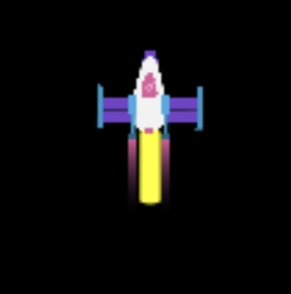

## Effetto gas di scarico

Il razzo apparirà più realistico con alcuni effetti speciali che simulino la scia di scarico. 

Puoi creare fantastici effetti utilizzando un ciclo "for" che disegni molte forme in ciascun fotogramma.

{:width="300px"}

Il coding viene utilizzato per creare **effetti grafici** per film e giochi. È molto più veloce scrivere il codice che disegnare individualmente ciascun fotogramma di un'animazione. 

### Disegna i tuoi gas di scarico

Disegnare molte ellissi gialle in diverse posizioni `y` crea una scia di scarico con un fondo rotondo.

--- task ---

Aggiorna la tua funzione `draw_rocket()` per includere un ciclo `for` che ripete il disegno di `25` ellissi di scarico. La  **variabile del ciclo** `i` viene aggiunta a `rocket_y` per disegnare ciascuna ellisse più in basso del razzo.

--- code ---
---
language: python filename: main.py - draw_rocket() line_numbers: true line_number_start: 12
line_highlights: 16-20
---

def draw_rocket(): global rocket_y   
rocket_y -= 1   

    no_stroke()  # Fa in modo che non venga disegnata la linea
    
    for i in range(25):  # Disegna 25 ellissi di gas di scarico
        fill(255, 255, 0)  # Giallo
        ellipse(width/2, rocket_y + i, 8, 3)  # aumenta I ad ogni ciclo 
    
    image(rocket, width/2, rocket_y, 64, 64)

--- /code ---

--- /task ---

Un ciclo `for` ripete un pezzo di codice una volta per ogni elemento fornito.

Per eseguire il codice in un ciclo `for` un certo numero di volte, puoi utilizzare la funzione `range()`. Ad esempio, `range(5)` crea una sequenza di cinque numeri a partire da 0, quindi [0, 1, 2, 3, 4].

Ogni volta che il ciclo `for` si ripete, imposta una variabile sull'elemento corrente in modo da poterlo utilizzare nel ciclo.

--- task ---

**Test:** Esegui il codice per verificare che il razzo abbia una nuova scia di scarico.

{:width="300px"}

--- /task ---

### Aggiungi una sfumatura

La variabile `i` può essere utilizzata anche per creare una sfumatura di colore con meno verde in ogni ellisse disegnata.

--- task ---

Cambia la chiamata della funzione `fill()` per impostare la quantità di verde al valore di `255 - i * 10` in modo che la prima ellisse abbia la stessa quantità di rosso e verde e l'ultima ellisse ha pochissimo verde.

--- code ---
---
language: python filename: main.py - draw_rocket() line_numbers: true line_number_start: 18
line_highlights: 19
---

    for i in range(25):   
        fill(255, 255 - i * 10, 0)  # Riduce la quantità di verde    
        ellipse(width/2, rocket_y + i, 8, 3)

--- /code ---

--- /task ---

--- task ---

**Test:** Controlla di avere ottenuto una scia di ellissi che cambiano gradualmente dal giallo al rosso.

--- /task ---

### Crea un effetto fumo

La scia del fumo viene creata disegnando molte ellissi grigie leggermente trasparenti in diverse posizioni in ciascun fotogramma.

--- task ---

Questa volta la funzione `fill()` è esterna al ciclo poiché il colore è lo stesso per ogni ellisse di fumo. Il quarto valore in input per `fill()` è l'opacità, un valore di opacità basso rende il colore più trasparente in modo da poter vedere le forme sottostanti.

In ogni fotogramma dell'animazione, verranno disegnate 20 ellissi di dimensioni casuali in posizioni casuali.

--- code ---
---
language: python filename: main.py - draw_rocket() line_numbers: true line_number_start: 18
line_highlights: 22-24
---

    for i in range(25):  
        fill(255, 255 - i * 10, 0)   
        ellipse(width/2, rocket_y + i, 8, 3)    
    
    fill(200, 200, 200, 100)  # Grigio trasparente   
    for i in range(20):  # Disegna 20 ellissi di fumo    
        ellipse(width/2 + randint(-5, 5), rocket_y + randint(20, 50), randint(5, 10), randint(5, 10))    
    
    image(rocket, width/2, rocket_y, 64, 64)

--- /code ---

--- /task ---

--- task ---

**Test:** Esegui il programma e verifica che i fumi di scarico siano visibili.

--- /task ---

--- save ---
