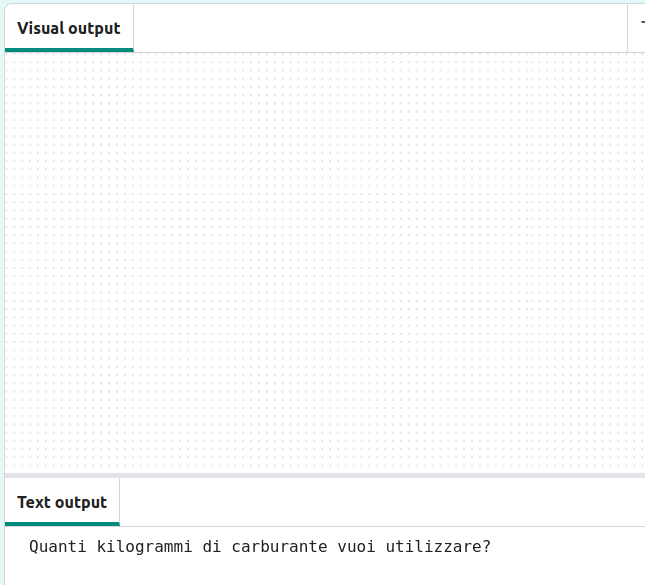
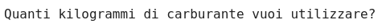
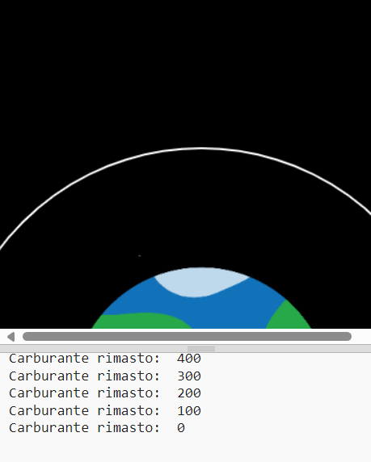

## Brucia carburante

Una delle cose più importanti da decidere quando si lancia un razzo è quanto carburante caricare a bordo. 

Per fare ciò, è necessario simulare la quantità di carburante che verrà bruciata durante il viaggio.

{:width="300px"}

### Crea una variabile fuel

--- task ---

Aggiungi una variabile per tenere traccia della quantità di carburante bruciato dal tuo razzo (in frame).

--- code ---
---
language: python
filename: main.py
line_numbers: true
line_number_start: 7 
line_highlights: 10
---

# Imposta le variabili globali
screen_size = 400   
rocket_y = screen_size  
burn = 100  # Quanto carburante viene bruciato in ogni frame

--- /code ---

--- /task ---

--- task ---

Nella parte inferiore del programma, aggiungi il codice per chiedere all'utente quanto carburante intende aggiungere al razzo e memorizza la risposta in una variabile globale `fuel`.

--- code ---
---
language: python
filename: main.py 
line_numbers: true
line_number_start: 51
line_highlights: 51
---

fuel = int(input('Quanti kg di carburante vuoi usare?'))
run()

--- /code ---

--- /task ---

### Controlla il pieno e il carburante consumato

Il razzo potrà muoversi solo se non ha bruciato tutto il carburante.

--- task ---

Aggiungi il codice alla funzione `draw_rocket()` per ridurre il `carburante` della quantità `bruciata` in ciascun fotogramma. Usa `print()` per mostrare quanto carburante è rimasto in ogni fotogramma.

Devi dichiarare che vuoi utilizzare le variabili globali `fuel` e `burn` .

--- code ---
---
language: python
filename: main.py — draw_rocket()
line_numbers: true
line_number_start: 15 
line_highlights: 15, 17-18
---

    global rocket_y, fuel, burn   
    rocket_y -= 1   
    fuel -= burn  # Burn fuel   
    print('Carburante rimasto: ', fuel)

--- /code ---

--- /task ---

--- task ---

**Test:** Esegui il programma per verificare che l'animazione non inizi prima che si sia risposto alla domanda `Quanti chilogrammi di carburante vuoi utilizzare?` . Prova a inserire `30000` come quantità di carburante.

Il razzo continuerà a funzionare anche se non avrà più carburante.

--- /task ---

--- task ---

Il razzo dovrebbe muoversi solo se sarà rimasto abbastanza carburante. Aggiungi un'istruzione `if` per verificare che `fuel >= burn`.

Dovrai rientrare tutte le righe di codice prima della chiamata alla funzione `image()` . Per fare ciò, evidenzia tutte le righe con il mouse e quindi premi <kbd>Tab</kbd> sulla tastiera per rientrare tutte le righe contemporaneamente.

Non è necessario che la riga `image()` sia rientrata perché vuoi che venga eseguita sempre indipendentemente dalla dichiarazione <0>If</0> .

--- code ---
---
language: python
filename: main.py — draw_rocket()
line_numbers: true
line_number_start: 15
line_highlights: 17-30
---

    global rocket_y, fuel, burn  
    
    if fuel >= burn:  # C'è ancora carburante   
        rocket_y -= 1   
        fuel -= burn   
        print('Carburante rimanente: ', fuel)   
    
        no_stroke()  # Non disegnare righe   
    
        for i in range(25):   
            fill(255, 255 - i*10, 0)   
            ellipse(width/2, rocket_y + i, 8, 3)    
    
        fill(200, 200, 200, 100)   
        for i in range(20):   
            ellipse(width/2 + randint(-5, 5), rocket_y + randint(20, 50), randint(5, 10), randint(5, 10))   
    
    image(rocket, width/2, rocket_y, 64, 64)

--- /code ---

--- /task ---

--- task ---

**Test:** Esegui il programma per verificare che il razzo si fermi quando non rimane più carburante.

{:width="300px"}

--- /task ---

Il tuo razzo si è fermato quando ha finito il carburante? Ben fatto, hai inviato un razzo nello spazio!

--- save ---

