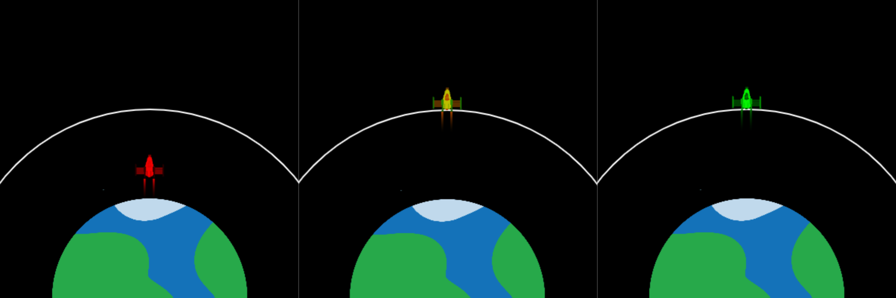

## Raggiungere l'orbita

Lo scopo del lancio del razzo è spingere un satellite in orbita. 

Un'orbita è un percorso curvo che un oggetto compie attorno a un altro a causa della gravità.

Il razzo può cambiare colore per mostrare che il lancio è avvenuto con successo. 

{:width="400px"}

### Disegna una linea orbitale

--- task ---

Crea due nuove variabili globali per impostare il raggio del cerchio orbitale e le coordinate `y` dell'orbita nel punto che il centro del razzo deve raggiungere per lanciare il satellite.

--- code ---
---
language: python
filename: main.py
line_numbers: true
line_number_start: 7 
line_highlights: 11-12
---

# Imposta le variabili globali
screen_size = 400   
rocket_y = screen_size   
burn = 100   
orbit_radius = 250   
orbit_y = screen_size - orbit_radius

--- /code ---

--- /task ---

--- task ---

Aggiorna la funzione `draw_background()` per rappresentare l'orbita del satellite che il razzo deve raggiungere tramite il disegno di un'ellisse.

--- code ---
---
language: python
filename: main.py - draw_background()
line_numbers: true
line_number_start: 38
line_highlights: 42-45
---

def draw_background():   
    background(0)  # Forme breve di background(0, 0, 0) — nero   
    image(planet, width/2, height, 300, 300)   

    no_fill()  # Non riempire il cerchio  
    stroke(255)  # Imposta il tratto di disegno bianco   
    stroke_weight(2)   
    ellipse(width/2, height, orbit_radius * 2, orbit_radius * 2)

--- /code ---

--- /task ---

--- task ---

**Test:** Esegui il programma e verifica che venga disegnata una linea orbitale bianca.

{:width="300px"}

--- /task ---

### Lancia il razzo in orbita

Il razzo dovrebbe fermarsi quando raggiunge l'orbita del satellite: cioè la fine della missione.

--- task ---

Aggiorna il tuo codice `if fuel >= burn` in modo che verifichi anche che il razzo non abbia raggiunto l'orbita.

Puoi utilizzare `and` nelle istruzioni `if` per verificare se due o più condizioni sono vere.

--- code ---
---
language: python
filename: main.py - draw_rocket()
line_numbers: true
line_number_start: 15
line_highlights: 19
---

# La funzione draw_rocket va qui
def draw_rocket():   
    global rocket_y, fuel, burn

        if fuel >= burn and rocket_y > orbit_y:  # E' ancora in volo

--- /code ---

--- /task ---

--- task ---

**Test:** Esegui il tuo progetto e inserisci `50000` come quantità di carburante. Dovrebbe esserci abbastanza carburante per raggiungere l'orbita. Il razzo dovrebbe smettere di muoversi quando raggiunge l'orbita.

--- /task ---

### Controlla se il lancio ha avuto successo

Il razzo dovrebbe colorarsi di rosso se esaurisce il carburante prima di raggiungere un'altezza sufficiente per lanciare il satellite.

--- task ---

--- code ---
---
language: python
filename: main.py — draw_rocket()
line_numbers: true
line_number_start: 30
line_highlights: 34-35
---

    fill(200, 200, 200, 100)   
    for i in range(20):   
        ellipse(width/2 + randint(-5, 5), rocket_y + randint(20, 50), randint(5, 10), randint(5, 10))
    
    if fuel < burn and rocket_y > orbit_y:  # Carburante finito e non in orbita   
        tint(255, 0, 0)  # Fallito

--- /code ---

--- /task ---

--- task ---

**Test:** Esegui il tuo progetto e inserisci `20000` come quantità di carburante. Controlla che il razzo diventi rosso quando si ferma sotto l'orbita.

{:width="300px"}

Oh no, il pianeta è diventato rosso!

--- /task ---

--- task ---

La funzione `tint()` imposta il colore della tinta per tutte le immagini disegnate finché non cambi la tinta o usi `no_tint()` per disattivarla.

**Scegli:** Aggiungi una chiamata alla funzione `no_tint()` dopo aver disegnato l'immagine in modo che il pianeta non sia colorato di rosso nel fotogramma successivo — oppure lascialo così se ti piace che il pianeta diventi rosso!

--- code ---
---
language: python
filename: main.py - draw_rocket()
line_numbers: true
line_number_start: 34
line_highlights: 38
---

    if fuel < burn and rocket_y > orbit_y:    
        tint(255, 0, 0)  # Fallito
    
    image(rocket, width/2, rocket_y, 64, 64)   
    no_tint()  # Così il pianeta non sarà tinto di rosso nel fotogramma successivo!

--- /code ---

--- /task ---

--- task ---

Usa di nuovo la funzione `tint()` , questa volta per colorare il razzo di verde se il razzo ha abbastanza carburante per raggiungere l'orbita del satellite:

--- code ---
---
language: python
filename: main.py - draw_rocket()
line_numbers: true
line_number_start: 34
line_highlights: 36-37
---

    if fuel < burn and rocket_y > orbit_y:    
        tint(255, 0, 0)  # Fallito
    elif rocket_y <= orbit_y:   
        tint(0, 255, 0)  # Successo   
    
    image(rocket, width/2, rocket_y, 64, 64)   
    no_tint()

--- /code ---

--- /task ---

--- task ---

**Test:** Esegui il tuo progetto e inserisci `50000` come quantità di carburante. Controlla che il tuo razzo diventi verde quando raggiunge l'orbita del satellite.

{:width="300px"}

--- /task ---

Ora hai una simulazione che può essere utilizzata per mostrare la quantità minima di carburante necessaria per raggiungere l'orbita del satellite. È fantastico; tuttavia, potresti anche prendere un'enorme quantità di carburante e avere comunque successo, questo però sarebbe costoso e dispendioso!

--- task ---

Modifica le condizioni nel tuo codice corretto in modo che il razzo diventi verde solo se raggiunge l'orbita `e` se ha meno di 1.000 kg di carburante rimasto.

Aggiungi il codice per colorare il razzo di giallo se al razzo rimangono più di 1.000 kg di carburante quando raggiunge l'orbita.

--- code ---
---
language: python
filename: main.py
line_numbers: true
line_number_start: 34
line_highlights: 36, 38-39
---

    if fuel < burn and rocket_y > orbit_y:   
        tint(255, 0, 0)  # Fallito
    elif fuel < 1000 and rocket_y <= orbit_y:   
        tint(0, 255, 0)  # Eseguito con successo
    elif fuel >= 1000 and rocket_y <= orbit_y:    
        tint(255, 200, 0)  # Troppo carburante   
    
    image(rocket, width/2, rocket_y, 64, 64)    
    no_tint()  # Così il pianeta non sarà colorato di rosso nel prossimo fotogramma!

--- /code ---

--- /task ---

--- task ---

**Test:** Esegui il tuo programma più volte con numeri diversi; ad esempio, 25.000 kg di carburante dovrebbero essere la quantità necessaria per far diventare verde il razzo, ma verifica anche che si colori di giallo quando utilizzi una quantità maggiore.

{:width="300px"}

--- /task ---

--- save ---
