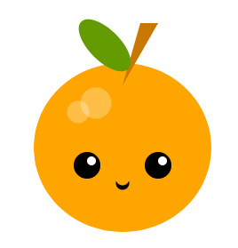

## E adesso?

Se stai seguendo il percorso [Introduzione a Python](https://projects.raspberrypi.org/it-IT/raspberrypi/python-intro), puoi passare al progetto [Crea un volto](https://projects.raspberrypi.org/it-IT/projects/make-a-face). In questo progetto disegnerai un volto o una maschera utilizzando forme geometriche.

--- print-only ---

--- /print-only ---

--- no-print ---

<iframe src="https://editor.raspberrypi.org/it-IT/embed/viewer/fruit-face-example" width="400" height="710" frameborder="0" marginwidth="0" marginheight="0" allowfullscreen>
</iframe>

--- /no-print ---

Se vuoi divertirti ancora di più esplorando Python, puoi provare [uno qualsiasi di questi progetti](https://projects.raspberrypi.org/it-IT/projects?software%5B%5D=python).

***

Questo progetto è stato tradotto da volontari:

Stefano Panzera
Alberto Giust

Grazie ai volontari, possiamo offrire alle persone di tutto il mondo la possibilità di imparare nella loro lingua. Puoi aiutarci a raggiungere più persone offrendoti come volontario per la traduzione - puoi trovare maggiori informazioni su [rpf.io/translate](https://rpf.io/translate).
