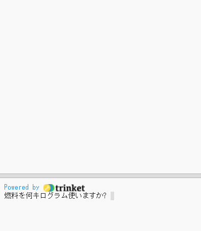
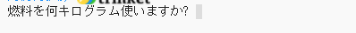
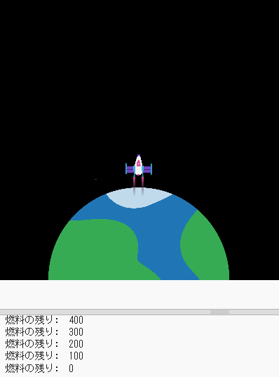

## 燃料を燃やす

ロケットに搭載する燃料の量を決めることは、ロケットを打ち上げるときに決定する最も重要なことの1つです。 

これを行うには、飛行中に燃焼する燃料の量をシミュレートする必要があります。

{:width="300px"}

### Create a fuel variable

--- task ---

変数を追加して、ロケットが(フレームごとに) 燃焼する燃料の量を追跡します。

--- code ---
---
language: python filename: main.py line_numbers: true line_number_start: 7
line_highlights: 10
---

# グローバル変数を設定する
screen_size = 400   
rocket_y = screen_size  
burn = 100 #フレームごとに燃焼される燃料の量

--- /code ---

--- /task ---

--- task ---

プログラムの下部に、ロケットに搭載する燃料の量をユーザーに尋ねるコードを追加し、その答えを `fuel` グローバル変数に格納します。

--- code ---
---
language: python filename: main.py line_numbers: true line_number_start: 52
line_highlights: 52
---

fuel = int(input('燃料を何キログラム使いますか?'))   
run()

--- /code ---

--- /task ---

### Check fuel against burn

ロケットは、燃料をすべて燃焼するまで動くことができます。

--- task ---

`draw_rocket()` 関数にコードを追加して、残りの `fuel(燃料)` をフレームごとに `burn(燃焼)` だけ減らします。 `print()` を使用して、フレームごとに残っている燃料の量を表示します。

`fuel` および `burn` 変数をグローバル変数として使用することを宣言しなければなりません。

--- code ---
---
language: python filename: main.py — draw_rocket() line_numbers: true line_number_start: 15
line_highlights: 15, 17-18
---

    global rocket_y, fuel, burn 
      rocket_y -= 1 
      fuel -= burn #燃料の燃焼 
      print('燃料の残り: ', fuel)

--- /code ---

--- /task ---

--- task ---

**テスト：** プログラムを実行して、`燃料を何キログラム使いますか？ ` に回答するまでアニメーションが開始されないことを確認します。 燃料の量として`30000` を入力してみてください。

燃料が残っていなくてもロケットは動き続けます。

--- /task ---

--- task ---

ロケットは、十分な燃料が残っている場合にのみ動くようにする必要があります。 `if` ステートメントを追加して、 `fuel >= burn`であることを確認します。

`image()` 関数を呼び出す前のコードのすべての行をインデントする必要があります。 これを行うには、マウスですべての行を強調表示してから、キーボードの <kbd>Tab</kbd> をタップします。

ロケットを描くのは常に行うので、 `image()` 行をインデントする必要はありません。

--- code ---
---
language: python filename: main.py — draw_rocket() line_numbers: true line_number_start: 15
line_highlights: 16-31
---

    if fuel &#062;= burn: #まだ燃料が残っている 
        rocket_y -= 1 
        fuel -= burn 
        print('燃料の残り: ', fuel)

--- /code ---

--- /task ---

--- task ---

**テスト：** プログラムを実行して、燃料がなくなったときにロケットが停止することを確認します。

{:width="300px"}

--- /task ---

Did your rocket stop when it ran out of fuel? Well done, you sent a rocket to outer space!

--- save ---

