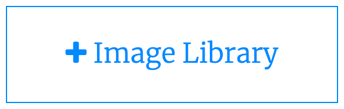

## तुमचा प्रोजेक्ट अपग्रेड करा
Your project is complete, but you can still make it better if you want. Here are a few upgrades to consider:

 + Let the user set the rate at which the rocket burns fuel or how far the rocket flies in each frame.
 + Add a second, higher, orbit for the rocket to reach and drop off another satellite. Have it change colour again when it gets there.
 + Add you own rocket or planet image to use in your project.

--- collapse ---
---
title: Adding your own image to Trinket
---

If you want to use your own picture for the planet — or the rocket — then you can do that by choosing the **View and Add Images** button.

Then choose **Image Library** and follow the on-screen instructions to upload an image to your Trinket image library.

Note the filename of the image you've uploaded, and use it in the code in place of `planet.png`.

--- /collapse ---

Here's a version of the project with all those upgrades, so you can see how they could work:

<iframe src="https://trinket.io/embed/python/76c7d66070?outputOnly=true&runOption=run&start=result" width="100%" height="600" frameborder="0" marginwidth="0" marginheight="0" allowfullscreen></iframe>

--- collapse ---
---
title: पूर्ण झालेला प्रोजेक्ट
---

तुम्ही

येथे पूर्ण झालेला प्रोजेक्ट<0>{:target="_blank"} बघू शकता.
 

--- /collapse ---

--- save ---
