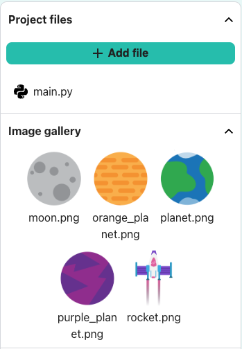

## Teken achtergrond

--- task ---

Open het [projectsjabloon](https://editor.raspberrypi.org/nl-NL/projects/rocket-launch-starter){:target="_blank"}.

--- /task ---

First, you will create a black background to represent space.

Definieer een `teken_achtergrond()` functie, om de achtergrond te tekenen, onder de opmerking die je vertelt waar deze moet komen.

--- code ---
---
language: python filename: main.py line_numbers: true line_number_start: 7
line_highlights: 8
---

# De functie teken_achtergrond komt hier
def setup():   
# Stel hier je animatie in   
size(scherm_grootte, scherm_grootte)

--- /code ---

--- /task ---

--- task ---

Add this function to the list of things to `draw()` in every frame.

--- code ---
---
language: python filename: main.py — draw() line_numbers: true line_number_start: 28
line_highlights: 20
---

def draw():   
# Dingen om te doen in elk frame    
teken_achtergrond()

--- /code ---

--- /task ---

--- task ---

**Test:** Run your code and you should see a black square. --- /task ---

--- task ---

Add a line of code to display an image of a planet.

--- code ---
---
language: python filename: main.py — setup() line_numbers: true line_number_start: 18
line_highlights: 21-23
---
def teken_achtergrond():   
background(0) # Staat voor background(0, 0, 0) — zwart    
image(planeet, width/2, height, 300, 300) # Teken de afbeelding

De functie `image()` is als volgt ingedeeld:

- image filename - we have already loaded the planet image
- x coordinate - we have already set the screen size
- y coordinate
- image width
- image height

--- /task ---

--- task ---

**Test:** Voer je code uit en controleer of deze een zwarte achtergrond tekent met onderaan een halve planeet.

{:width="300px"}](images/step_2.png){:width="300px"}

--- /task ---

### A different planet?

--- task ---

Click on the image icon to the left to view the image gallery.

Bijvoorbeeld `orange_planet.png`.

--- code ---
---
language: python filename: main.py line_numbers: true line_number_start: 18
line_highlights: 15-17
---
def setup():   
# Stel hier je animatie in   
size(scherm_grootte, scherm_grootte)   
image_mode(CENTER)  # Plaats de afbeelding in het midden global planeet   
planeet = load_image('planet.png') # Je gekozen planeet

--- /task ---

