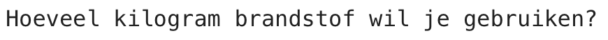

## Brandstof verbruik

Een van de belangrijkste dingen om te beslissen bij het lanceren van een raket, is hoeveel brandstof erin moet worden geladen. 

Om dit te doen, moet je simuleren hoeveel brandstof er tijdens de reis wordt verbruikt.

{:width="300px"}

### Maak een brandstofvariabele

--- task ---

Voeg een variabele toe om bij te houden hoeveel brandstof je raket verbruikt (in frames).

--- code ---
---
language: python
filename: main.py
line_numbers: true
line_number_start: 7 
line_highlights: 10
---

# Globale variabelen instellen
scherm_grootte = 400   
raket_y = scherm_grootte  
verbruik = 100 # Hoeveel brandstof wordt er in elk frame verbruikt

--- /code ---

--- /task ---

--- task ---

Voeg onderaan je programma code toe om de gebruiker te vragen hoeveel brandstof hij aan de raket moet toevoegen en sla zijn antwoord op in een global variabele `brandstof`.

--- code ---
---
language: python
filename: main.py 
line_numbers: true
line_number_start: 51
line_highlights: 51
---

brandstof = int(input('Hoeveel kilogram brandstof wil je gebruiken?'))   
run()

--- /code ---

--- /task ---

### Controleer de brandstof op verbranding

De raket mag alleen bewegen als hij niet al zijn brandstof heeft opgebruikt.

--- task ---

Voeg code toe aan de functie `teken_raket()` om de resterende `brandstof` te verminderen met het `verbruik` in elk frame. Gebruik `print()` om aan te geven hoeveel brandstof er nog over is in elk frame.

Je moet aangeven dat je de global variabelen `brandstof` en `verbruik` wilt gebruiken.

--- code ---
---
language: python
filename: main.py — draw_rocket()
line_numbers: true
line_number_start: 15 
line_highlights: 15, 17-18
---

    global raket_y, brandstof, verbruik
    raket_y -= 1
    brandstof -= verbruik # Brandstof verbruik
    print('Brandstof over: ', brandstof)

--- /code ---

--- /task ---

--- task ---

**Test:** Voer je programma uit om te controleren of de animatie pas begint nadat de vraag `Hoeveel kilogram brandstof wil je gebruiken?` is beantwoord. Probeer eens om `30000` in te voeren als de hoeveelheid brandstof.

De raket zal doorgaan, zelfs als hij geen brandstof meer heeft.

--- /task ---

--- task ---

De raket mag alleen bewegen als er genoeg brandstof over is. Voeg een `if` statement toe om te controleren of `brandstof >= verbruik`.

Je moet alle coderegels laten inspringen vóór de functieaanroep `image()`. Markeer hiervoor alle regels met de muis en tik vervolgens op <kbd>Tab</kbd> op het toetsenbord om alle regels tegelijk te laten inspringen.

De regel `image()` hoeft niet te worden ingesprongen omdat je altijd de raket wilt tekenen.

--- code ---
---
language: python
filename: main.py — draw_rocket()
line_numbers: true
line_number_start: 15
line_highlights: 17-30
---

    global raket_y, brandstof, verbruik
    
    if brandstof >= verbruik:  # Heb nog brandstof   
        rocket_y -= 1   
        brandstof -= verbruik
        print('Brandstof over: ', brandstof)   
    
        no_stroke()  # Zet de lijn uit 
    
        for i in range(25):   
            fill(255, 255 - i*10, 0)   
            ellipse(width/2, raket_y + i, 8, 3)    
    
        fill(200, 200, 200, 100)   
        for i in range(20):   
            ellipse(width/2 + randint(-5, 5), raket_y + randint(20, 50), randint(5, 10), randint(5, 10))   
    
    image(raket, width/2, raket_y, 64, 64)

--- /code ---

--- /task ---

--- task ---

**Test:** Voer je programma uit om te controleren of de raket stopt als er geen brandstof meer is.

{:width="300px"}

--- /task ---

Stopte je raket toen de brandstof op was? Goed gedaan, je hebt een raket naar de ruimte gestuurd!

--- save ---

