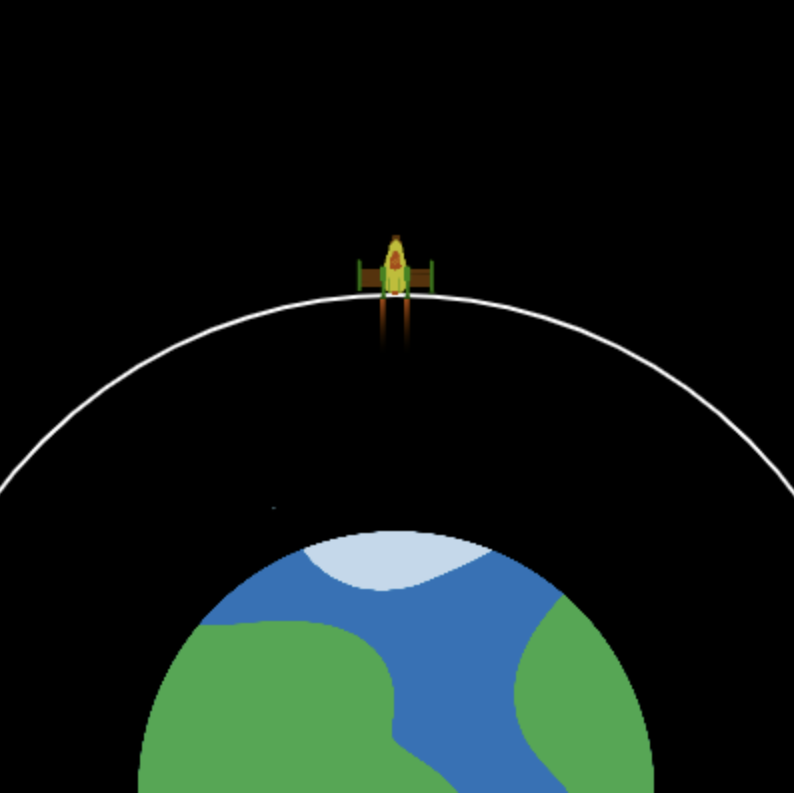

## Omloopbaan bereiken

Het doel van het lanceren van de raket is om een satelliet in een baan om de aarde te brengen. 

Een baan is een gekromd pad dat door een object om een ander object wordt afgelegd als gevolg van de zwaartekracht.

De raket kan van kleur veranderen om te laten zien hoe succesvol de lancering was. 

{:width="400px"}

--- task ---

Maak twee nieuwe global variabelen om de straal van de baancirkel en de `y`-coördinaat van de baan in te stellen op het punt dat de raket moet bereiken om de satelliet te lanceren.

--- code ---
---
language: python 
filename: main.py 
line_numbers: true 
line_number_start: 7
line_highlights: 11-12
---

#Globale variabelen instellen
scherm_grootte = 400   
raket_y = scherm_grootte   
verbruik = 100   
omloopbaan_straal = 250   
omloopbaan_y = scherm_grootte - omloopbaan_straal

--- /code ---

--- /task ---

--- task ---

Werk de functie `teken_achtergrond()` bij om een ellips te tekenen die de satellietbaan voorstelt die de raket moet bereiken.

--- code ---
---
language: python 
filename: main.py - teken_achtergrond() 
line_numbers: true 
line_number_start: 37
line_highlights: 42-45
---

def teken_achtergrond():   
  background(0) # Staat voor background(0, 0, 0) — zwart   
  image(planet, width/2, height, 300, 300)

  no_fill() #Schakel elke vulling uit  
  stroke(255) #Stel een witte lijn in   
  stroke_weight(2)   
  ellipse(width/2, height, omloopbaan_straal * 2, omloopbaan_straal * 2)

--- /code ---

--- /task ---

--- task ---

**Test:** Voer je programma uit en controleer of er een witte omloopbaanlijn is getekend.

{:width="300px"}

--- /task ---

De raket moet stoppen wanneer hij de omloopbaan van de satelliet bereikt - het einde van de missie.

--- task ---

Werk je `if brandstof >= verbruik` code bij om ook te controleren of de raket de baan niet heeft bereikt.

Je kunt een `and` in `if`-statements gebruiken om te controleren of twee of meer voorwaarden waar zijn.

--- code ---
---
language: python 
filename: main.py - teken_raket() 
line_numbers: true 
line_number_start: 14
line_highlights: 19
---

#De teken_raket functie komt hier
def teken_raket():

  global raket_y, brandstof, verbruik

    if brandstof >= verbruik and raket_y > omloopbaan_y: #Vliegt nog steeds

--- /code ---

--- /task ---

--- task ---

**Test:** Voer je project uit en geef `50000` in als de hoeveelheid brandstof. Dit zou voldoende brandstof moeten zijn om een baan om de aarde te bereiken. De raket moet stoppen wanneer hij zijn baan bereikt.

--- /task ---

De raket moet rood gekleurd zijn als de brandstof opraakt voordat hij hoog genoeg is om de satelliet te lanceren.

--- task ---

--- code ---
---
language: python 
filename: main.py — teken_raket() 
line_numbers: true 
line_number_start: 30
line_highlights: 34-35
---

    fill(200, 200, 200, 100)   
    for i in range(20):   
      ellipse(width/2 + randint(-5, 5), raket_y + randint(20, 50), randint(5, 10), randint(5, 10))

  if branstof < verbruik and raket_y > omloopbaan_y: #Geen brandstof meer en niet in de baan 
    tint(255, 0, 0) #Mislukt

--- /code ---

--- /task ---

--- task ---

**Test:** Voer je project uit en geef `20000` in als de hoeveelheid brandstof. Controleer of de raket rood wordt als hij onder de omloopbaan stopt.

{:width="300px"}

Oh nee, de planeet is rood gekleurd!

--- /task ---

--- task ---

De functie `tint()` stelt de tintkleur in voor alle afbeeldingen die worden getekend totdat je de tint wijzigt of `no_tint()` gebruikt om deze uit te schakelen.

**Kies:** Roep `no_tint()` aan na het tekenen van de afbeelding, zodat de planeet niet rood gekleurd wordt in het volgende frame — of laat het staan als je wilt dat de planeet rood wordt!

--- code ---
---
language: python 
filename: main.py - teken_raket() 
line_numbers: true 
line_number_start: 34
line_highlights: 38
---

if brandstof < verbruik and raket_y > omloopbaan_y: 
  tint(255, 0, 0) #Mislukt

image(raket, width/2, raket_y, 64, 64)   
no_tint() #Dus de planeet is niet rood gekleurd in het volgende frame!

--- /code ---

--- /task ---

--- task ---

Gebruik de functie `tint()` opnieuw, deze keer om de raket groen te kleuren als de raket voldoende brandstof heeft om de satellietbaan te bereiken:

--- code ---
---
language: python 
filename: main.py - teken_raket() 
line_numbers: true 
line_number_start: 34
line_highlights: 36-37
---

if brandstof < verbruik and raket_y > omloopbaan_y: 
  tint(255, 0, 0) #Mislukt   
elif raket_y <= omloopbaan_y:   
  tint(0, 255, 0) #Gelukt

image(raket, width/2, raket_y, 64, 64)   
no_tint()

--- /code ---

--- /task ---

--- task ---

**Test:** Voer je project uit en geef `50000` in als de hoeveelheid brandstof. Controleer of je raket groen wordt wanneer hij de baan van de satelliet bereikt.

{:width="300px"}

--- /task ---

Je hebt nu een simulatie waarmee je kunt laten zien hoeveel brandstof er minimaal nodig is om de satellietbaan te bereiken. Dat is geweldig; je kunt echter een enorme hoeveelheid brandstof verbruiken en toch succesvol zijn, maar dit is kostbaar en verspillend!

--- task ---

Pas de voorwaarden in je succescode aan zodat de raket pas groen wordt als hij de baan bereikt `en` minder dan 1.000 kg brandstof over heeft.

Voeg code toe om de raket geel te kleuren als de raket meer dan 1.000 kg brandstof over heeft wanneer hij zijn baan bereikt.

--- code ---
---
language: python 
filename: main.py 
line_numbers: true 
line_number_start: 34
line_highlights: 36, 38-39
---

if brandstof < verbruik and raket_y > omloopbaan_y: 
  tint(255, 0, 0) #Mislukt   
elif brandstof < 1000 and raket_y <= omloopbaan_y:   
  tint(0, 255, 0) #Gelukt   
elif brandstof >= 1000 and raket_y <= omloopbaant_y:    
  tint(255, 200, 0) #Te veel brandstof

image(raket, width/2, raket_y, 64, 64)    
no_tint() #Dus de planeet is niet rood gekleurd in het volgende frame!

--- /code ---

--- /task ---

--- task ---

**Test:** Voer je programma meerdere keren uit met verschillende getallen; 25.000 kg brandstof zou bijvoorbeeld de hoeveelheid moeten zijn die nodig is om de raket groen te maken, maar controleer ook of de gele tint ook werkt door een grotere hoeveelheid te gebruiken.

{:width="300px"}

--- /task ---

--- save ---
