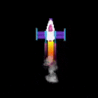

## Efekty wydechu

Rakieta będzie wyglądać bardziej realistycznie z pewnymi efektami specjalnymi, aby symulować szlak wydechowy. 

Możesz tworzyć fajne efekty za pomocą pętli "for", aby narysować wiele kształtów w każdej klatce.

{:width="300px"}

Kodowanie służy do tworzenia efektów graficznych ** dla filmów i gier. Pisanie kodu jest znacznie szybsze niż rysowanie każdej klatki animacji indywidualnie. 

### Narysuj wydech

Rysowanie wielu żółtych elips w różnych pozycjach `.` tworzy ślad wydechowy z okrągłym dnem.

--- task ---

Zaktualizuj funkcję ` draw_ROCKET()`, aby uwzględnić pętlę ` `, która powtarza rysunek elips wydechowych ` `. Zmienna pętli ** ** ` ` zostaje dodana do ` rocket_`, aby narysować każdą elipsę dalej pod rakietą.

--- code ---
---
language: python filename: main.py - draw_rocket() line_numbers: true line_number_start: 12
line_highlights: 16-20
---

def draw_rocket(): global rocket_   
rocket_y -= 1   

    No_stroke() # Wyłącz obrys
    
    for i in range(25): # Rysuj 25 palące się elipsy wydechowe
    Fill(255, 255, 0) # Żółty
    elipsa(width/2, rocket_y + i, 8, 3) # i zwiększa się za każdym razem, gdy pętla się powtarza
    
    image(rakieta, width/2, rocket_y, 64, 64)

--- /code ---

--- /task ---

Pętla ` ` powtarza kawałek kodu raz dla każdego podanego elementu.

Aby uruchomić kod w pętli ` ` określoną liczbę razy, możesz użyć funkcji ` range()` . Na przykład ` range(5)` tworzy sekwencję pięciu liczb zaczynającą się od 0, więc [0, 1, 2, 3, 4].

Za każdym razem, gdy pętla ` ` się powtarza, ustawia zmienną na bieżący element, dzięki czemu możesz jej użyć w pętli.

--- task ---

** Test:** Uruchom swój kod, aby sprawdzić, czy rakieta ma nowy ślad wydechowy.

{:width="300px"}

--- /task ---

### Dodaj gradient

Zmienna ` ` może być również używana do tworzenia gradientu koloru z mniejszą ilością zieleni w każdej rysowanej elipsie.

--- task ---

Zmień wywołanie na ` fill()`, aby ustawić ilość zieleni na ` 255 - i * 10 ` tak, aby pierwsza elipsa miała równe ilości czerwonego i zielonego, a ostatnia elipsa miała bardzo mało zielonego.

--- code ---
---
language: python filename: main.py - draw_rocket() line_numbers: true line_number_start: 18
line_highlights: 19
---

    for i in range(25):
    Fill(255, 255 - i * 10, 0) # Zmniejsz ilość zieleni
    elipsa(width/2, rocket_y + i, 8, 3)

--- /code ---

--- /task ---

--- task ---

Test **:** Sprawdź, czy otrzymujesz ślad elips stopniowo zmieniający się z żółtego na czerwony.

--- /task ---

### Stwórz efekt dymu

Ślad wydechu dymu jest tworzony przez rysowanie wielu lekko przezroczystych szarych elips w różnych pozycjach w każdej klatce.

--- task ---

Tym razem ` fill()` znajduje się poza pętlą, ponieważ kolor jest taki sam dla każdej elipsy dymu. Czwarte wejście do ` fill()` to nieprzezroczystość, niska wartość nieprzezroczystości sprawia, że kolor jest bardziej przezroczysty, dzięki czemu możesz zobaczyć kształty pod spodem.

W każdej klatce animacji zostanie narysowanych 20 elips o losowych rozmiarach.

--- code ---
---
language: python filename: main.py - draw_rocket() line_numbers: true line_number_start: 18
line_highlights: 22-24
---

    for i in range(25):
    fill(255, 255 - i * 10, 0)
    elipsa(width/2, rocket_y + i, 8, 3)
    
    Fill(200, 200, 200, 100) # Przezroczysty szary
    dla i w zakresie(20): # Rysuj 20 losowych elips dymu
    elipsa(width/2 + randint(-5, 5), rocket_y + randint(20, 50), randint(5, 10), randint(5, 10))
    
    image(rakieta, width/2, rocket_y, 64, 64)

--- /code ---

--- /task ---

--- task ---

** Test:** Uruchom swój program i sprawdź, czy spaliny są widoczne.

--- /task ---

--- save ---
