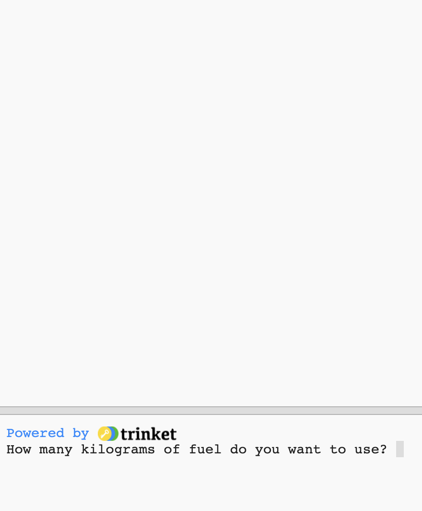

## Spalić paliwo

Jedną z najważniejszych rzeczy, o których należy decydować podczas wystrzelania rakiety, jest ilość paliwa do niej załadowanego. 

Aby to zrobić, musisz symulować, ile paliwa zostanie spalone podczas podróży.

{:width="300px"}

### Utwórz zmienną paliwa

--- task ---

Dodaj zmienną, aby śledzić, ile paliwa spala Twoja rakieta (w klatkach).

--- code ---
---
language: python filename: main.py line_numbers: true line_number_start: 7
line_highlights: 10
---

# Ustaw zmienne globalne
Screen_size = 400    
ROCKET_y = screen_  
burn = 100 # Ile paliwa jest spalane w każdej klatce

--- /code ---

--- /task ---

--- task ---

Na dole programu dodaj kod, aby zapytać użytkownika, ile paliwa dodać do rakiety i zapisać odpowiedź w zmiennej globalnej ` `.

--- code ---
---
language: python filename: main.py line_numbers: true line_number_start: 51
line_highlights: 51
---

Paliwo = int(input('Ile kilogramów paliwa chcesz użyć?'))   
run()

--- /code ---

--- /task ---

### Sprawdzić paliwo pod kątem przepalenia

Rakieta powinna się poruszać tylko wtedy, gdy nie spaliła całego paliwa.

--- task ---

Dodaj kod do funkcji ` draw_rocket()`, aby zmniejszyć pozostałą wartość ` ` o ` ` każdej klatki. Użyj ` print()`, aby pokazać, ile paliwa pozostało w każdej klatce.

Musisz powiedzieć, że chcesz użyć globalnych zmiennych ` ` i ` `.

--- code ---
---
language: python filename: main.py — draw_rocket() line_numbers: true line_number_start: 15
line_highlights: 15, 17-18
---

    Global ROCKET_y, paliwo, spalanie
    ROCKET_y -
    = 1 paliwo -= spalanie # spalanie
    odbitki paliwa('Początek paliwa: ', paliwo)

--- /code ---

--- /task ---

--- task ---

** Test:** Uruchom swój program, aby sprawdzić, czy animacja nie uruchamia się, dopóki nie ` Ile kilogramów paliwa chcesz użyć?` został udzielony odpowiedzi. Spróbuj wprowadzić ` 30000` jako ilość paliwa.

Rakieta będzie działać, nawet jeśli nie ma już paliwa.

--- /task ---

--- task ---

Rakieta powinna się poruszać tylko wtedy, gdy ma wystarczająco dużo paliwa. Dodaj polecenie ` ` , aby sprawdzić, czy ` fuel >= `.

Przed wywołaniem funkcji ` image()` musisz wcięcie wszystkich linii kodu. Aby to zrobić, podświetl wszystkie linie za pomocą myszy, a następnie dotknij <kbd> </kbd> na klawiaturze, aby wcięcie wszystkich linii naraz.

Linia ` image()` nie musi być wcięta, ponieważ zawsze chcesz narysować rakietę.

--- code ---
---
language: python filename: main.py — draw_rocket() line_numbers: true line_number_start: 15
line_highlights: 17-30
---

    global rocket_y, paliwo, spalanie
    
    IF fuel >= spal: # nadal ma paliwo
    rocket_y -= 1
    paliwo -= spalanie
    Print('Pozostało paliwo: ', paliwo)
    
    No_stroke() # Wyłącz obrys
    
    for i in range(25):
    fill(255, 255 - i*10, 0)
    elipsa(width/2, rocket_y + i, 8, 3)
    
    fill(200, 200, 200, 100)
    for i in range(20):
    elipsa(width/2 + randint(-5, 5), rocket_y + randint(20, 50), randint(5, 10), randint(5, 10))
    
    image(rakieta, width/2, rocket_y, 64, 64)

--- /code ---

--- /task ---

--- task ---

** Test:** Uruchom swój program, aby sprawdzić, czy rakieta zatrzymuje się, gdy nie ma już paliwa.

{:width="300px"}

--- /task ---

Czy Twoja rakieta zatrzymała się, gdy zabrakło paliwa? Dobra robota, wysłałeś rakietę w kosmos!

--- save ---

