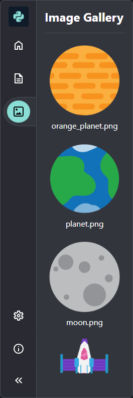

## Preparando o cenário

A animação precisa de um cenário espacial com um planeta para lançar o foguete.

{:width="300px"}

--- task ---

Abra o [modelo de projeto](https://editor.raspberrypi.org/en/projects/rocket-launch-starter){:target="_blank"}.

### Crie a tela

--- /task ---

Você usará uma variável `tamanho_tela` para definir o tamanho da tela e nos cálculos. As variáveis definidas fora das funções são **globais** para que você possa usá-las em qualquer lugar do seu programa.

--- task ---

Encontre o comentário `Configurar variáveis globais` e adicione uma linha de código para criar sua variável `tamanho_tela`:

--- code ---
---
language: python filename: main.py line_numbers: true line_number_start: 7
line_highlights: 8
---

# Configurar variáveis globais
tamanho_tela = 400

--- /code ---

--- /task ---

--- task ---

Use a variável `tamanho_tela` para criar um quadrado de 400 por 400 pixels:

--- code ---
---
language: python filename: main.py — setup() line_numbers: true line_number_start: 18
line_highlights: 20
---

def setup():   
# Configure sua animação aqui   
size(tamanho_tela, tamanho_tela)

--- /code ---

--- /task ---

### Escolha uma imagem

--- task ---

O projeto inicial tem três imagens diferentes de planetas e a lua fornecidas para você. Você pode visualizá-los na **Galeria de imagens** no lado esquerdo do editor de código.

**Escolha:** Decida qual imagem deseja usar e anote o nome do arquivo. Por exemplo, `orange_planet.png`.

--- /task ---

--- task ---

Adicione código à função `setup()` para carregar e posicionar sua imagem.

A linha `image_mode(CENTER)` indica que você posicionará as imagens fornecendo as coordenadas do centro da imagem (em vez do canto superior esquerdo).

Em seguida, carregue sua imagem em uma variável global `planeta`. A variável precisa ser global para que você possa usá-la mais tarde ao desenhar o planeta na tela.

--- code ---
---
language: python filename: main.py line_numbers: true line_number_start: 18
line_highlights: 21-23
---

def setup():   
# Configure sua animação aqui   
size(tamanho_tela, tamanho_tela)   
image_mode(CENTER)  # Posiciona a imagem no centro global planet   
planet = load_image('planet.png')  # O planeta que você escolheu

--- /code ---

--- /task ---

### Desenhar o plano de fundo

--- task ---

Defina a função `desenhar_plano_de_fundo()`, para desenhar o fundo, abaixo do comentário que informa onde ela deve ir.

Use `background(0)` para definir a cor de fundo como preto e adicione uma função `image()` para desenhar o planeta. A função `image()` exemplificada:

`image(nome do arquivo de imagem, coordenada x, coordenada y, largura da imagem, altura da imagem)`

A linha de código `from p5 import *` fornece variáveis globais de `largura` e de `altura` com base no tamanho da tela. Use-os em seu código para posicionar o planeta com seu centro na metade da largura (`width/2`) e na parte inferior (`height`) da tela.

--- code ---
---
language: python filename: main.py — desenhar_plano_de_fundo() line_numbers: true line_number_start: 14
line_highlights: 15-17
---

# A função desenhar_plano_de_fundo vai aqui
def desenhar_plano_de_fundo():   
background(0)  # Abreviação de background(0, 0, 0) — preto    
image(planet, width/2, height, 300, 300)  # Desenha a imagem

--- /code ---

Colocar todo o código para desenhar o plano de fundo em uma função torna seu código mais fácil de entender.

--- /task ---

--- task ---

Para fazer o plano de fundo aparecer, chame `desenhar_plano_de_fundo()` em `draw()`. Isso fará com que o plano de fundo seja redesenhado toda vez que `draw()` for chamado, cobrindo qualquer desenho mais antigo:

--- code ---
---
language: python filename: main.py — draw() line_numbers: true line_number_start: 28
line_highlights: 30
---

def draw():   
# Coisas para fazer em cada quadro    
desenhar_plano_de_fundo()

--- /code ---

--- /task ---

--- task ---

**Teste:** Execute seu código e verifique que ele desenha um fundo preto com meio planeta na parte inferior.

--- /task ---

Se você possui uma conta Raspberry Pi, em seu editor de código, você pode clicar no botão **Salvar** para salvar uma cópia do seu projeto em seus Projetos.

--- save ---
