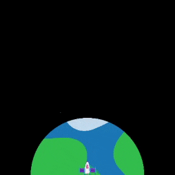

## Decolar!

Cada vez que um novo quadro é desenhado, o foguete precisa se mover para cima na tela para criar um efeito de animação.

{:width="300px"}

--- task ---

O projeto inicial tem uma imagem de foguete fornecida para você.

--- /task ---

--- task ---

Adicione código à função `configuração()` para carregar a imagem do foguete em uma variável global `foguete`.

--- code ---
---
language: python
filename: main.py
line_numbers: true
line_number_start: 20
line_highlights: 24, 26
---

def setup():   
    #Configure sua animação aqui   
    size(tamanho_tela, tamanho_tela)   
    image_mode(CENTER)   
    global planeta, foguete   
    planeta = load_image('planet.png')    
    foguete = load_image('rocket.png')

--- /code ---

--- /task ---

### Faça o foguete voar

A posição `y` do foguete começará em 400 (a altura da tela) e diminuirá em 1 cada vez que um novo quadro for desenhado.

--- task ---

Adicione uma variável global `foguete_y` para acompanhar a posição `y` do foguete.

--- code ---
---
language: python
filename: main.py
line_numbers: true
line_number_start: 7 
line_highlights: 9
---

# Configurar variáveis globais
tamanho_tela = 400    
foguete_y = tamanho_tela # Comece na parte inferior

--- /code ---

--- /task ---

--- task ---

Defina uma função `desenhar_foguete()` para alterar a posição `y` do foguete e redesenhá-lo.

`foguete_y -= 1` é uma forma mais curta de dizer `foguete_y = foguete_y - 1`.

--- code ---
---
language: python
filename: main.py
line_numbers: true
line_number_start: 11 
line_highlights: 12-16 
---

# A função desenhar_foguete vai aqui
def desenhar_foguete():
    global foguete_y #Use a variável global foguete_y    
    foguete_y -= 1 #Mova o foguete    
    image(foguete, width/2, foguete_y, 64, 64)

--- /code ---

--- /task ---

--- task ---

Chame seu novo `desenhar_foguete()` na função `draw()` para que o foguete seja redesenhado a cada quadro.

--- code ---
---
language: python
filename: main.py
line_numbers: true
line_number_start: 33 
line_highlights: 36 
---

def draw():   
    # O que fazer em cada quadro   
    desenhar_plano_de_fundo()   
    desenhar_foguete()

--- /code ---

--- /task ---

--- task ---  

**Teste:** Execute seu código para verificar que o foguete começa na parte inferior da tela e se move para cima a cada quadro.

--- /task ---

--- save ---
